# 1. First Steps

## This chapter covers
- An introduction to the Certified Kubernetes Administrator exam
- What the Kubernetes administrator role entails
- Kubernetes and the problems it solves
- The Kubernetes API and its architecture
- Kubernetes components and Linux backend processes
- Declarative and imperative commands in Kubernetes

Welcome to *Acing the Certified Kubernetes Administrator Exam, Second Edition*. If you've purchased this book, chances are you've already researched the exam, know what it's about, and perhaps even have it on your schedule. If not, don't worry; we'll talk about what the exam is and how to get signed up as soon as possible. If you want to get right down to it, you can skip to section 1.2, where we get into the meat and potatoes of the exam curriculum.

---

## 1.1 Introducing the Certified Kubernetes Administrator Exam

For those who are new to the **Certified Kubernetes Administrator (CKA)** exam, let's review what the exam entails and its requirements. First, note that there are now **five Kubernetes exams** in total; the CKA is the first and the longest-running exam. The others are:

- **KCNA** - Kubernetes and Cloud Native Associate
- **KCSA** - Kubernetes and Cloud Native Security Associate
- **CKAD** - Certified Kubernetes Application Developer
- **CKS** - Certified Kubernetes Security Specialist

There's even a new program called **Kubestronauts** that awards you a special jacket, a Credly badge, and other perks when you collect them all!

### Key Points About the CKA Exam

- It is a **hands-on exam**, which means it does not offer multiple-choice or fill-in-the-blank questions
- It covers the background services (`kubelet`, `kubeadm`, and `systemd`) that help Kubernetes run
- It was the first Kubernetes exam ever and was first introduced in **November 2017**

### Why Get Certified?

I'm glad you've decided to join us on this journey to getting certified in Kubernetes. The CKA certification will be quite an accomplishment and will help advance your career. Also, you'll be a part of a large group of individuals who hold this certification, including **over 70,000 people worldwide** (as of 2025). Here's why it's worth it:

- Kubernetes and distributed systems are going to be around for a long time
- Kubernetes skills are in high demand
- Getting certified will help solidify your understanding and show that you are well-rounded and versed in Kubernetes

### The Exam Experience

The CKA exam is a competency test like no other. Instead of multiple-choice or fill-in-the-blank type questions, this exam is entirely executed from within a **Linux terminal (Ubuntu XFCE)** in a remote desktop environment provided by **PSI Services** (the exam provider).

| Aspect | Details |
|--------|---------|
| **Duration** | 2 hours |
| **Tasks** | 15 to 20 tasks |
| **Passing Score** | 66% or higher |
| **Partial Credit** | Yes, available on any task |
| **Retakes** | One free retake included |

You are graded on the **outcome** of your tasks, no matter which path you took to achieve the outcome; there may be more than one way to solve a given task.

> [!TIP]
> Throughout this book, we'll address tips and tricks available for each topic within each chapter. These exam tips, in combination with your determination and repeated practice, will lead to success in passing the CKA exam.

### Exam Cost and Resources

The CKA exam is provided by the **Linux Foundation**, and Kubernetes is maintained by the **Cloud Native Computing Foundation (CNCF)**. The exam costs **$445** as of the time of writing.

**Allowed Resources During Exam:**
- https://kubernetes.io/docs/
- https://kubernetes.io/blog/
- https://helm.sh/docs
- https://gateway-api.sigs.k8s.io/

### System Requirements

| Requirement | Specification |
|-------------|---------------|
| **Operating System** | Windows 10/11 (64-bit), macOS 13.x+, or Ubuntu 22.04 |
| **Screen Resolution** | 1,920 × 1,080 or higher (32-bit color) |
| **Webcam** | 640 × 480 pixel resolution minimum |
| **Internet Speed** | 300 kbps minimum |
| **Dual Monitors** | Not supported |

The room where you take the exam must be quiet and well-lit. Public spaces such as coffee shops or stores are not allowed. Your desk must be cleared of all papers and other electronics.

> [!WARNING]
> Regardless of your machine's operating system, before starting the exam, the PSI will close prohibited programs, such as display mirroring subsystems. We recommend connecting to the exam **30 minutes before** the scheduled time in case you have to troubleshoot these programs. Some students reported that they could only start the exam on macOS after disabling Bluetooth.

### Exam Day Procedures

1. Sit down at your desk with your computer plugged in
2. Go to the Linux Foundation portal to start your exam
3. Ensure all browser tabs are closed and no other applications are running
4. Click the Begin Exam button
5. Meet with the exam proctor who will verify your environment
6. Show a 360° view of your room with your camera
7. Present your government-issued ID
8. Begin the exam once the proctor releases it

> [!TIP]
> If you are copying and pasting text back and forth from the Firefox browser and the terminal, use the keyboard shortcut `CTRL + SHIFT + C` to copy and `CTRL + SHIFT + V` to paste.

### CKA Exam Core Competencies

The CKA exam covers five core competencies:

| Domain | Weight |
|--------|--------|
| Cluster Architecture, Installation, and Configuration | **25%** |
| Workloads and Scheduling | **15%** |
| Services and Networking | **20%** |
| Storage | **10%** |
| Troubleshooting | **30%** |

---

### Table 1.1: Exam Competencies and Percentages

#### Cluster Architecture, Installation, and Configuration: 25%
- Manage role-based access control (RBAC)
- Implement and configure a highly available control plane
- Create and manage Kubernetes clusters using kubeadm
- Manage the lifecycle of Kubernetes clusters
- Prepare underlying infrastructure for installing a Kubernetes cluster
- Use Helm and Kustomize to install cluster components
- Understand extension interfaces like CNI, CSI, and CRI
- Install and configure operators with an understanding of CRDs

#### Workloads and Scheduling: 15%
- Understand application deployments and how to perform rolling updates and rollbacks
- Use ConfigMaps and secrets to configure applications
- Configure workload autoscaling
- Understand the primitives used to create robust, self-healing, application deployments
- Configure pod admission and scheduling (requests, limits, node affinity, etc.)

#### Services and Networking: 20%
- Understand host networking configuration on pods and nodes
- Define and enforce network policies
- Understand ClusterIP, NodePort, and LoadBalancer service types and endpoints
- Know how to use ingress controllers and ingress resources
- Use Gateway API to manage ingress traffic
- Know how to configure and use CoreDNS

#### Storage: 10%
- Implement storage classes and dynamic volume provisioning
- Configure volume types, access modes, and reclaim policies
- Manage persistent volumes and persistent volume claims

#### Troubleshooting: 30%
- Troubleshoot clusters and nodes
- Understand how to monitor cluster and application resource usage
- Manage and evaluate container logs from stdout and stderr
- Troubleshoot cluster component failure
- Troubleshoot services and networking

---

### Exam Clusters and Aliases

You will have access to different clusters during the exam, which you will be required to SSH to each control plane node depending on the question. The test provides instructions at the beginning of each question for which node to SSH to.

The exam also has the alias for `kubectl` set to `k`:
```bash
alias k='kubectl'
```

### Certification Validity

The certificate is valid for **2 years**, and the process to recertify is the same as what you originally went through the first time you sat for the exam.

> [!IMPORTANT]
> I suggest scheduling your exam now so you have an end goal and a deadline for completing it. If you are working with Kubernetes daily, schedule your exam for **1 month from today**. If you are just approaching Kubernetes, schedule your exam for the **furthest date** the exam scheduler will allow (usually three months).

---

## 1.2 What's in Store

This book includes exercises and exam-like scenarios so you can practice `kubectl` commands and prepare for the exam. To make it as easy as possible for you to practice, I've included instructions for creating your own local cluster.

**Appendix A** walks you through the steps to create a Kubernetes cluster using **kind** (Kubernetes in Docker). [kind](https://kind.sigs.k8s.io/) is a free, lightweight, and easy-to-use tool for creating a cluster right on your existing laptop or desktop computer. The only requirement is Docker, and with one command, you'll have a cluster up and running in seconds.

Other methods to create a local cluster include:
- **minikube**
- **microk8s**

Within each chapter of this book, there are scenarios that resemble the real exam (called **Exam Tasks**), which we'll work through together, in addition to practice exercises to complete on your own. **Appendix D** includes hints for solving these practice exercises.

> [!NOTE]
> This is not an introduction to Kubernetes, so I expect you to have a background in containers and an understanding of what problems Kubernetes solves. The CKA exam requires quite a bit of experience using and navigating the Linux operating system.

---

## 1.3 What is a Kubernetes Administrator?

The role of a Kubernetes administrator is twofold. A Kubernetes administrator knows the inner workings of Kubernetes and how to translate that into value for the end users.

### Sample Job Posting

> *The responsibility of a Kubernetes administrator is to ensure that the company's services meet the needs of the customers within the desired levels of reliability, performance, and availability by developing continuous improvements, tools, and automation. You must know how to install, configure, deploy, update, and patch each of the components of the Kubernetes infrastructure to ensure that services and underlying systems are properly monitored and have adequate observability. This includes identifying and monitoring proper key performance indicators to ensure service health, minimizing mean time to acknowledge and mean time to repair.*

---

## 1.4 Meeting Kubernetes

The **Kubernetes cluster** is called a cluster because it is a series of components working together in conjunction. Just like a server farm, the components are interconnected and housed within the same facility or network.

Key difference in Kubernetes:
- Connected components not only **distribute load** appropriately
- They easily **exchange data** to eliminate a single point of failure
- If one component fails, it doesn't bring down the entire cluster

From now on, we call these components **nodes**. Node is a term that's specific to clusters, which tends to indicate that the components are part of a larger system like a cluster.

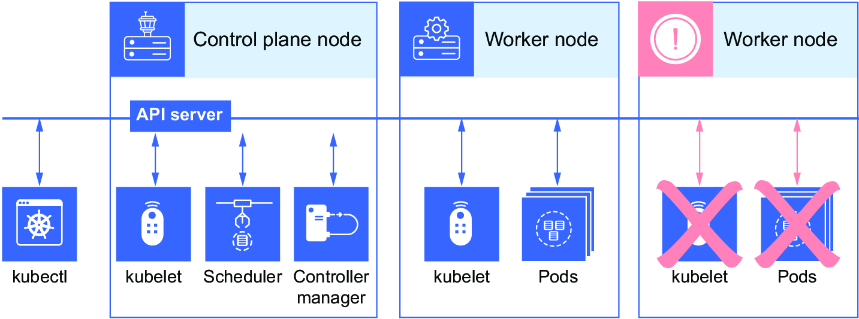

> [!NOTE]
> Kubernetes is often referred to as **K8s** (pronounced "kates") for short, where the 8 between the K and the s represents the number of characters between the K and the s ("ubernete" = 8 characters).

### The Kubernetes API

Kubernetes is nothing more than a piece of software that you interact with via a **REST API**. A RESTful API is a well-defined, highly scalable, loosely coupled application architecture that allows communication over a network.

**Key Concepts:**
- **Resources** - How we address objects in Kubernetes
- **Objects** - Can have more than one resource address (URI)
- **Deployments** - Objects that offer automated control over pods and ReplicaSets
- **ReplicaSets** - Control loop running a specified number of pods

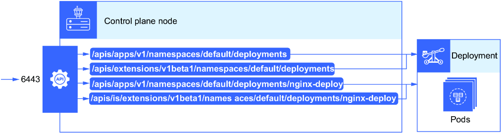

We commonly interact with the Kubernetes API using a command-line tool called **kubectl**. The `kubectl` command-line tool, in addition to a certificate, is needed to create, read, update, and delete Kubernetes resources.

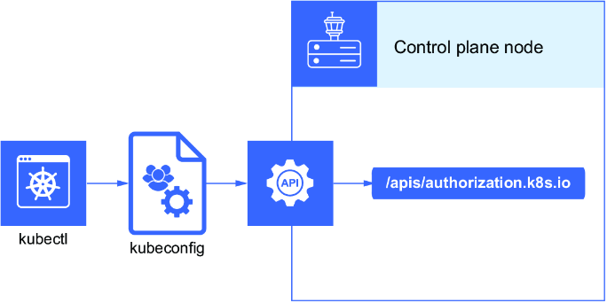

---

### 1.4.1 Cluster Architecture, Installation, and Configuration

The architecture of a cluster is built out of nodes, and on those nodes are running **pods**. A pod is the smallest deployable unit in Kubernetes and contains one or more containers.

**Two Types of Nodes:**

| Node Type | Components |
|-----------|------------|
| **Control Plane Node** | API server, DNS, controller manager, scheduler, kube-proxy, etcd datastore |
| **Worker Node** | kubelet, kube-proxy, container runtime |

Communication to the control plane happens through the API on the control plane node. The worker nodes, by way of the kubelet, get instructions from the control plane to run containers and report back on their health.

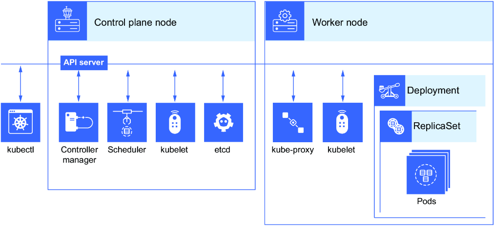

---

### 1.4.2 Workloads and Scheduling

Resources like **ReplicaSets** and **Deployments** are essential to developing stateless application workloads running on Kubernetes. Without them, we wouldn't be able to automatically scale pods, which provide load balancing.

The term "**scheduling**" comes from the **scheduler**, which is a component of the control plane. Kubernetes abstracts hardware away and creates a common interface (an API) between it and everything else.

#### Understanding APIs with SWAPI Example

Let's look at an API that's been rendered through the browser at https://swapi.info/playground. If you go to Star Wars API (SWAPI), you'll see a way to request different facts about the Star Wars movies.

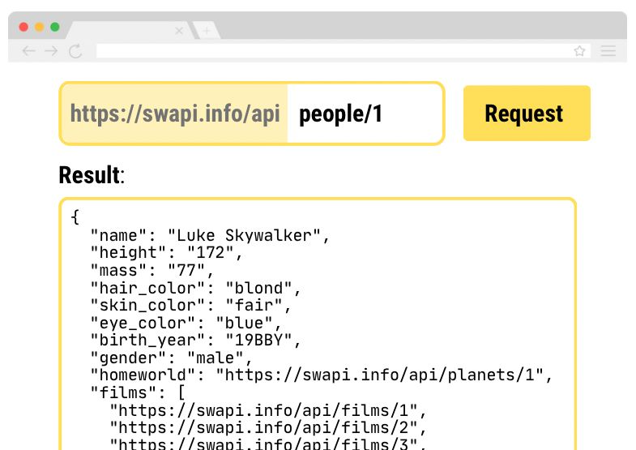

The data that you received is the resource URI we've been talking about. Relating this back to Kubernetes, the `people` object in SWAPI is much like the `Deployment` object in Kubernetes.

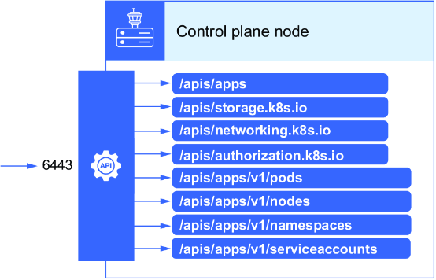

**HTTP Methods for API Actions:**
| Method | Action |
|--------|--------|
| GET | Retrieves data |
| POST | Creates new resources |
| PATCH | Updates parts of existing resources |
| PUT | Replaces resources entirely |
| DELETE | Removes resources |

---

### 1.4.3 Services and Networking

To have the end user interact with your application running on Kubernetes, we create an object called a **service**. These services provide:
- Load-balancing feature to the pods they serve
- A single IP address and DNS name

**CoreDNS** provides names to IP translations, meaning resources in Kubernetes can talk to each other using common names as opposed to IP addresses.

**Three Types of Services:**
1. **ClusterIP**
2. **NodePort**
3. **LoadBalancer**

An **ingress resource** is another Kubernetes object that provides path-based routing to a service in Kubernetes.

---

### 1.4.4 Storage

In Kubernetes, there is the concept of **persistent volumes**, which aren't tied to an individual pod but instead to an NFS, EFS, or iSCSI volume.

| Concept | Description |
|---------|-------------|
| **Persistent Volume** | Storage not tied to ephemeral pods |
| **Persistent Volume Claim** | Reserves a persistent volume for an application |
| **Storage Class** | Enables dynamic storage provisioning (e.g., slow vs. fast) |
| **Access Modes** | Read/write capability of a volume to one or many pods |
| **Reclaim Policy** | Allows or denies access from other pods |

---

### 1.4.5 Troubleshooting

Kubernetes clusters can get quite complex as more resources and objects are created in them. Troubleshooting when problems arise is essential to:
- Limit downtime of running applications
- Detect problems to optimize and keep Kubernetes performing at its best

**Logs** are time-based behavioral data sent via text to a directory on the filesystem to give you verbose information about problems occurring.

Applications running on Kubernetes also contain logs from **STDOUT** and **STDERR** that are important for detecting communication problems or imminent application failures.

---

### Practice Exercises

1. In the SWAPI playground, try sending the request `starships/9/`. What fields are included? How would this resemble a Kubernetes resource like a Deployment?
2. Perform the command to list all API resources in your Kubernetes cluster. Save the output to a file named `resources.csv`.

---

## 1.5 Control Plane Node

The services and components on the control plane are:

- **Controller manager**
- **API server**
- **Scheduler**
- **etcd datastore**

### Controller Manager

The controller manager is the manager for all other controllers in Kubernetes and includes Deployments, ReplicaSets, etc. A controller in Kubernetes is responsible for matching the **current state** to the **desired state**.

The controller also creates:
- Default accounts and API access tokens for new namespaces
- Default namespace, Service Account, and Secret for deploying resources

### API Server

The API server exposes the Kubernetes API (the RESTful API). It's the entry point for the cluster, so all communication to the cluster passes through it.

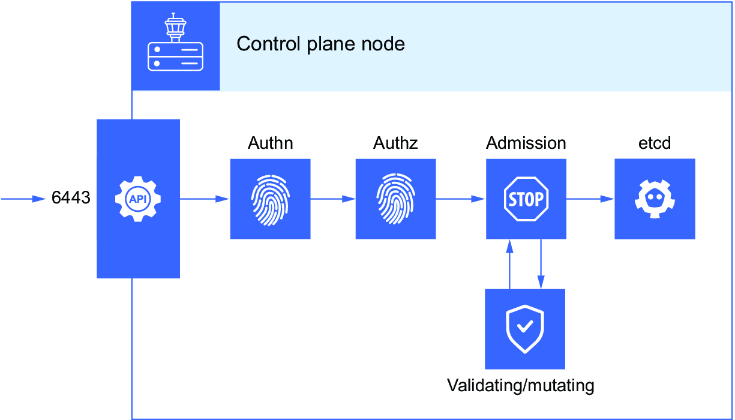

### Scheduler

The scheduler selects the nodes for the pods to run on. If there are multiple nodes that already have pods running on them, the scheduler will place the pods on a different node, taking into consideration:
- Available resources
- Other rules/specifications placed on that node

### Control Plane High Availability

Control plane components are so critical that in a production scenario, they are replicated for high availability. This works by:
1. Ensuring control plane components have only one instance receiving requests at a time (leader election)
2. Creating multiple redundant copies of etcd

For more information, see: https://mng.bz/Mw6o

### etcd Datastore

**etcd** stores all the Kubernetes configuration data (the state of Kubernetes). It is a consistent distributed **key–value store** designed to hold small amounts of data that can fit entirely in memory.

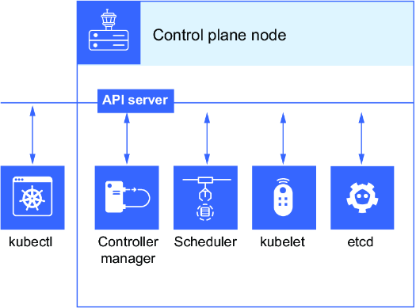

> [!CAUTION]
> Losing etcd (etcd failure) is catastrophic, as it contains all the configuration information for resources running inside a Kubernetes cluster.

---

## 1.6 Worker Nodes

The components that run on a worker node are:

- **kubelet**
- **kube-proxy**
- **Container runtime**

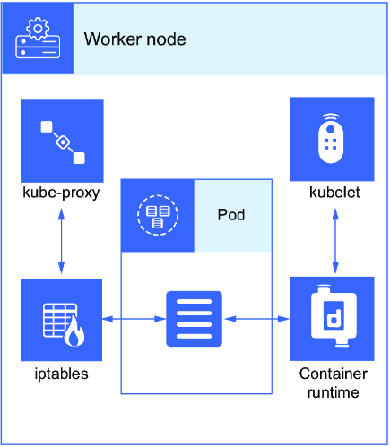

### kubelet

The **kubelet** service runs on each worker node and makes sure containers are running in a pod. It can:
- Detect when a container (within a pod) is failing
- Take corrective action to ensure the container restarts as specified in the YAML manifest

> [!NOTE]
> We'll use **kind** in this book to get hands-on for the exam. For instructions on how to create your cluster, see Appendix A.

#### Example: Describing a Pod

```bash
$ kubectl describe po nginx
Name:         nginx
Namespace:    default
Priority:     0
Node:         host01/172.17.0.33
Start Time:   Tue, 01 Feb 2022 16:49:36 +0000
Labels:       run=nginx
Annotations:  <none>
Status:       Running
IP:           192.168.0.4
IPs:
  IP:  192.168.0.4
Containers:
  nginx:
    Container ID:   containerd://4de3efffd3a6f1ec49c968d7fde95e8eae4ae0c25574e...
    Image:          nginx
    Image ID:       docker.io/library/nginx@sha256:2834dc507516af02784808c5f48b7...
    Port:           <none>
    Host Port:      <none>
    State:          Running
      Started:      Tue, 01 Feb 2022 16:49:44 +0000
    Ready:          True
    Restart Count:  0
    Environment:    <none>
    Mounts:
      /var/run/secrets/kubernetes.io/serviceaccount from kube-api-access-5ffvj (ro)
Conditions:
  Type              Status
  Initialized       True 
  Ready             True 
  ContainersReady   True 
  PodScheduled      True 
Events:
  Type    Reason     Age   From               Message
  ----    ------     ----  ----               -------
  Normal  Scheduled  17s   default-scheduler  Successfully assigned default/nginx to host01
  Normal  Pulling    16s   kubelet            Pulling image "nginx"
  Normal  Pulled     9s    kubelet            Successfully pulled image "nginx" in 6.993614669s
  Normal  Created    9s    kubelet            Created container nginx
  Normal  Started    9s    kubelet            Started container nginx
```

**Container States:** Pending, Running, Terminated, Completed, etc.

### kube-proxy

The **kube-proxy** service running on each node is the communication mechanism of a Kubernetes service. It contains basic network rules for the node to follow when traffic needs to get to the pods.

> [!TIP]
> Watch the excellent video "Life of a Packet" for more details: https://youtu.be/0Omvgd7Hg1I

### Container Runtime

The container runtime is a necessary component for Kubernetes to work. For the CKA exam, this will be **containerd** (https://containerd.io/).

**CRI-Compliant Container Runtimes:**
- **cri-containerd** - Lightweight and portable
- **CRI-O** - Supports Open Container Initiative and multiple image formats

---

## 1.7 API Model and Public Key Infrastructure

To manipulate objects in Kubernetes, we need two things:
1. The command-line tool **kubectl**
2. A **client certificate**

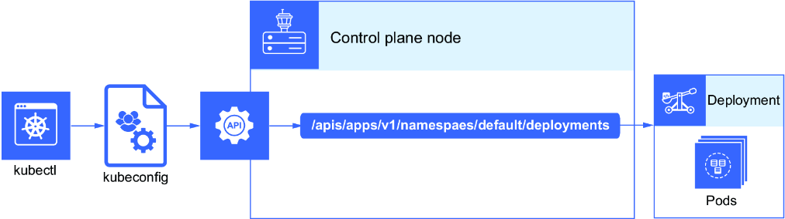

### Understanding PKI

**PKI (Public Key Infrastructure)** is a very common client/server communication pattern. It securely communicates with websites by ensuring:
- The website you're visiting is actually the website you intended to visit (via cryptographic signature)
- Nobody is snooping or intercepting the back-and-forth traffic

### PKI Components

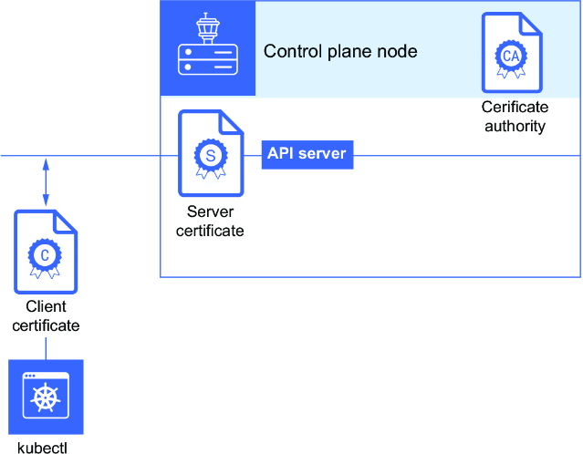

| Component | Role |
|-----------|------|
| **Certificate Authority (CA)** | Acts as the root of trust, signs server certificates |
| **Server** | Proves identity to the CA |
| **Client** | Verifies the server's identity |

### PKI in Kubernetes

**Kubernetes is its own CA** and will be the source of truth for other components within a Kubernetes cluster.

| Role | Components |
|------|------------|
| **Clients** | kubelet, scheduler, controller manager, etcd datastore |
| **Servers** | kubelet, Kubernetes API, etcd datastore |


> [!NOTE]
> You don't have to worry about creating a CA, client, or server certificate. **kubeadm** will do all of this for you. kubeadm is a command-line tool that creates the necessary components that make up our Kubernetes cluster, sometimes called "bootstrapping the cluster."

---

## 1.8 Linux Background Processes

Linux background processes are a grouping of files on the Linux operating system that provide software programs that run constantly in the background. These are called **daemons** (or **services** in Windows).

A **DaemonSet** in Kubernetes makes sure the daemon is running on each node as a pod in the Kubernetes cluster at all times.

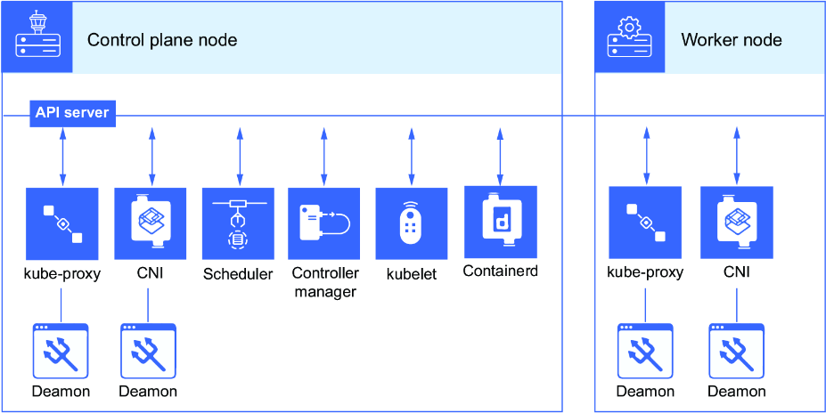

### Viewing DaemonSets

```bash
$ kubectl get ds -A
NAMESPACE     NAME              DESIRED   CURRENT   READY   UP-TO-DATE   AVAILABLE   NODE SELECTOR            AGE
kube-system   kube-flannel-ds   1         1         1       1            1           <none>                   18m
kube-system   kube-proxy        1         1         1       1            1           kubernetes.io/os=linux   19m
```

### The kubelet Process

**kubelet** is one of the only background processes that runs on the Linux system itself (as a Linux background process), not managed by Kubernetes as a DaemonSet.

#### Listing kubelet Service

```bash
$ systemctl list-unit-files --type service | grep kubelet -A3 -B3
iscsid.service                         disabled        enabled
kmod-static-nodes.service              static          -
kmod.service                           alias           -
kubelet.service                        enabled         enabled
modprobe@.service                      static          -
nfs-common.service                     masked          enabled
nfs-idmapd.service                     static          -
```

#### Managing kubelet

| Command | Purpose |
|---------|---------|
| `systemctl start kubelet` | Start the kubelet if stopped |
| `systemctl enable kubelet` | Enable kubelet to start on boot |
| `systemctl status kubelet` | Check if kubelet is active or inactive |

### journald and Logs

**journald** is the system service managed by `systemd` that collects logs for various processes on a Linux system, including the kubelet process.

```bash
$ systemctl list-unit-files --type service | grep journald.service
systemd-journald.service               static          enabled
```

#### Useful Commands for Troubleshooting

```bash
# Check kubelet logs
sudo journalctl -u kubelet

# Check containerd logs
sudo journalctl -u containerd

# Check pod logs using kubectl
kubectl logs kube-controller-manager-server1 -n kube-system
```

You can also check the `/var/log/pods` directory for pod logs.

---

### Practice Exercises

3. List the background processes on your Linux operating system that are associated with Kubernetes.
4. List the status of the kubelet process running on the Kubernetes node, and output the result to a file named `kubelet-status.txt`.
5. Use `journalctl` to output the logs created by the kubelet process running on your Kubernetes control plane node.

---

## 1.9 Declarative Syntax

Now that you have a good idea of what a Kubernetes cluster is composed of and its underlying processes, let's mention the primary purpose of Kubernetes: **to run applications**.

Kubernetes doesn't care about the language or framework of your application. You can run a Java application just the same as a .NET application.

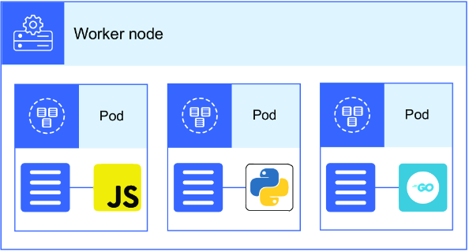

### Declarative vs. Imperative

| Approach | Description |
|----------|-------------|
| **Imperative** | Running a series of commands in a specific sequence |
| **Declarative** | Describing configuration via a YAML file with the end state in mind |

### Benefits of Declarative Approach

- Configuration can be checked into **version control**
- Build with the **end state in mind**, without considering order or specific commands
- Higher efficiency and speed through **parallel actions**

### Example YAML Manifest

**File:** `my-pod-manifest.yaml`

```yaml
apiVersion: v1
kind: Pod
metadata:
  labels:
    run: nginx
  name: nginx
spec:
  containers:
  - image: nginx
    name: nginx
```

These YAML files (called **manifests**) serve as documentation of how an application is configured to run on Kubernetes and can be stored in version control.

### Creating Resources

```bash
$ kubectl create -f my-pod-manifest.yaml 
pod/nginx created
```

### Three Ways to Submit YAML Files

| Command | Behavior |
|---------|----------|
| `kubectl create -f manifest.yaml` | Creates new resource; errors if resource exists |
| `kubectl apply -f manifest.yaml` | Creates or updates existing resource |
| `kubectl replace -f manifest.yaml` | Deletes existing resource and creates new one |

### Idempotency

The benefit of working with the Kubernetes API is that the state of resources will remain unchanged, no matter how many times the same call is made. This creates **consistency** in your environment.

---

## Summary

- **Kubernetes is an application** that runs other applications and is built much like other RESTful web apps. The API is the central hub for authentication, authorization, and communication in the Kubernetes cluster.

- **A cluster has many different components**, including two main parts:
  - A **control plane**, handled by control plane nodes
  - **Worker nodes**, responsible for running workloads (containerized applications)

- **Linux background processes** are important because they are responsible for keeping Kubernetes running on the host itself.

- **You can access the cluster in two ways**: programmatically or by using `kubectl`. Both require a certificate to authenticate. This certificate is common in a PKI system.

- **Kubernetes is optimized for microservices**, enabling scalable and efficient Deployments by treating each service as an independent, decoupled component.

- **Running workloads on Kubernetes is more efficient via a declarative approach**. This way, we can describe what we want the end state to be, as opposed to running a set of imperative commands.
