# 2. Kubernetes Cluster

## This chapter covers
- Control plane and worker node components in a multinode cluster
- Upgrading control plane components with kubeadm
- Pod and node networking in Kubernetes
- Extension interfaces (the container network interface, container storage interface, and container runtime interface)
- Taints and tolerations in Kubernetes

The Kubernetes cluster architecture is almost impossible to grasp without getting inside an actual running cluster and discovering the components firsthand. No matter how you look at it, as Kubernetes administrators, we must know what's going on under the hood. By the time you finish this chapter, you will feel comfortable with accessing all the components in a Kubernetes cluster and know how to upgrade components when needed.

---

## The Cluster Architecture, Installation, and Configuration Domain

This chapter covers part of the **Cluster Architecture, Installation, and Configuration** domain of the Certified Kubernetes Administrator (CKA) curriculum. This domain covers what a Kubernetes cluster consists of, including the key components and ways to maintain a healthy Kubernetes cluster.

| Competency | Chapter Section |
|------------|-----------------|
| Prepare underlying infrastructure for installing a Kubernetes cluster | 2.1 |
| Create and manage Kubernetes clusters using kubeadm | 2.1 |
| Manage the lifecycle of Kubernetes clusters | 2.2 |
| Understand extension interfaces (CNI, CSI, CRI, etc.) | 2.3 |

---

## 2.1 Kubernetes Cluster Components

Certain pods work together to form the control plane. These components are:
- **API server**
- **Controller manager**
- **Scheduler**
- **etcd**

In the Kubernetes clusters that you will face on exam day, these components exist as pods running on the control plane node. We can view the cluster components by viewing the pods running in the `kube-system` namespace:

```bash
# First, get a shell to the control plane node
docker exec -it kind-control-plane bash

# View pods in kube-system namespace
kubectl get pods -n kube-system
```

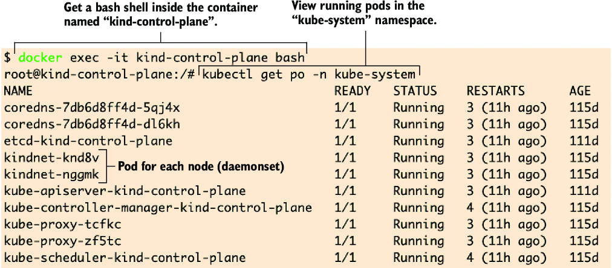

In the coming sections of this chapter, we'll learn how to manage these components, including how to access them, modify their configuration, and upgrade them.

---

### 2.1.1 Kubernetes Version Upgrade

The CKA exam will test your knowledge of maintaining a Kubernetes cluster. This knowledge includes upgrading the control plane components to a certain version.

> [!NOTE]
> **Exam Task Example:** There's a need for company X to upgrade the Kubernetes controller to version 1.31 or higher due to a bug that affects pod scheduling. Perform the update with minimal downtime and loss of service.

Knowing that you should use `kubeadm` to complete this request will allow you to breeze through that task on the exam.

#### Viewing Current Versions

If you don't already have access to an existing Kubernetes cluster, see **Appendix A**, which explains how to create one using kind. To follow along, get a bash shell to the control plane node:

```bash
docker exec -it kind-control-plane bash
```

Using the command `kubeadm upgrade plan` from the control plane will return a list of the control plane components:
- **CURRENT** column: Shows what version they are currently on
- **TARGET** column: Shows what version they can be upgraded to

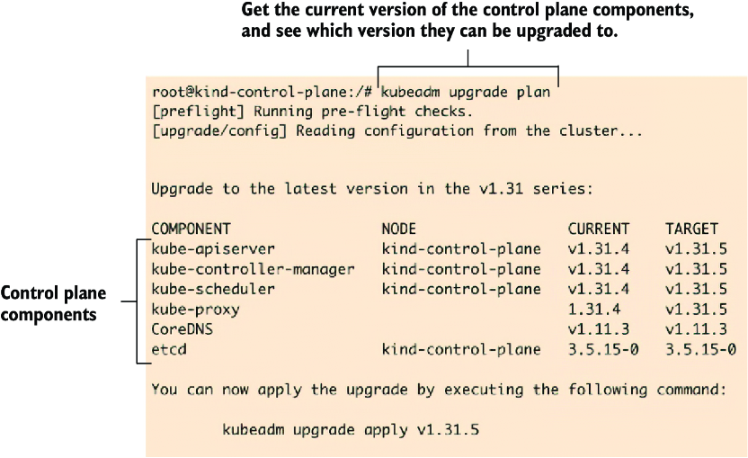

> [!NOTE]
> The TARGET column doesn't show the latest release of Kubernetes. We can only update to the current version of kubeadm. If kubeadm was at v1.32.1, the TARGET column would show v1.32.1.

#### Upgrading kubeadm

To upgrade kubeadm to get to the latest release:

**Step 1: Install GPG**
```bash
apt update
apt install -y gpg
```

**Step 2: Download the GPG key**
```bash
curl -fsSL https://pkgs.k8s.io/core:/stable:/v1.32/deb/Release.key | \
  gpg --dearmor -o /etc/apt/keyrings/kubernetes-apt-keyring.gpg
```

**Step 3: Add kubeadm to your local apt packages**
```bash
echo 'deb [signed-by=/etc/apt/keyrings/kubernetes-apt-keyring.gpg] \
  https://pkgs.k8s.io/core:/stable:/v1.32/deb/ /' | tee \
  /etc/apt/sources.list.d/kubernetes.list
```

**Step 4: Install the new version of kubeadm**
```bash
apt update
apt install -y kubeadm=1.32.1-00
```

When you run the `kubeadm upgrade plan` command again, you'll notice that your TARGET column has a higher version of 1.32.1.

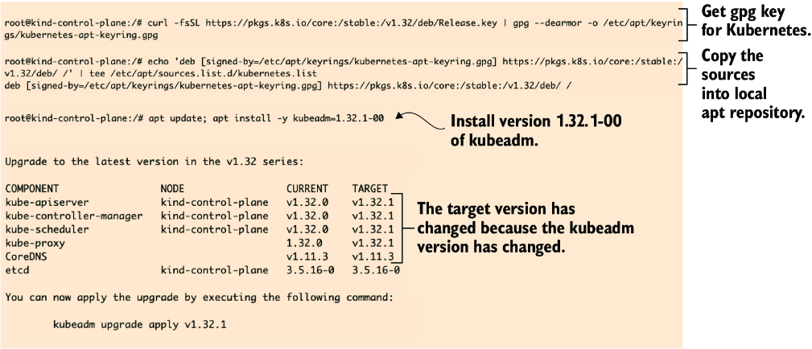

> [!TIP]
> By the time you read this, newer versions of Kubernetes will be available, and you will need to update these commands accordingly, but the logic will be the same.

---

### 2.1.2 The Control Plane

The control plane and worker nodes have different responsibilities:

| Node Type | Responsibility |
|-----------|---------------|
| **Worker Nodes** | Carry the application workload and run pods containing application containers |
| **Control Plane** | Runs system pods with the control plane components |

The `kube-apiserver`, `kube-controller-manager`, `kube-scheduler`, and `etcd` all run as system pods on the control plane node. These system pods are essential to the core of Kubernetes.

View system pods on the control plane:
```bash
kubectl get po -o wide -A --field-selector spec.nodeName=kind-control-plane
```

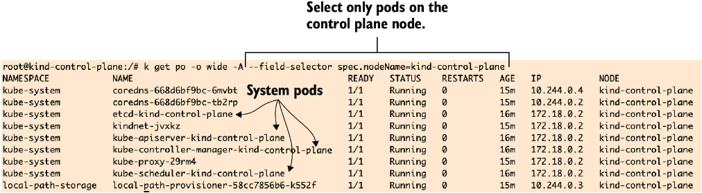

> [!NOTE]
> **CoreDNS** is also a pod that runs on the control plane node, but it's considered a plugin, not a core system pod. The **kube-proxy** pod runs on all nodes, regardless of whether it's a control plane or worker node.

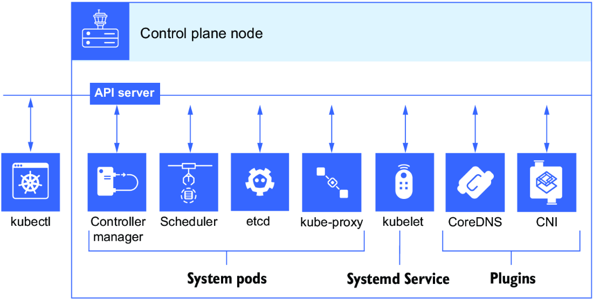

#### Core Component Roles

| Component | Role |
|-----------|------|
| **Controller Manager** | Maintains cluster operations, ensuring Deployments run the correct number of replicas |
| **Scheduler** | Detects available resources on a node to place a pod on that node |
| **API Server** | Exposes the API interface; communication hub for all components |
| **etcd** | Datastore for storing cluster configuration data |

---

### 2.1.3 Taints and Tolerations

By default, application pods will not run on the control plane node because it is protecting the system pods. The control plane has a special attribute called a **taint**.

- **Taint**: Repels work, disabling scheduling to that node
- **Toleration**: A specification in the pod YAML that allows scheduling despite a taint

View the taint on your control plane node:
```bash
kubectl describe node kind-control-plane | grep Taints
```

**Output:**
```
Taints:             node-role.kubernetes.io/control-plane:NoSchedule
```

> [!NOTE]
> The taint will not be shown on a single-node cluster created with kind (where the node acts as both control plane and worker).

#### Taint Structure

A taint has three parts:
1. **Key** - The identifier (e.g., `node-role.kubernetes.io`)
2. **Value** - Optional qualifier (e.g., `special-user`)
3. **Effect** - The action (`NoSchedule`, `NoExecute`, etc.)

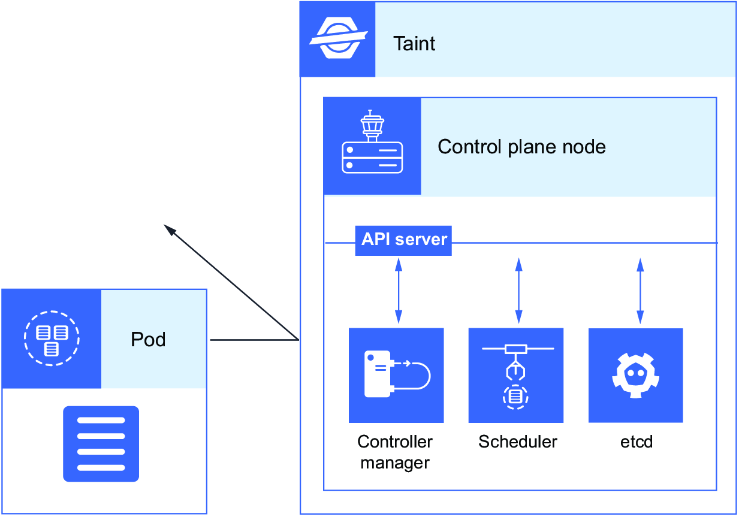

#### Applying a Taint

Apply a taint to a worker node:
```bash
kubectl taint node kind-worker dedicated=special-user:NoSchedule
```

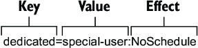

#### Understanding Tolerations

A **toleration** does not mean you are selecting that particular node; it just means the scheduler *may* choose to schedule the pod there if conditions are right.

View tolerations in the CoreDNS pod:
```bash
kubectl get pod coredns-668d6bf9c-6mvbt -o yaml -n kube-system | grep tolerations -A14
```

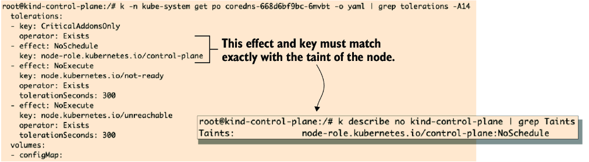

#### Toleration Matching Rules

| Operator | Matching Rule |
|----------|---------------|
| **Equal** (default) | Key, effect, and value must all match exactly |
| **Exists** | Key and effect must match; no value should be specified |

- **tolerationSeconds**: Optional parameter specifying how long the pod stays bound after a taint is added

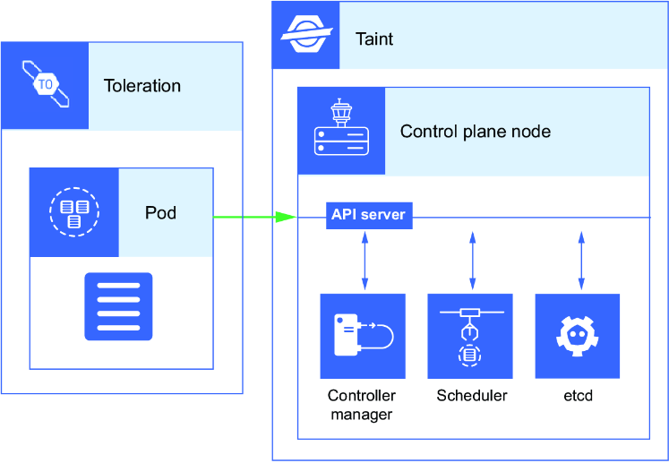

#### Creating a Pod with Toleration

**Step 1: Generate pod template**
```bash
kubectl run pod-tolerate --image=nginx --dry-run=client -o yaml > pod-tolerate.yaml
```

**Step 2: View the generated YAML**
```yaml
apiVersion: v1
kind: Pod
metadata:
  creationTimestamp: null
  labels:
    run: pod-tolerate
  name: pod-tolerate
spec:
  containers:
  - image: nginx
    name: pod-tolerate
    resources: {}
  dnsPolicy: ClusterFirst
  restartPolicy: Always
status: {}
```

> [!TIP]
> The `--dry-run=client` flag is a valuable resource during the exam because you can pre-create the skeleton of objects, which is much easier than typing out the file from scratch.

**Step 3: Add tolerations to the YAML**

Edit `pod-tolerate.yaml` to add tolerations matching the taint:

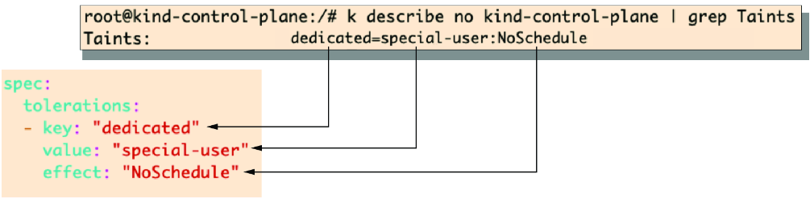

**Step 4: Create the pod**
```bash
kubectl create -f pod-tolerate.yaml

kubectl get pods -o wide
```

**Output:**
```
NAME           READY   STATUS    RESTARTS   AGE   IP           NODE          NOMINATED NODE   READINESS GATES
pod-tolerate   1/1     Running   0          6s    10.244.2.6   kind-worker   <none>           <none>
```

> [!TIP]
> If you're having trouble, try: `kubectl apply -f https://raw.githubusercontent.com/chadmcrowell/k8s/main/manifests/pod-tolerate.yaml`

#### Node Selectors and Labels

**Node selectors** allow you to select a node based on its label. **Node name** allows you to select a single node by its hostname.

View labels on nodes and pods:
```bash
# Node labels
kubectl get no --show-labels

# Pod labels in kube-system
kubectl get po -n kube-system --show-labels
```

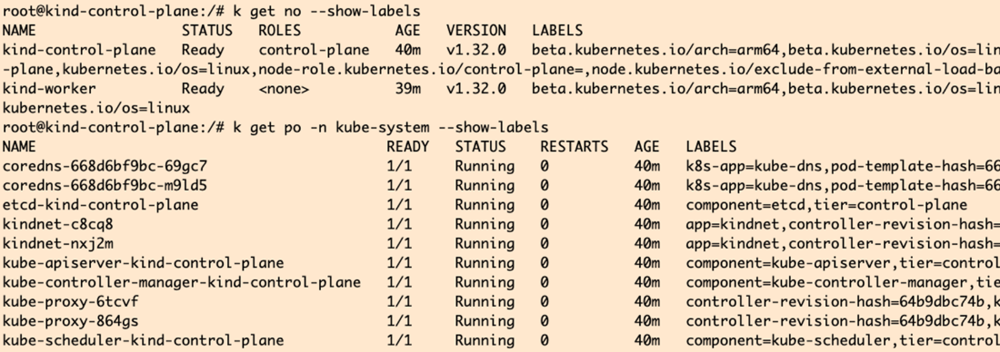

---

### 2.1.4 Nodes in kind

kind creates a cluster's Kubernetes node inside a Docker container. The container exists inside the pod, which is inside the node; with kind, it's a container made up of a Kubernetes cluster in Docker.

Kind achieves this using Linux primitives:
- **cgroups**
- **namespaces**

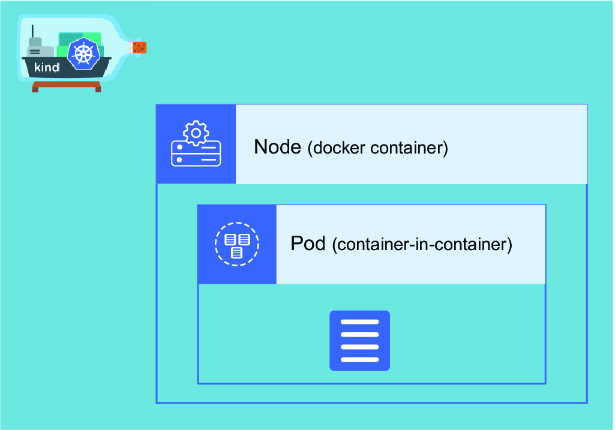

#### Viewing Docker Containers

```bash
docker container ls
```

**Output:**
```
CONTAINER ID   IMAGE                  COMMAND      CREATED       STATUS        PORTS                       NAMES
c23f3ab00ba3   kindest/node:v1.31.0   "/usr/lo…"   4 days ago    Up 25 hours   127.0.0.1:59546->6443/tcp   kind-control-plane
```

#### Kubernetes Resource Abbreviations

| Resource | Abbreviation | Example |
|----------|--------------|---------|
| Namespace | `ns` | `kubectl get ns` |
| Pod | `po` | `kubectl get po` |
| Deployment | `deploy` | `kubectl get deploy` |
| ReplicaSet | `rs` | `kubectl get rs` |
| Service | `svc` | `kubectl get svc` |
| Service Account | `sa` | `kubectl get sa` |
| ConfigMap | `cm` | `kubectl get cm` |
| DaemonSet | `ds` | `kubectl get ds` |
| Persistent Volume | `pv` | `kubectl get pv` |
| Persistent Volume Claim | `pvc` | `kubectl get pvc` |
| Storage Class | `sc` | `kubectl get sc` |
| Network Policy | `netpol` | `kubectl get netpol` |
| Ingress | `ing` | `kubectl get ing` |
| Endpoints | `ep` | `kubectl get ep` |

#### Viewing Node Details

```bash
kubectl get no -o wide
```

**Output:**
```
NAME                 STATUS   ROLES           AGE   VERSION   INTERNAL-IP   EXTERNAL-IP   OS-IMAGE                         KERNEL-VERSION    CONTAINER-RUNTIME
kind-control-plane   Ready    control-plane   35s   v1.31.0   172.18.0.2    <none>        Debian GNU/Linux 12 (bookworm)   6.6.12-linuxkit   containerd://1.7.18
```

#### Using crictl

Get a shell inside the container and use `crictl` to list containers:

```bash
docker exec -it kind-control-plane bash
crictl ps
```

**Output:**
```
CONTAINER           IMAGE               CREATED             STATE         NAME                      ATTEMPT             POD ID
1fec85d809fc4       e422121c9c5f9       26 hours ago        Running       local-path-provisioner    2                   6be3b31e9b9eb
1b8372af65cf2       296a6d5035e2d       26 hours ago        Running       coredns                   1                   0821c481585d6
...
a67abd31ab1ae       94ffe308aeff9       26 hours ago        Running       kube-apiserver            1                   1865042cc7955
```

#### Worker Node Components

Worker nodes contain:
- **kubelet**
- **kube-proxy**
- **Container runtime**

View pods on worker nodes:
```bash
kubectl get po -o wide -A | grep worker
```

**Output:**
```
kube-system   kindnet-fs6jt     1/1   Running   0   22h   172.18.0.2   kind-worker
kube-system   kube-proxy-szr7n  1/1   Running   0   22h   172.18.0.2   kind-worker
```

#### Checking kubelet Status

Since kubelet is a systemd service, get a shell into the worker node:

```bash
docker exec -it kind-worker bash
systemctl status kubelet
```

**Output:**
```
● kubelet.service - kubelet: The Kubernetes Node Agent
     Loaded: loaded (/etc/systemd/system/kubelet.service; enabled; preset: enabled)
     Active: active (running) since Wed 2025-01-01 23:49:37 UTC; 1min 6s ago
```

#### Testing kubelet Failure

```bash
# Stop kubelet
root@kind-worker:~# systemctl stop kubelet
root@kind-worker:~# exit

# Check node status
$ kubectl get no
NAME                 STATUS     ROLES           AGE     VERSION
kind-control-plane   Ready      control-plane   5h27m   v1.31.0
kind-worker          NotReady   <none>          5h27m   v1.31.0
kind-worker2         Ready      <none>          5h27m   v1.31.0
```

> [!NOTE]
> It may take a few seconds for the message to get back to the API server that the kubelet service is not running.

To restart kubelet:
```bash
docker exec -it kind-worker bash
systemctl start kubelet
```

---

### Practice Exercises

1. Increase your efficiency when running kubectl commands by shortening kubectl and creating a shell alias to `k`.
2. Using the kubectl CLI tool, get the output of the pods running in the kube-system namespace, and show the pod IP addresses. Save the output to a file named `pod-ip-output.txt`.
3. Upgrade the control plane components using kubeadm. When completed, check that everything, including kubelet and kubectl, is upgraded to version 1.32.1 (or the latest distribution).

---

## 2.2 Cluster State

In Kubernetes, **etcd** contains all of our cluster configuration data:
- Information about how many pods or Deployments are running
- Historical information
- Which ports are exposed on which services

> [!CAUTION]
> We're not talking about the data associated with your application. We're talking about the **configuration of the Kubernetes cluster itself**.

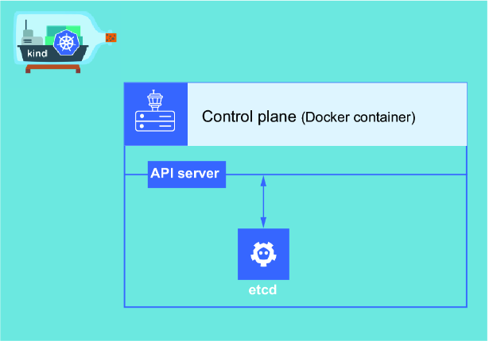

### etcd Security

etcd requires its own server certificate to ensure:
- **Secure communication**
- **Authentication**
- **Integrity of data** between the Kubernetes control plane and etcd

This secure communication via TLS encryption ensures protection from potential man-in-the-middle attacks, keeping data such as Secrets, ConfigMaps, and PersistentVolumeClaims protected.

#### etcd Configuration in kube-apiserver

On the control plane, in the `kube-apiserver.yaml` file in `/etc/kubernetes/manifests`:

```yaml
spec:
  containers:
  - command:
    - kube-apiserver
    - --etcd-cafile=/etc/kubernetes/pki/etcd/ca.crt
    - --etcd-certfile=/etc/kubernetes/pki/apiserver-etcd-client.crt
    - --etcd-keyfile=/etc/kubernetes/pki/apiserver-etcd-client.key
    - --etcd-servers=https://127.0.0.1:2379
```

---

### 2.2.1 Client and Server Certificates

PKI is the client–server model that Kubernetes imposes. It authenticates any requests that come into the API using a certificate file.

> [!IMPORTANT]
> You won't have to create or manage these certificates, but it's good to know where they reside on the control plane for the CKA exam.

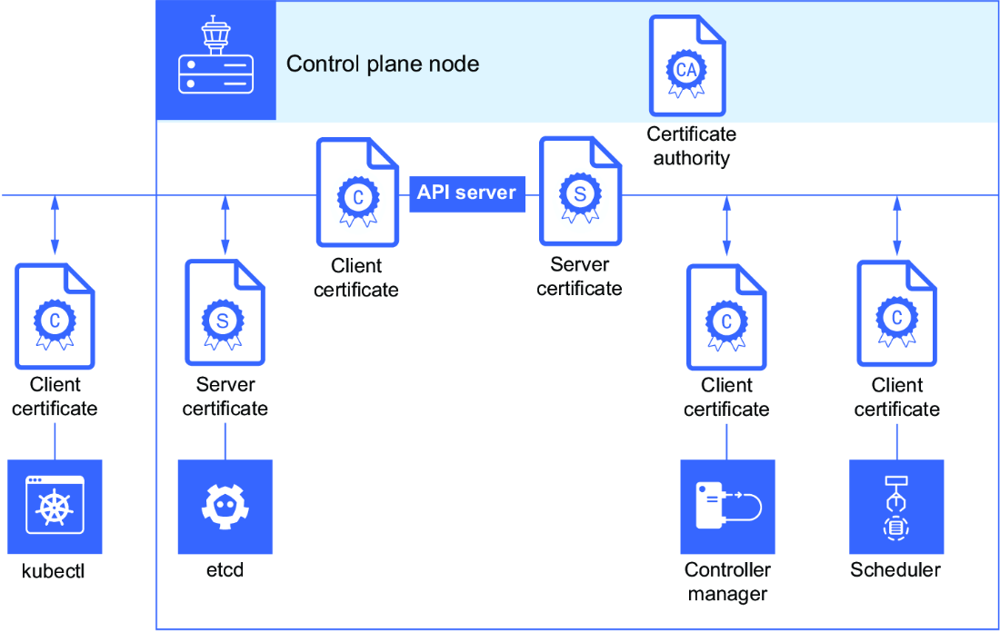

#### Listing Kubernetes Configuration Files

```bash
ls /etc/kubernetes
```

**Output:**
```
admin.conf  controller-manager.conf  kubelet.conf  manifests  pki  scheduler.conf
```

> [!NOTE]
> You'll need a shell to the kind-control-plane: `docker exec -it kind-control-plane bash`

#### Viewing kubelet.conf

```bash
cat /etc/kubernetes/kubelet.conf
```

**Output:**
```yaml
apiVersion: v1
clusters:
- cluster:
    certificate-authority-data: LS0tLS1CRUdJTiBDRVJUSUZJQ0FURS0tLS0t...
    server: https://kind-control-plane:6443
  name: kind
contexts:
- context:
    cluster: kind
    user: system:node:kind-control-plane
  name: system:node:kind-control-plane@kind
current-context: system:node:kind-control-plane@kind
kind: Config
preferences: {}
users:
- name: system:node:kind-control-plane
  user:
    client-certificate: /var/lib/kubelet/pki/kubelet-client-current.pem
    client-key: /var/lib/kubelet/pki/kubelet-client-current.pem
```

The user is the system user and the client certificate is located at `/var/lib/kubelet/pki/kubelet-client-current.pem`.

#### PKI Directory Contents

```bash
ls /etc/kubernetes/pki
```

**Output:**
```
apiserver-etcd-client.crt  apiserver-kubelet-client.crt  apiserver.crt  ca.crt  etcd                front-proxy-ca.key      front-proxy-client.key  sa.pub
apiserver-etcd-client.key  apiserver-kubelet-client.key  apiserver.key  ca.key  front-proxy-ca.crt  front-proxy-client.crt  sa.key
```

#### Certificate Summary

| Certificate | Type | Purpose |
|-------------|------|---------|
| `apiserver.crt` | Server | Server certificate for the API server |
| `apiserver-etcd-client.crt` | Client | API server authenticating to etcd |
| `apiserver-kubelet-client.crt` | Client | API server authenticating to kubelet |
| `/etc/kubernetes/pki/etcd/server.crt` | Server | etcd server certificate |

---

### Practice Exercises

4. List the files in the PKI directory. Output the results to a file named `certificates.txt`.
5. Use the Linux standard CLI tool to view the client certificate that the kubelet uses to authenticate to the Kubernetes API. Output the results to a file named `kubelet-cert.txt`.

---

## 2.3 Extension Interfaces

Kubernetes provides extension interfaces that allow administrators to customize and extend its functionality without modifying the core codebase. This enables:
- Third-party developers to introduce new capabilities
- Organizations to adapt Kubernetes to their specific needs
- Kubernetes to remain highly modular and customizable

### Four Key Interfaces for the CKA Exam

| Interface | Full Name | Purpose |
|-----------|-----------|---------|
| **CRI** | Container Runtime Interface | Standardizes how kubelet communicates with container runtimes |
| **CNI** | Container Network Interface | Configures pod networking |
| **CSI** | Container Storage Interface | Standardizes storage provider integration |
| **CRD** | Custom Resource Definitions | Extends Kubernetes with custom resources (covered in Chapter 5) |

---

### 2.3.1 Container Runtime Interface

The **CRI** defines how the kubelet talks to the container runtime (e.g., starting and stopping containers, pulling images, etc.).

#### History

- Previously, Kubernetes relied solely on Docker
- This created unnecessary dependency on one tool
- CRI was created to simplify the logic and make it a standard for every vendor

#### Using crictl

For the CKA exam, you will need to know how to use `crictl` because Kubernetes no longer uses Docker as a default container runtime.

**Key crictl commands:**

| Command | Purpose |
|---------|---------|
| `crictl ps` | List running containers |
| `crictl ps -a` | List all containers (including stopped) |
| `crictl inspect <container_id>` | Get container state (useful for CrashLoopBackOff troubleshooting) |
| `crictl logs <container_id>` | View container logs |

```bash
root@kind-control-plane:/# crictl ps | awk '{print $1}'
CONTAINER
8d54e1f2032c4
61778f0404b76
28249f397ab90
...
```

> [!NOTE]
> `crictl` is used directly on the node you're troubleshooting, so you won't see containers running on other nodes in the cluster.

---

### 2.3.2 Container Network Interface

The **CNI** is a specification and library for configuring network interfaces in Linux containers. It defines how pod networking is set up and managed.

#### Why CNI?

- Kubernetes needed a flexible way to handle cluster networking across various environments
- Different projects implement different networking models:
  - **Calico**
  - **Flannel**
  - **Cilium**

> [!IMPORTANT]
> For the CKA exam, the two CNI projects you should be concerned about are **Flannel** and **Calico**.

#### Checking CNI Plugin

```bash
kubectl get pods -n kube-system
```

**Output:**
```
NAME                                      READY   STATUS    RESTARTS      AGE
calico-kube-controllers-fdf5f5495-7lzbl   1/1     Running   2 (43m ago)   9d
canal-vmgsc                               2/2     Running   2 (43m ago)   9d
canal-xntjt                               2/2     Running   2 (43m ago)   9d
coredns-7695687499-27bvx                  1/1     Running   1 (43m ago)   9d
...
```

For the CKA exam, you should know how to:
- Install the CNI
- Replace and troubleshoot CNI-related issues

#### CNI Operation

When Kubernetes schedules a new pod:
1. The container runtime calls the CNI plugin
2. The plugin configures the network interface
3. Sets up IP addresses and routes
4. Handles additional tasks such as implementing network policies
5. When a pod is removed, the plugin tears down those resources

#### Viewing kindnet CNI

```bash
kubectl -n kube-system get ds kindnet
```

**Output:**
```
NAME      DESIRED   CURRENT   READY   UP-TO-DATE   AVAILABLE   NODE SELECTOR            AGE
kindnet   1         1         1       1            1           kubernetes.io/os=linux   41m
```

#### CNI Configuration

View configuration in `/etc/cni/net.d/10-kindnet.conflist`:

```json
{
    "cniVersion": "0.3.1",
    "name": "kindnet",
    "plugins": [
    {
        "type": "ptp",
        "ipMasq": false,
        "ipam": {
            "type": "host-local",
            "dataDir": "/run/cni-ipam-state",
            "routes": [
                { "dst": "0.0.0.0/0" }
            ],
            "ranges": [
                [ { "subnet": "10.244.0.0/24" } ]
            ]
        },
        "mtu": 65535
    },
    {
        "type": "portmap",
        "capabilities": {
            "portMappings": true
        }
    }
    ]
}
```

> [!TIP]
> Appendix C provides instructions for installing the Flannel CNI.

---

### 2.3.3 Container Storage Interface

The **CSI** standardizes how storage providers integrate with container orchestrators like Kubernetes.

#### History

- Earlier Kubernetes releases had storage plugins **in-tree** (compiled into Kubernetes itself)
- This was cumbersome and slowed innovation
- CSI creates an **out-of-tree** plugin model

#### CSI Benefits

| Aspect | Benefit |
|--------|---------|
| **Vendor-neutral** | Storage solutions from different providers plug in the same way |
| **Operations** | Handles volume operations: attach, mount, format, snapshot, etc. |
| **Providers** | Works with AWS, GCP, Azure, on-prem systems, etc. |

#### CSI Commands

```bash
# List installed CSI drivers
kubectl get csidrivers

# List available StorageClasses
kubectl get storageclasses
```

> [!NOTE]
> For the CKA exam, you may not need to install a CSI driver from scratch; however, you must know how to work with StorageClasses, PersistentVolumes, and PersistentVolumeClaims.

---

### Practice Exercises

6. View the CRI implementation using the crictl command-line tool. Determine the container runtime in use.
7. Use the crictl command-line tool to list the running containers. Stop and remove the kube-apiserver container by its container ID, and see what happens.
8. Use the kubectl command-line tool to determine what CNI is installed with the cluster. Also determine what version the CNI is currently running.
9. Use the kubectl command-line tool to list the CSI drivers in your Kubernetes cluster as well as the CSI StorageClasses.

---

## Summary

- The **bootstrapping process** hides the complexity of creating a Kubernetes cluster, such as the PKI and etcd creation, generating kubeconfigs and more.

- The **kubeconfig** is created for us by kubeadm in the bootstrap process and is how we authenticate with the API using kubectl. This file is located in the `~/.kube/config` directory.

- **Services** are Kubernetes objects providing load balancing to one or more pods based on pod labels. Services have their own unique IP address and DNS name.

- The **client and server certificates** in `/var/lib/kubelet/pki` and `/etc/kubernetes/pki` allow the control plane and worker nodes to authenticate to the API. Multiple Kubernetes components can have both client and server certificates.

- **etcd** is a key–value datastore that contains the cluster configuration, including how many objects exist.

- The directory `/etc/kubernetes/manifests` contains YAML files for the API server, controller manager, scheduler, and etcd. Whatever is in this directory, kubelet will pick up and create automatically.

- In a **multinode cluster**, the worker node runs kubelet, kube-proxy, and the container runtime, whereas the control plane also runs the kubelet, controller manager, scheduler, and etcd. A taint is applied to prevent application pods from running on the control plane.

- To standardize on pluggable extensions in Kubernetes, the **CRI, CNI, and CSI** were created.

- The main benefit of the **CNI** is that it is a standard framework for configuring network connectivity between containers, enabling flexible, pluggable networking solutions.

- The main advantage of **CRI** is that it allows seamless integration of different container runtimes, enabling flexibility and standardization.

- The **CSI** enables seamless storage integration with third-party storage solutions, working the same way regardless of the storage backend.
