# 3. Identity and Access Management

## This chapter covers
- The basics of role-based access control
- Creating roles and role bindings
- Using certificates to create users and groups
- Creating Service Accounts with roles
- Mounting Service Accounts to pods

In this chapter, we'll focus on **role-based access control (RBAC)**, which is within the Cluster Architecture, Installation, and Configuration section of the exam curriculum. Now that you know how the Kubernetes API works, it's essential to understand how to authenticate and authorize a user and a Service Account for the exam.

---

## The Cluster Architecture, Installation, and Configuration Domain

This chapter covers part of the **Cluster Architecture, Installation, and Configuration** domain of the CKA curriculum. This domain includes a Kubernetes cluster and the ways in which we configure different aspects of the cluster.

| Competency | Chapter Section |
|------------|-----------------|
| RBAC | 3.1, 3.2, 3.3 |

---

## 3.1 Role-Based Access Control

To access the resources within a Kubernetes cluster, you must first be **authenticated**. We use the `kubectl` tool to interface with the Kubernetes API, and we're allowed to do this because we have a client certificate to authenticate with.

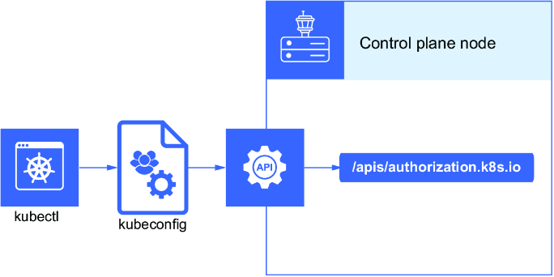

This is called **RBAC** because, based on our role in Kubernetes, we were able to list the running pods in the kube-system namespace.

### Authentication Methods

Kubernetes supports multiple authentication methods:

| Method | Description | Use Case |
|--------|-------------|----------|
| **X.509 Certificate** | API server verifies identity based on a signed client certificate | User authentication |
| **Bearer Tokens** | Token-based authentication | Various |
| **Service Account Tokens** | Kubernetes-managed tokens for pods | Pod authentication |
| **OpenID Connect** | External identity provider integration | Enterprise SSO |

For the CKA exam, it's essential to understand:
- **X.509 certificate authentication** (for user authentication)
- **Service Account tokens** (for pod authentication with the API)

### Request Flow

When a request is made to the Kubernetes API:
1. The API server attempts authentication using configured mechanisms
2. Only one method needs to succeed for authentication to pass
3. Requests from humans (kubectl) are authenticated using client certificates
4. Machine-to-machine requests (pods) are authenticated using Service Accounts

View the default Service Account:
```bash
$ kubectl get sa
NAME      SECRETS   AGE
default   1         3d9h
```

Service accounts are often associated with pods running in the cluster, allowing applications to access the Kubernetes API.

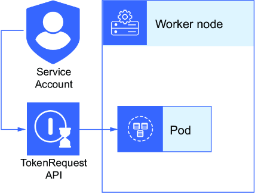

### Authorization Mechanisms

After authentication, the request is passed to the authorization mechanism. RBAC is the most popular:

| Authorization Mode | Description |
|-------------------|-------------|
| **RBAC** | Role-based access control (focus for CKA) |
| **Node** | Node authorization plugin |
| **AlwaysAllow** | Default when none is specified |
| **AlwaysDeny** | Deny all requests |
| **ABAC** | Attribute-based access control |
| **WebHook** | External authorization |

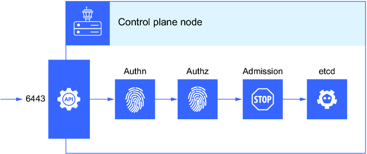

RBAC prevents unauthorized users from viewing or modifying the cluster state through the **principle of least privilege**.

> [!IMPORTANT]
> The principle of least privilege means granting subjects (users, groups, or Service Accounts) only the minimum permissions they need to perform their tasks.

### Viewing Authorization Mode

The authorization mode in kind is set to RBAC and Node authorization. View it in `/etc/kubernetes/manifests`:

```bash
root@kind-control-plane:/# cat /etc/kubernetes/manifests/kube-apiserver.yaml | more
apiVersion: v1
kind: Pod
metadata:
  annotations:
    kubeadm.kubernetes.io/kube-apiserver.advertise-address.endpoint: 172.18.0.4:6443
  creationTimestamp: null
  labels:
    component: kube-apiserver
    tier: control-plane
  name: kube-apiserver
  namespace: kube-system
spec:
  containers:
  - command:
    - kube-apiserver
    - --advertise-address=172.18.0.4
    - --allow-privileged=true
    - --authorization-mode=Node,RBAC
    - --client-ca-file=/etc/kubernetes/pki/ca.crt
    - --enable-admission-plugins=NodeRestriction
    - --enable-bootstrap-token-auth=true
    - --etcd-cafile=/etc/kubernetes/pki/etcd/ca.crt
    - --etcd-certfile=/etc/kubernetes/pki/apiserver-etcd-client.crt
    - --etcd-keyfile=/etc/kubernetes/pki/apiserver-etcd-client.key
    - --etcd-servers=https://127.0.0.1:2379
    ...
```

> [!TIP]
> Remember the manifests for control plane components are in the `/etc/kubernetes/manifests` directory. On the exam, you can simply type `ssh control-plane-node` to get a shell to the control plane node.

---

### 3.1.1 Roles and Role Bindings

RBAC determines what actions are permitted using four different types of objects:

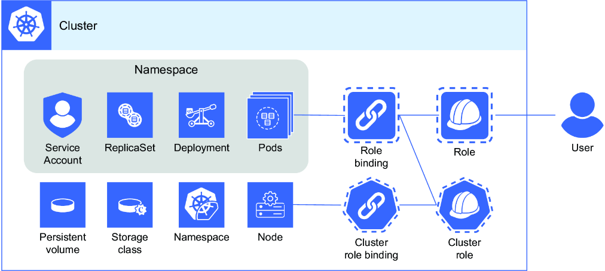

| Object | Scope | Use Case |
|--------|-------|----------|
| **Role** | Namespace | Define permissions for namespaced resources |
| **ClusterRole** | Cluster-wide | Define permissions for cluster resources |
| **RoleBinding** | Namespace | Bind roles to users/groups/Service Accounts |
| **ClusterRoleBinding** | Cluster-wide | Bind cluster roles cluster-wide |

> [!NOTE]
> **Application developers** will commonly be assigned roles (namespaced resources). **Cluster administrators** will commonly be assigned cluster roles (cluster-wide operations).

### Understanding Verbs

Verbs represent operations on resources and map to Kubernetes API operations:

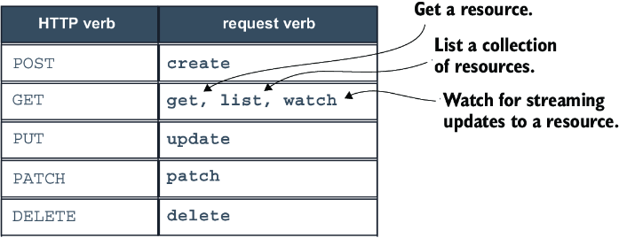

| Verb | Action |
|------|--------|
| `get` | Retrieve a resource |
| `list` | List resources |
| `watch` | Watch for changes |
| `create` | Create a resource |
| `update` | Update a resource |
| `patch` | Partially update a resource |
| `delete` | Delete a resource |

### Creating Roles

**Create a role imperatively:**
```bash
kubectl create role pod-reader --verb=get,list,watch --resource=pods
```

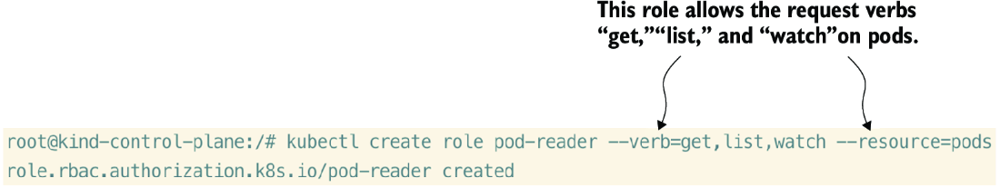

**View the role YAML:**
```bash
kubectl get role pod-reader -o yaml
```

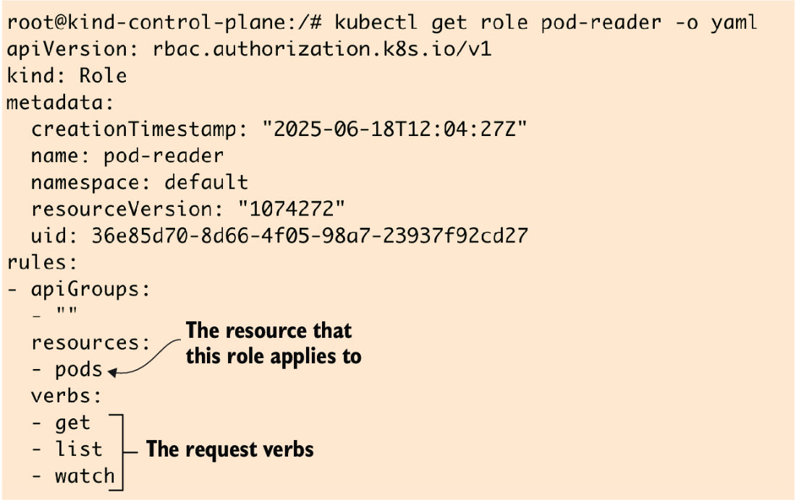

**Create role with dry-run (save to file):**
```bash
kubectl create role pod-reader --verb=get,list,watch --resource=pods --dry-run=client -o yaml > role.yaml
```

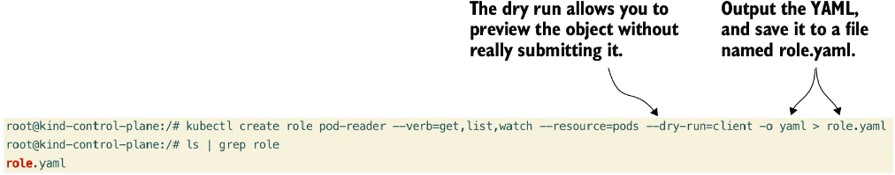

### API Groups

Remember how Kubernetes API resources have different paths:

| Resource | API Path | API Group |
|----------|----------|-----------|
| Pods | `/api/v1/pods` | Core (`""`) |
| Deployments | `/apis/apps/v1/deployments` | `apps` |

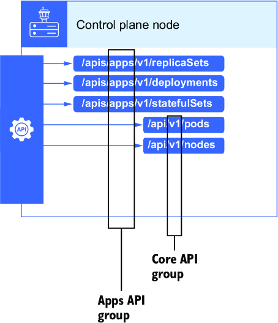

### Creating Role Bindings

Role bindings attach (bind) a role to a user, group, or Service Account:

```bash
kubectl create rolebinding pod-reader-binding --role=pod-reader --user=carol
```

**View the role binding YAML:**
```yaml
apiVersion: rbac.authorization.k8s.io/v1
kind: RoleBinding
metadata:
  creationTimestamp: "2022-03-29T04:22:35Z"
  name: pod-reader-binding
  namespace: default
  resourceVersion: "566785"
  uid: 9f7d1036-9123-4288-94cf-ef527aa090d0
roleRef:
  apiGroup: rbac.authorization.k8s.io
  kind: Role
  name: pod-reader
subjects:
- apiGroup: rbac.authorization.k8s.io
  kind: User
  name: carol
```

### Verifying Authorization with kubectl auth can-i

A useful tool to verify whether users can perform certain actions:

```bash
$ kubectl auth can-i -h
Check whether an action is allowed.

Examples:
  # Check to see if I can create pods in any namespace
  kubectl auth can-i create pods --all-namespaces

  # Check to see if I can list deployments in my current namespace
  kubectl auth can-i list deployments.apps

  # Check to see if I can do everything in my current namespace ("*" means all)
  kubectl auth can-i '*' '*'

  # Check to see if I can get the job named "bar" in namespace "foo"
  kubectl auth can-i list jobs.batch/bar -n foo

  # Check to see if I can read pod logs
  kubectl auth can-i get pods --subresource=log

  # List all allowed actions in namespace "foo"
  kubectl auth can-i --list --namespace=foo
```

**Test authorization as a specific user:**
```bash
$ kubectl auth can-i get pods -n default --as carol
yes
$ kubectl auth can-i delete pods -n default --as carol
no
```

> [!TIP]
> Use `kubectl auth can-i` on the exam to verify task completion and save time. The `--as` parameter allows impersonation, and `--list` shows all permissions.

### Cluster Roles and Cluster Role Bindings

Created the same way as roles and role bindings:
```bash
kubectl create clusterrole <name> --verb=<verbs> --resource=<resources>
kubectl create clusterrolebinding <name> --clusterrole=<role> --user=<user>
```

> [!TIP]
> Use the `-h` flag to get examples for commands (e.g., `kubectl create clusterrole -h`).

### Role Binding Combinations

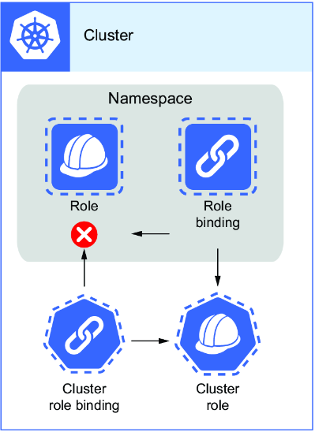

| Binding Type | Can Bind To |
|--------------|-------------|
| RoleBinding | Role ✓, ClusterRole ✓ |
| ClusterRoleBinding | ClusterRole ✓, Role ✗ |

> [!WARNING]
> Permissions via cluster roles will affect all namespaces—both current and future. Follow the principle of least privilege carefully.

---

### 3.1.2 System Roles and Groups

The API server creates a set of default cluster roles and cluster role bindings:

```bash
root@kind-control-plane:/# kubectl get clusterrole | grep -v system
NAME                               CREATED AT
admin                              2025-03-25T17:44:03Z
cluster-admin                      2025-03-25T17:44:03Z
edit                               2025-03-25T17:44:03Z
kindnet                            2025-03-25T17:44:08Z
kubeadm:get-nodes                  2025-03-25T17:44:05Z
local-path-provisioner-role        2025-03-25T17:44:09Z
view                               2025-03-25T17:44:09Z
```

#### Default Cluster Roles

| Role | Description |
|------|-------------|
| **cluster-admin** | Equivalent to Linux "root"; full access to everything |
| **admin** | Read/write access for all objects except quotas, clusterroles, clusterrolebindings, endpoints, and namespace |
| **edit** | Cannot modify roles/bindings but can access Secrets and run pods with any Service Account |
| **view** | View most namespaced objects except Secrets |

> [!TIP]
> Kubernetes allows binding a cluster role to multiple users/groups/Service Accounts via role or cluster role binding. On the exam, it may save time to bind to an existing role (e.g., `view`).

#### Built-in Groups

Built-in groups are managed by the API server and cannot be modified:

| Group | Purpose |
|-------|---------|
| `system:authenticated` | Privileges for successfully authenticated users |
| `system:unauthenticated` | Used when no authentication plugin validates the request |
| `kubeadm:cluster-admins` (or `system:masters`) | Super users with unfettered access |

**View your permissions:**
```bash
root@kind-control-plane:/# kubectl auth can-i --list
Resources                                       Non-Resource      Verbs
*.*                                             []                [*]
                                                [*]               [*]
selfsubjectreviews.authentication.k8s.io        []                [create]
selfsubjectaccessreviews.authorization.k8s.io   []                [create]
selfsubjectrulesreviews.authorization.k8s.io    []                [create]
                                                [/api/*]          [get]
                                                [/api]            [get]
                                                [/apis/*]         [get]
                                                [/apis]           [get]
```

> [!TIP]
> If stuck on cluster role format, save output to file: `kubectl create clusterrole pod-reader --verb get,list,watch --resource pods --dry-run=client -o yaml > pod-reader.yaml`

---

### Practice Exercises

1. Create a new role named `sa-creator` that will allow creating Service Accounts.
2. Create a role binding that is associated with the previous `sa-creator` role named `sa-creator-binding` that will bind to the user Sandra.

---

## 3.2 Users and Groups

Let's create a new user that follows the **principle of least privilege**. We'll create the kubeconfig that Carol can use to access the cluster.

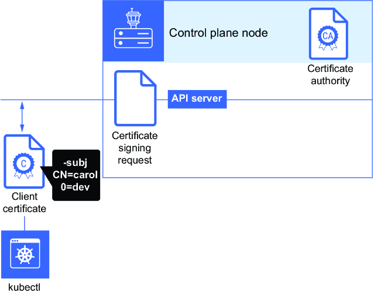

Since users and groups are arbitrary notations on a certificate and not managed by Kubernetes, we start by creating a **certificate signing request**.

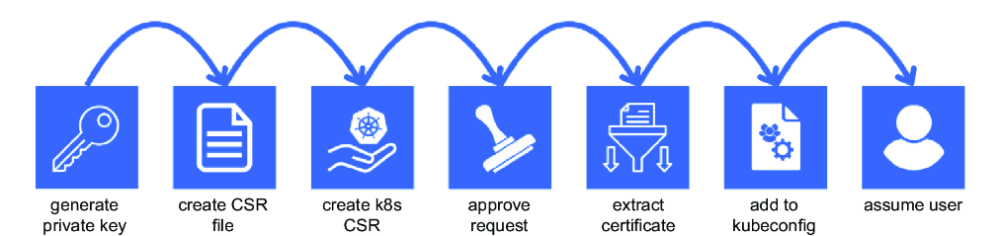

### Step 1: Generate Private Key

```bash
root@kind-control-plane:/# openssl genrsa -out carol.key 2048
```

### Step 2: Create Certificate Signing Request

Specify user in **CN** (Common Name) and group in **O** (Organization):

```bash
root@kind-control-plane:/# openssl req -new -key carol.key -subj "/CN=carol/O=developers" -out carol.csr
root@kind-control-plane:/# ls | grep carol
carol.csr
carol.key
```

### Step 3: Store CSR in Environment Variable

```bash
export REQUEST=$(cat carol.csr | base64 -w 0)
```

### Step 4: Create CertificateSigningRequest Resource

> [!TIP]
> Since you can have an additional tab open during the exam, utilize the search function in Kubernetes docs (https://kubernetes.io/docs). Hover over links to ensure they stay within the kubernetes.io/docs subdomain.

Create the CSR resource in Kubernetes:

```bash
cat <<EOF | kubectl apply -f -
apiVersion: certificates.k8s.io/v1
kind: CertificateSigningRequest
metadata:
  name: carol
spec:
  groups:
  - developers
  request: $REQUEST
  signerName: kubernetes.io/kube-apiserver-client
  usages:
  - client auth
EOF
```

Or use the pre-made file:
```bash
kubectl apply -f https://raw.githubusercontent.com/chadmcrowell/k8s/main/manifests/csr-carol.yaml
```

### Step 5: View and Approve the CSR

```bash
root@kind-control-plane:/# kubectl get csr
NAME    AGE   SIGNERNAME                            REQUESTOR          CONDITION
carol   4s    kubernetes.io/kube-apiserver-client   kubernetes-admin   Pending
```

**Approve the request:**
```bash
root@kind-control-plane:/# kubectl certificate approve carol
certificatesigningrequest.certificates.k8s.io/carol approved
root@kind-control-plane:/# kubectl get csr
NAME    AGE     SIGNERNAME                            REQUESTOR          CONDITION
carol   2m12s   kubernetes.io/kube-apiserver-client   kubernetes-admin   Approved,Issued
```

### Step 6: Extract the Signed Certificate

```bash
root@kind-control-plane:/# kubectl get csr carol -o jsonpath='{.status.certificate}' | base64 -d > carol.crt
root@kind-control-plane:/# ls | grep carol
carol.crt
carol.csr
carol.key
```

### Step 7: Add Credentials to Kubeconfig

```bash
kubectl config set-credentials carol --client-key=carol.key --client-certificate=carol.crt --embed-certs
```

> [!NOTE]
> If you don't want to embed the certificate and key, leave off `--embed-certs`. This would list the path to the files instead of raw values.

**View the kubeconfig:**
```bash
root@kind-control-plane:/# kubectl config view
apiVersion: v1
clusters:
- cluster:
    certificate-authority-data: DATA+OMITTED
    server: https://kind-control-plane:6443
  name: kind
contexts:
- context:
    cluster: kind
    user: kubernetes-admin
  name: kubernetes-admin@kind
current-context: kubernetes-admin@kind
kind: Config
preferences: {}
users:
- name: carol
  user:
    client-certificate-data: REDACTED
    client-key-data: REDACTED
- name: kubernetes-admin
  user:
    client-certificate-data: REDACTED
    client-key-data: REDACTED
```

### Step 8: Create and Use Context

```bash
root@kind-control-plane:/# kubectl config set-context carol --user=carol --cluster=kind-kind
Context "carol" created.
root@kind-control-plane:/# kubectl config get-contexts
CURRENT   NAME                    CLUSTER   AUTHINFO           NAMESPACE
          carol                   kind      carol
*         kubernetes-admin@kind   kind      kubernetes-admin
```

### Step 9: Test the User

First, create a test pod:
```bash
kubectl run nginx --image nginx
```

Switch to carol's context:
```bash
root@kind-control-plane:/# kubectl config use-context carol
Switched to context "carol".
root@kind-control-plane:/# kubectl get po
NAME    READY   STATUS    RESTARTS   AGE
nginx   1/1     Running   0          13s
root@kind-control-plane:/# kubectl delete po nginx
Error from server (Forbidden): pods "nginx" is forbidden: User "carol" cannot delete resource "pods" in API group "" in the namespace "default"
```

### Binding to Groups Instead of Users

Switch back to admin:
```bash
kubectl config use-context kubernetes-admin@kind
```

Delete old binding and create new one for groups:
```bash
root@kind-control-plane:/# kubectl delete rolebinding pod-reader-binding
rolebinding.rbac.authorization.k8s.io "pod-reader-binding" deleted
root@kind-control-plane:/# kubectl create rolebinding pod-reader-bind --role=pod-reader --group=developers
rolebinding.rbac.authorization.k8s.io/pod-reader-bind created
```

Test with carol's context:
```bash
root@kind-control-plane:/# kubectl config use-context carol
Switched to context "carol".
root@kind-control-plane:/# kubectl get po
NAME    READY   STATUS    RESTARTS   AGE
nginx   1/1     Running   0          8m9s
```

---

### Practice Exercises

3. Create a new user named Sandra, first creating the private key and then the certificate signing request. Then use the CSR resource in Kubernetes to generate the client certificate.
4. Add that new user Sandra to your local kubeconfig using the `kubectl config` command.

---

## 3.3 Service Accounts

Users and groups are great, but what about machines? Pods need to communicate with the Kubernetes API to carry out actions as part of their primary function.

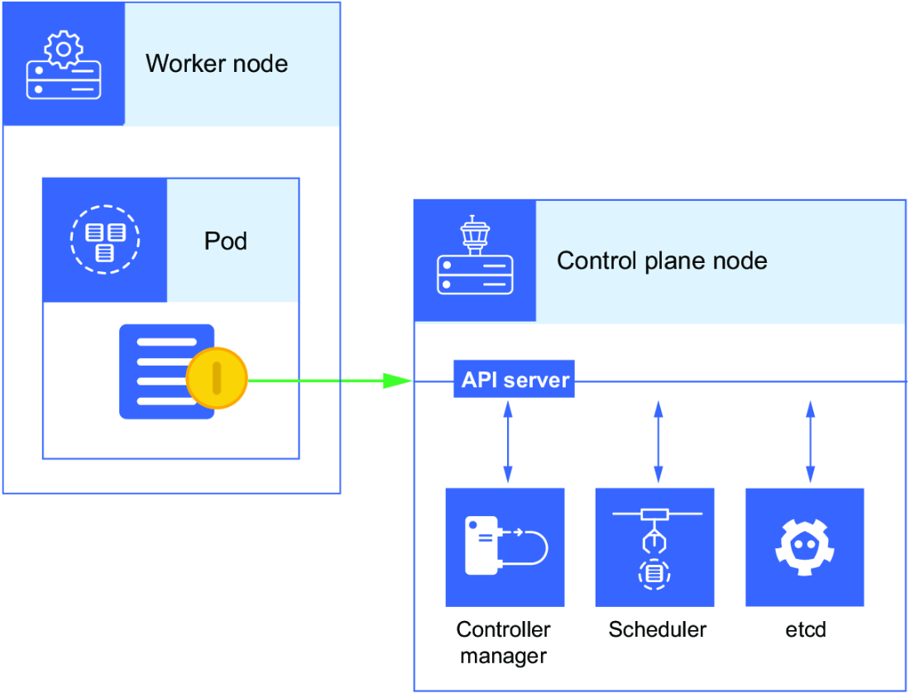

Service accounts are **namespace-scoped resources**. The default Service Account is created automatically when you create a new namespace:

```bash
root@kind-control-plane:/# kubectl create ns web
namespace/web created
root@kind-control-plane:/# kubectl get sa -n web
NAME      SECRETS   AGE
default   0         10s
```

### Automatic Token Mounting

When we create a pod, the default Service Account is automatically mounted so the pod can authenticate to the Kubernetes API:

```bash
root@kind-control-plane:/# kubectl get po nginx -o yaml | grep volumeMounts -A14
    volumeMounts:
    - mountPath: /var/run/secrets/kubernetes.io/serviceaccount
      name: kube-api-access-nhxf2
      readOnly: true
  dnsPolicy: ClusterFirst
  enableServiceLinks: true
  nodeName: kind-worker2
  preemptionPolicy: PreemptLowerPriority
  priority: 0
  restartPolicy: Always
  schedulerName: default-scheduler
  securityContext: {}
  serviceAccount: default
  serviceAccountName: default
  terminationGracePeriodSeconds: 30
```

### Viewing the Token Inside a Pod

```bash
root@kind-control-plane:/# kubectl exec -it nginx -- sh
# cat /var/run/secrets/kubernetes.io/serviceaccount/token
eyJhbGciOiJSUzI1NiIsImtpZCI6IllyN3NCd1JPOHZMbkhFZ3BLQkVBbUloZGx0...
```

### Disabling Automatic Token Mounting

You can disable automatic mounting from:
1. The Service Account itself
2. The pod YAML specification
3. Both

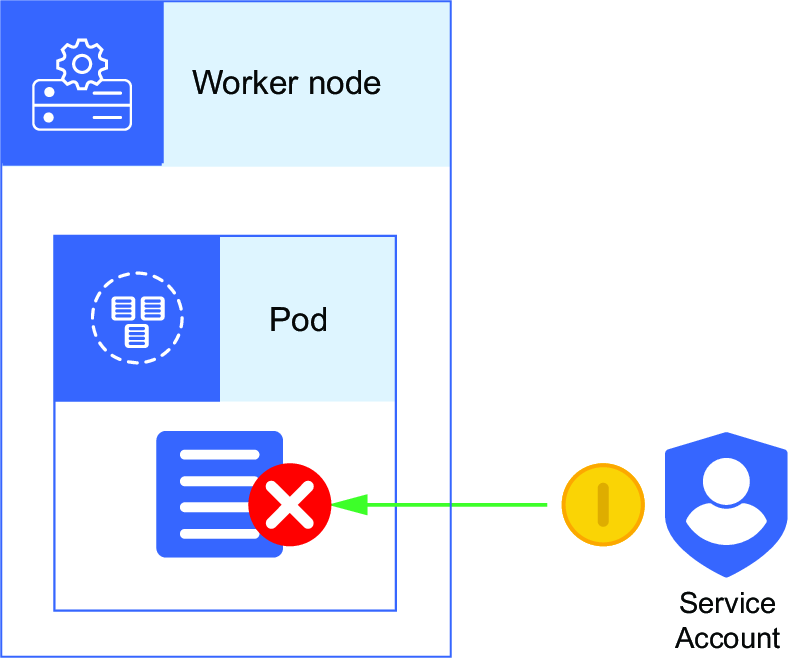

#### Method 1: From Service Account

Create a Service Account that doesn't mount tokens:

```bash
kubectl create sa nomount-sa --dry-run=client -o yaml > nomount-sa.yaml
echo "automountServiceAccountToken: false" >> nomount-sa.yaml
```

```yaml
apiVersion: v1
kind: ServiceAccount
metadata:
  creationTimestamp: null
  name: nomount-sa
automountServiceAccountToken: false
```

Create the Service Account and use it in a pod:

```bash
kubectl create -f nomount-sa.yaml
kubectl run no-mount --image nginx --dry-run=client -o yaml > no-mount-pod.yaml
```

Add `serviceAccountName: nomount-sa` to the pod spec:

```yaml
apiVersion: v1
kind: Pod
metadata:
  creationTimestamp: null
  labels:
    run: no-mount
  name: no-mount
spec:
  serviceAccountName: nomount-sa
  containers:
  - image: nginx
    name: no-mount
    resources: {}
  dnsPolicy: ClusterFirst
  restartPolicy: Always
status: {}
```

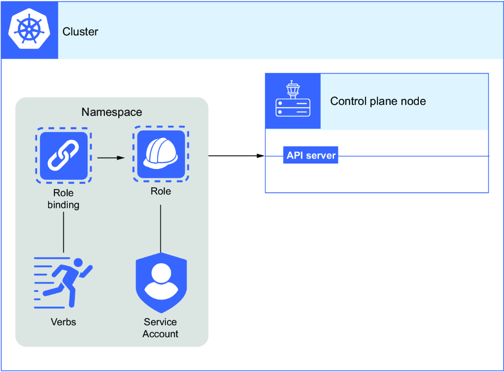

Verify no volume mounts:
```bash
root@kind-control-plane:/# kubectl get po no-mount -o yaml | grep serviceAccount
  serviceAccount: nomount-sa
  serviceAccountName: nomount-sa
root@kind-control-plane:/# kubectl get po no-mount -o yaml | grep volumeMounts -A14
root@kind-control-plane:/#
```

#### Method 2: From Pod Spec

Add `automountServiceAccountToken: false` to the pod spec:

```yaml
apiVersion: v1
kind: Pod
metadata:
  creationTimestamp: null
  labels:
    run: default-no-mount
  name: default-no-mount
spec:
  automountServiceAccountToken: false
  containers:
  - image: nginx
    name: default-no-mount
    resources: {}
  dnsPolicy: ClusterFirst
  restartPolicy: Always
status: {}
```

### Assigning Roles to Service Accounts

> [!TIP]
> Target a Service Account using: `serviceaccount=<namespace>:<service-account-name>`. For example: `serviceaccount=default:nomount-sa`

**Create a role:**
```bash
root@kind-control-plane:/# kubectl create role pod-list --verb=list --resource=pods
role.rbac.authorization.k8s.io/pod-list created
```

**Create role binding for Service Account:**
```bash
root@kind-control-plane:/# kubectl create rolebinding pod-list-bind --role=pod-list --serviceaccount=default:nomount-sa
rolebinding.rbac.authorization.k8s.io/pod-list-bind created
```

**Test authorization:**
```bash
root@kind-control-plane:/# kubectl auth can-i list pods --as system:serviceaccount:default:nomount-sa
yes
```

> [!NOTE]
> The Service Account is addressed as `system:serviceaccount:default:nomount-sa` because this is the username according to the RBAC plugin: `system:serviceaccount` prefix + namespace + Service Account name.

### Key Points About Service Accounts

- Can be used for multiple pods in the **same namespace**
- Cannot be used across different namespaces
- Default Service Account cannot be deleted (has its own controller)
- Must specify `serviceAccountName` in pod YAML to use a custom Service Account

---

### Practice Exercises

5. Create a new Service Account named `secure-sa`, and create a pod that uses the `secure-sa` Service Account. Make sure the token is not exposed to the pod.
6. Create a new cluster role named `acme-corp-role` that will allow the create action on Deployments, ReplicaSets, and DaemonSets. Bind that cluster role to the Service Account `secure-sa`, and make sure the Service Account can only create the assigned resources within the default namespace and nowhere else. Use `auth can-i` to verify that the `secure-sa` Service Account cannot create Deployments in the kube-system namespace.

---

## Summary

- Anything that tries to access Kubernetes must be **authenticated** via certificate or token.

- The **authentication plugin** provides a mechanism to accept or deny user requests.

- Kubernetes has its own **certificate signing request** object, which can sign certificates for users or anything accessing the API.

- **RBAC** is a common plugin used to give permission to users in a Kubernetes cluster.

- In Kubernetes, **users and groups are not stored** in a built-in database. Authentication relies on credentials such as client certificates containing username and optional group information.

- You can assign RBAC permissions via **roles, cluster roles, role bindings, and cluster role bindings**, each for different use cases.

- All combinations of roles/bindings are supported **except cluster role binding to roles**.

- Two main subjects in RBAC: **users** (not a managed resource) and **Service Accounts** (managed resource).

- When creating a user, the **common name (CN)** inside the CSR is required. You can generate a client certificate from the Kubernetes API (its own CA).

- When creating a role for the exam, use the **dry-run option** to save time.

- **Built-in groups** are managed by the API server and cannot be modified.

- A new **default Service Account** is automatically created with each new namespace. The token is mounted to pods unless otherwise specified.

- Use **`kubectl auth can-i`** during the exam to test permissions for users and Service Accounts.
