# 4. Deploying Applications in Kubernetes

## This chapter covers
- Scheduling pods to nodes
- Creating multiple containers within a pod
- Requesting and limiting the resources a pod can take
- Passing configuration data to pods

Now we shift our focus to the **workloads and scheduling** part of the exam objectives. Deploying applications to run on Kubernetes is commonly referred to as **scheduling**, which makes sense because we're placing a pod on a node to run. There are many ways to deploy applications (aka schedule pods) to Kubernetes. This includes the ability to reserve resources from the underlying infrastructure as well as decouple components such as configuration information and sensitive data.

---

## The Workloads and Scheduling Domain

This chapter covers part of the **Workloads and Scheduling** domain of the CKA curriculum. This domain covers the ways in which we run applications on Kubernetes.

| Competency | Chapter Section |
|------------|-----------------|
| Use ConfigMaps and Secrets to configure applications | 4.2 |
| Configure pod admission and scheduling (limits, node affinity, etc.) | 4.2 |
| Understand the primitives used to create robust, self-healing application Deployments | 2.1 |

---

## 4.1 Scheduling Applications

The Kubernetes component that controls the assignment of a pod to a node is called the **scheduler**. The scheduler will:
- Tell the pod to run on a specific node
- Ensure that resources are available on the node

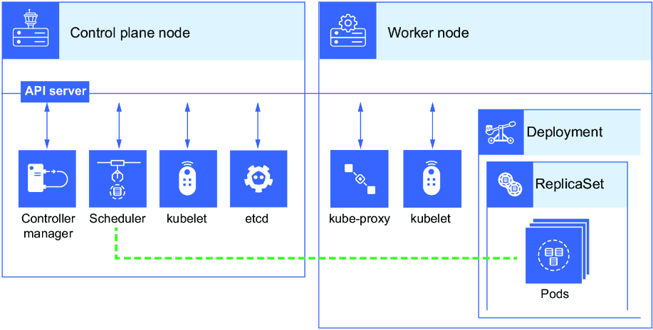

The CKA exam will test your knowledge of creating and updating application Deployments, including scheduling to certain nodes according to their labels.

> [!NOTE]
> **Exam Task Example:** Apply the label `disktype=ssd` to the worker node named kind-worker, and schedule a pod named ssd-pod to the kind-worker node by using a node selector.

### Creating a Pod with Node Selector

**Step 1: Create pod YAML template**
```bash
kubectl run ssd-pod --image=nginx --dry-run=client -o yaml > ssd-pod.yaml
```

**Step 2: View existing node labels**
```bash
root@kind-control-plane:/# kubectl get no --show-labels
NAME                 STATUS   ROLES           AGE   VERSION   LABELS
kind-control-plane   Ready    control-plane   13d   v1.32.0   beta.kubernetes.io/arch=amd64,...
kind-worker          Ready    <none>          13d   v1.32.0   beta.kubernetes.io/arch=amd64,...
kind-worker2         Ready    <none>          13d   v1.32.0   beta.kubernetes.io/arch=amd64,...
```

> [!TIP]
> On the exam, there may not be a label preapplied to the node. Check labels with `kubectl get no --show-labels`.

**Step 3: Apply a label to the node**
```bash
root@kind-control-plane:/# kubectl label no kind-worker disktype=ssd
node/kind-worker labeled

root@kind-control-plane:/# kubectl get no -l disktype=ssd
NAME          STATUS   ROLES    AGE   VERSION
kind-worker   Ready    <none>   13d   v1.32.0
```

**Step 4: Add nodeSelector to pod YAML**

Edit `ssd-pod.yaml` and add the `nodeSelector` field:

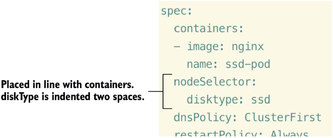

**Step 5: Create and verify the pod**
```bash
root@kind-control-plane:/# kubectl apply -f ssd-pod.yaml

root@kind-control-plane:/# kubectl get po -o wide
NAME      READY   STATUS    RESTARTS   AGE   IP           NODE          NOMINATED NODE   READINESS GATES
ssd-pod   1/1     Running   0          25s   10.244.1.2   kind-worker   <none>           <none>
```

> [!WARNING]
> Changing the default rules for scheduling changes the primary functionality of Kubernetes, which is to promote high availability and fault-tolerance.

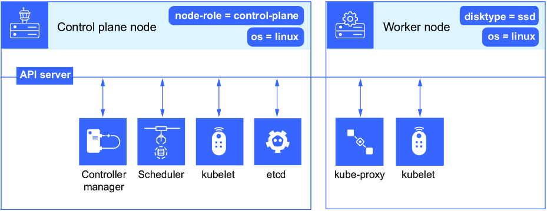

---

### 4.1.1 Node Selectors

There may come a time when you'd like to schedule a pod to a specific node—perhaps that node has a certain type of CPU or memory optimized for your workload.

| Method | Flexibility | Use Case |
|--------|-------------|----------|
| **nodeSelector** | More flexible - identifies by labels | Can apply to many nodes |
| **nodeName** | Less flexible - specific node by name | Single node only |

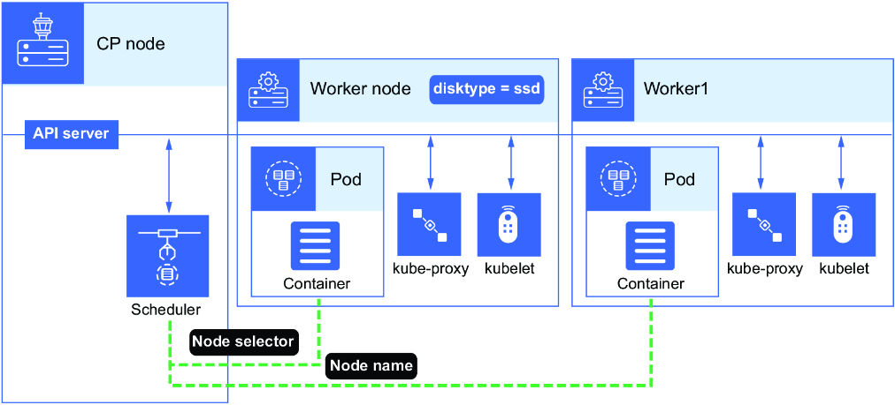

> [!CAUTION]
> Using `nodeName` creates a single point of failure. What if the node fails? What if it runs out of resources?

### DaemonSets

A **DaemonSet** ensures that one pod replica is always running on every single node in the cluster. Even if you delete the pod, the DaemonSet will respawn it.

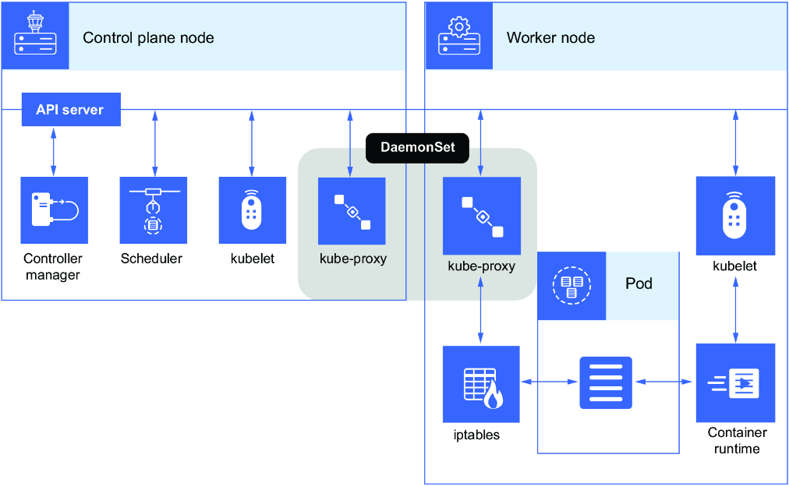

**View DaemonSet pod nodeName:**
```bash
kubectl -n kube-system get po kindnet-2tlqh -o yaml | grep nodeName -a3
```

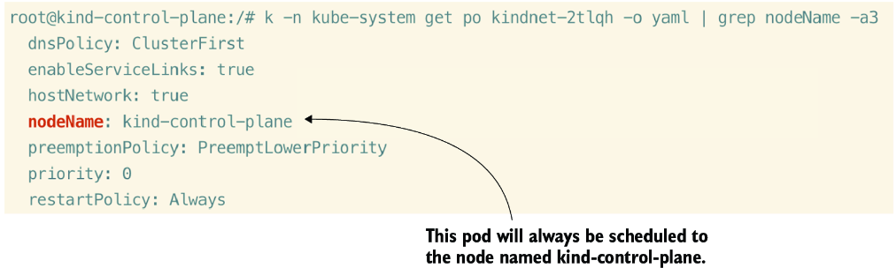

> [!TIP]
> You may see "node selector" or "node name" on the exam. Become familiar with the placement and proper syntax.

**View CoreDNS nodeSelector:**
```bash
kubectl -n kube-system get po coredns-64897985d-4th9h -o yaml | grep nodeSelector -a4
```

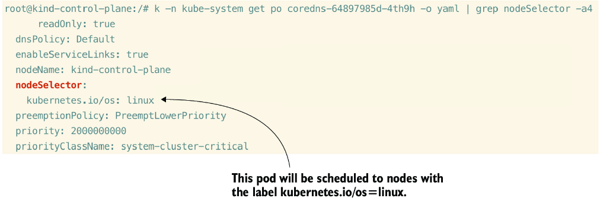

> [!NOTE]
> The name of your CoreDNS pod will be different. Use `kubectl -n kube-system get po` to find your unique name.

---

### 4.1.2 Node and Pod Affinity

**Affinity** is like a node selector, but its rules are more expressive:
- A node selector rule will **select** a node with a label
- An affinity rule will **prefer** a node with a label but accept other nodes if not available

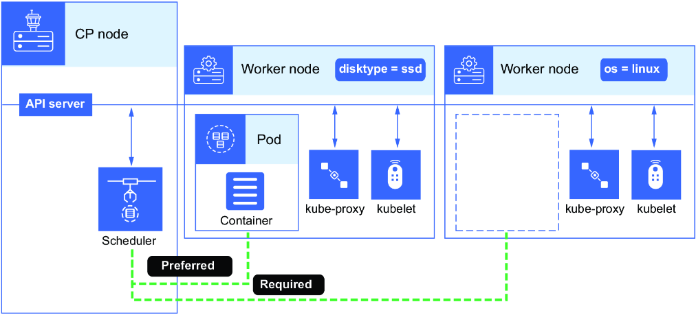

### Creating Node Affinity Rules

**Step 1: Create pod template**
```bash
kubectl run affinity --image nginx --dry-run=client -o yaml > affinity.yaml
```

**Step 2: Add affinity rules**

Add `affinity:` section with `nodeAffinity:` and scheduling rules:

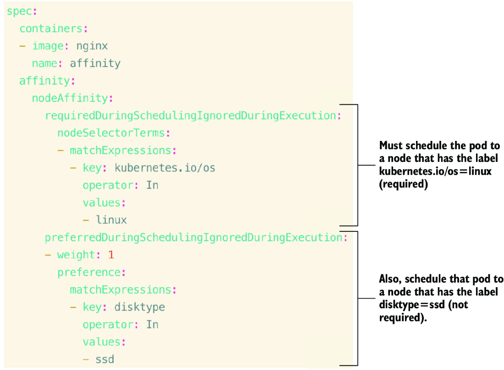

#### Affinity Types

| Type | Description |
|------|-------------|
| **requiredDuringSchedulingIgnoredDuringExecution** | Scheduler can't schedule the pod unless rule is met (hard rule) |
| **preferredDuringSchedulingIgnoredDuringExecution** | Optional for scheduler; pod still scheduled if no match (soft preference) |

You can specify a **weight** between 1 and 100 for each preferred rule. Nodes with highest total score are prioritized.

**Step 3: Apply the pod**
```bash
root@kind-control-plane:/# kubectl apply -f affinity.yaml
pod/affinity created

root@kind-control-plane:/# kubectl get po -o wide
NAME           READY   STATUS    RESTARTS   AGE   IP            NODE           NOMINATED NODE   READINESS GATES
affinity       1/1     Running   0          14s   10.244.1.6    kind-worker2   <none>           <none>
pod-tolerate   1/1     Running   0          24h   10.244.2.16   kind-worker    <none>           <none>
```

> [!TIP]
> Check your work: `kubectl apply -f https://raw.githubusercontent.com/chadmcrowell/k8s/main/manifests/pod-node-affinity.yaml`

### Pod Affinity (Inter-Pod Affinity)

**Pod affinity** is the preference to a node based on other pods already on that node. If a pod already exists (e.g., nginx), schedule the new pod to the same node.

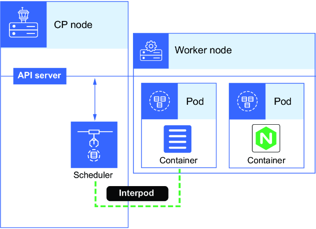

**Step 1: Create the target pod**
```bash
kubectl run nginx --image=nginx
```

**Step 2: Download and modify affinity YAML**
```bash
curl -O https://raw.githubusercontent.com/chadmcrowell/k8s/main/manifests/pod-node-affinity.yaml
```

**Step 3: Change to pod affinity**

Key changes:
- Change `nodeAffinity` to `podAffinity`
- Change `nodeSelectorTerms:` to `- labelSelector:`
- Change key to `run` and value to `nginx`
- Add `topologyKey: kubernetes.io/hostname`


**Step 4: Apply and verify**
```bash
kubectl apply -f pod-node-affinity.yaml
kubectl get po -o wide
```

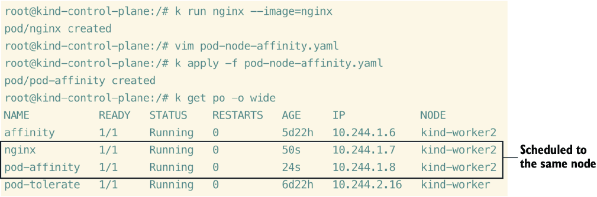

---

### Practice Exercises

1. Apply the label `disktype=ssd` to a node. Create a pod named `fast` using the nginx image that selects a node based on `disktype=ssd`.
2. Edit the `fast` pod using `kubectl edit po fast`, change the node selector to `disktype=slow`. Take the YAML in `/tmp/` and apply it by force to delete and recreate the pod.
3. Create a pod named `ssd-pod` using nginx image with node affinity (weight 1) for `disktype=ssd`. Alternatively choose nodes with `kubernetes.io/os=linux`.

---

## 4.2 Configuring Pods

Let's talk about customizations you can make before scheduling applications in Kubernetes:
- Resource constraints
- Additional features
- Unique characteristics each application may need

---

### 4.2.1 Resource Requests and Limits

| Parameter | Description |
|-----------|-------------|
| **Request** | CPU and RAM **minimum** that the pod requires to run optimally |
| **Limit** | CPU and RAM **maximum** that the pod should consume |

Key points:
- Requests and limits don't have to be defined together
- If you configure limits without requests, Kubernetes sets requests = limits
- You can specify CPU only or RAM only

> [!IMPORTANT]
> On the CKA exam, you will be tested on resource requests and limits and how they affect pod scheduling.

**Create pod template:**
```bash
kubectl run nginx2 --image=nginx --dry-run=client -o yaml > nginx2.yaml
```

**Add resource requests and limits:**

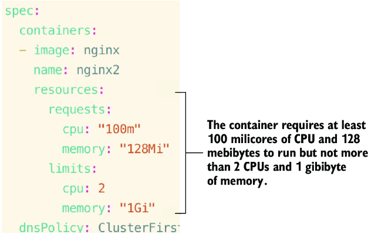

#### CPU and Memory Units

| Resource | Measurement | Examples |
|----------|-------------|----------|
| **CPU** | CPU units / millicores | `1` = 1 CPU, `1000m` = 1 CPU, `500m` = 0.5 CPU |
| **Memory** | Mebibytes (MiB) / Gibibytes (GiB) | `128Mi`, `1Gi` |

> [!NOTE]
> A container can use **more** than its request if resources are available, but it **cannot** exceed its limit.

---

### 4.2.2 Multicontainer Pods

Benefits of multiple containers in the same pod:
- Share the same **network namespace**
- Share **storage**
- Faster communication without additional services/network policies

#### Sidecar Container Pattern

A **sidecar container** assists the main application, such as collecting logs.

```bash
kubectl run sidecar --image=busybox --command "sh" "-c" "while true; do cat /var/log/nginx/error.log; sleep 20; done" --dry-run=client -o yaml > sidecar.yaml
```

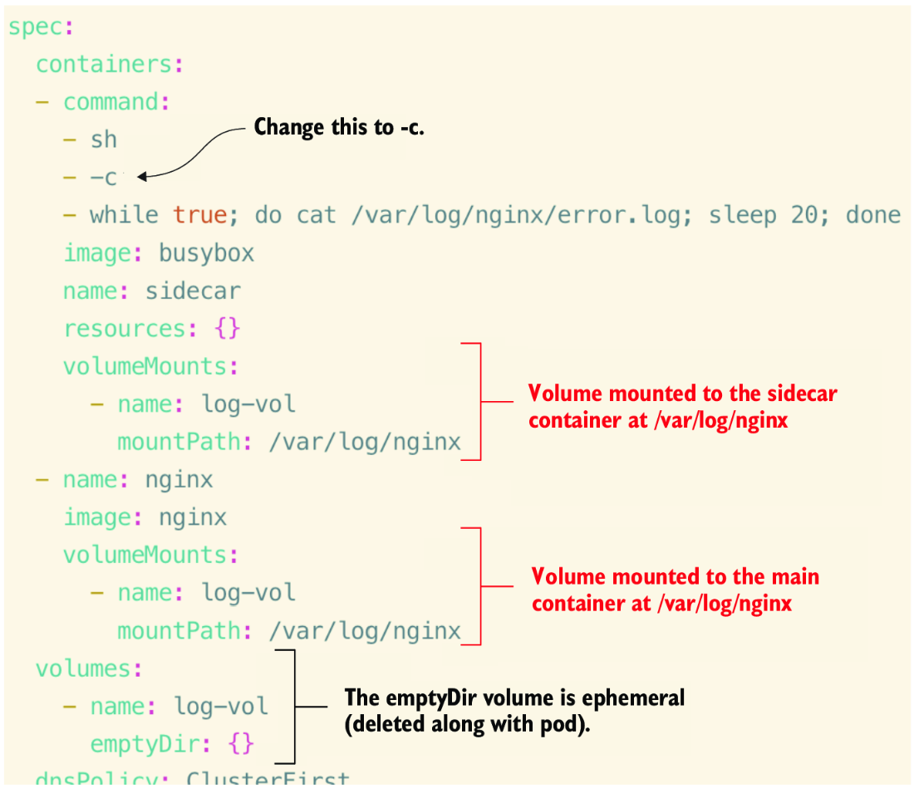

> [!NOTE]
> An **emptyDir** volume is ephemeral storage—as soon as the pod is deleted, the data is gone forever.

#### Init Containers

**initContainers** run to completion before the main container starts. Use cases:
- Clone a git repo
- Wait for a database to become ready
- Validate Secrets or config files

> [!TIP]
> **Native sidecar containers** (Kubernetes 1.28+): initContainers with `restartPolicy: Always` continue running alongside the main container.

**Create init container pod:**
```bash
kubectl run init --image=busybox:1.35 --command "sh" "-c" "echo The app is running! && sleep 3600" --dry-run=client -o yaml > init.yaml
```

Add an `initContainers:` section that waits for a service:
```bash
until nslookup init-svc.default.svc.cluster.local; do echo waiting for svc; sleep 2; done
```

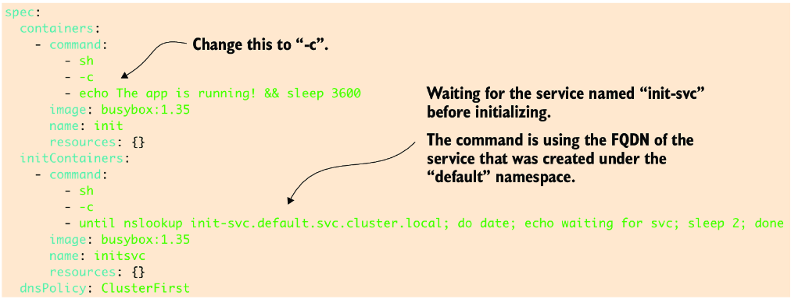

**Apply and observe:**
```bash
root@kind-control-plane:/# kubectl apply -n default -f init.yaml
pod/init created

root@kind-control-plane:/# kubectl get po -n default
NAME   READY   STATUS     RESTARTS   AGE
init   0/1     Init:0/1   0          7s

# Pod stays in "Init:0/1" until service is created

root@kind-control-plane:/# kubectl create -n default svc clusterip init-svc --tcp 80
service/init-svc created

root@kind-control-plane:/# kubectl get po -n default
NAME   READY   STATUS    RESTARTS   AGE
init   1/1     Running   0          34s
```

---

### 4.2.3 PriorityClass

A **PriorityClass** defines how important a pod is compared to others. Kubernetes uses it when scheduling and evicting pods.

**View default PriorityClasses:**
```bash
root@kind-control-plane:/# kubectl get priorityclass
NAME                      VALUE        GLOBAL-DEFAULT  AGE  PREEMPTIONPOLICY
system-cluster-critical   2000000000   false           30d  PreemptLowerPriority
system-node-critical      2000001000   false           30d  PreemptLowerPriority
```

| Priority Range | Use |
|----------------|-----|
| **2,000,000,000+** | Reserved for critical system pods |
| **-2,147,483,648 to 1,000,000,000** | Custom application priorities |

**Create a custom PriorityClass:**
```bash
kubectl create priorityclass high-priority --value=1000000
```

**Pod using PriorityClass:**
```yaml
apiVersion: v1
kind: Pod
metadata:
  name: high-prio
spec:
  priorityClassName: high-priority
  containers:
  - name: stress
    image: polinux/stress
    command: ["stress"]
    args: ["--cpu", "1", "--vm", "1", "--vm-bytes", "512M", "--timeout", "300s"]
    resources:
      requests:
        memory: "10Mi"
        cpu: "10m"
```

**Verify priority:**
```bash
root@kind-control-plane:/# kubectl describe po high-prio | head -5
Name:                 high-prio
Namespace:            default
Priority:             1000000
Priority Class Name:  high-priority
Service Account:      default
```

---

### 4.2.4 ConfigMaps

A **ConfigMap** passes configuration data to your application. Injection methods:
- Environment variable
- Volume mounted to the container

Creation sources:
- From literal values
- From a file
- From multiple files in a directory

**Create ConfigMap with dry-run:**
```bash
kubectl create cm redis-config --from-literal=key1=config1 --from-literal=key2=config2 --dry-run=client -o yaml > redis-config.yaml
```

**Multiline ConfigMap:**

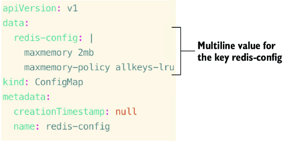

**Create the ConfigMap:**
```bash
kubectl apply -f redis-config.yaml
```

**Create Redis pod with ConfigMap volume:**
```bash
kubectl run redis --image=redis:7 --port 6379 --command 'redis-server' '/redis-master/redis.conf' --dry-run=client -o yaml > redis.yaml
```

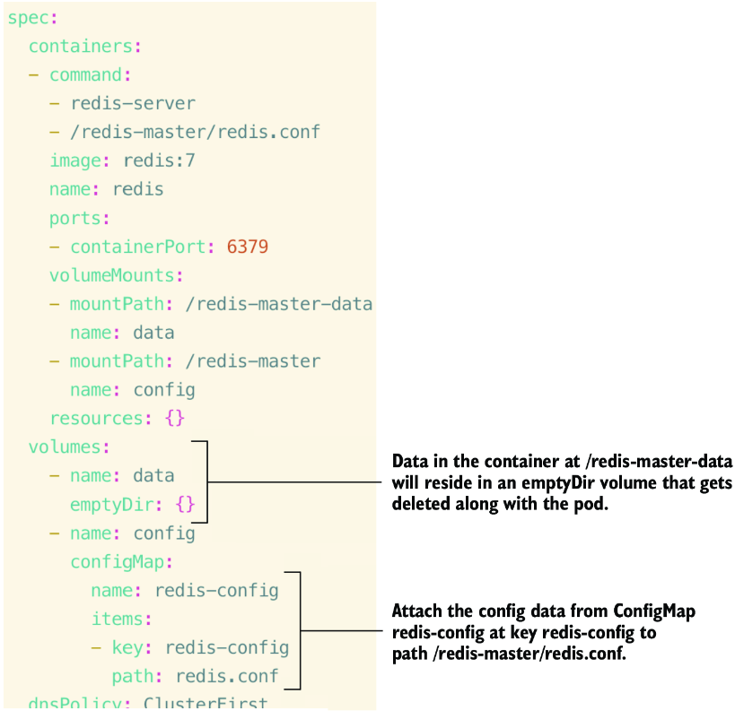

**Verify ConfigMap data in Redis:**
```bash
kubectl exec -it redis -- redis-cli
```

Then run:
```
CONFIG GET maxmemory
CONFIG GET maxmemory-policy
```

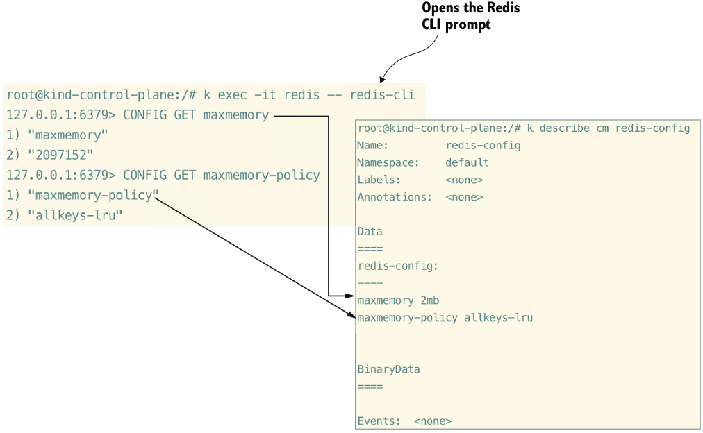

---

### 4.2.5 Secrets

**Secrets** are similar to ConfigMaps but store sensitive data with base64 encoding.

> [!WARNING]
> Secrets are **not secure by default**. Anyone with cluster access can view and read secret data. Never use this as your only method of security.

**Create a Secret:**
```bash
kubectl create secret generic dev-login --from-literal=username=dev --from-literal=password='S!B\*d$zDsb=' --dry-run=client -o yaml > dev-login.yaml
```

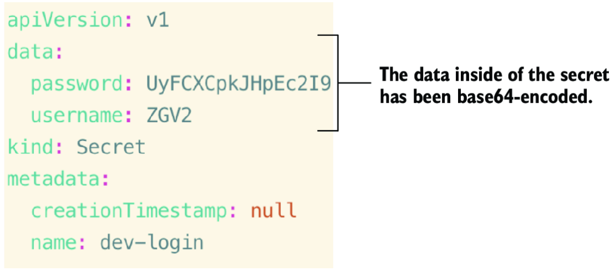

**Apply the Secret:**
```bash
kubectl apply -f dev-login.yaml
```

#### Mounting Secrets as Volumes

**Create pod with Secret volume:**
```bash
kubectl run secret-pod --image=busybox --command "sh" "-c" "echo The app is running! && sleep 3600" --dry-run=client -o yaml > secret-pod.yaml
```

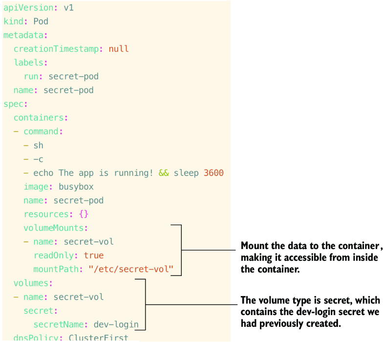

**View secret data from within pod:**
```bash
kubectl exec secret-pod -- cat /etc/secret-vol/username && echo
kubectl exec secret-pod -- cat /etc/secret-vol/password && echo
```

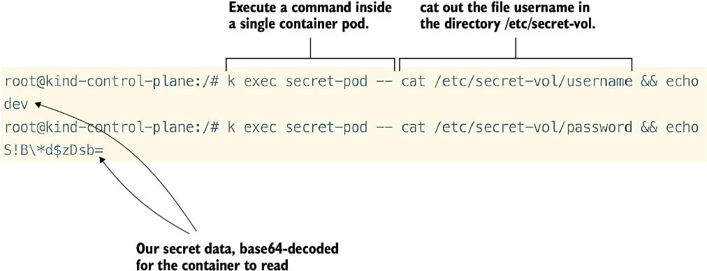

#### Using Secrets as Environment Variables

```bash
kubectl run secret-env --image=busybox --command "sh" "-c" "printenv DEV_USER DEV_PASS; sleep 8200" --env=DEV_PASS=password --dry-run=client -o yaml > secret-env.yaml
```

Modify to use `secretKeyRef`:

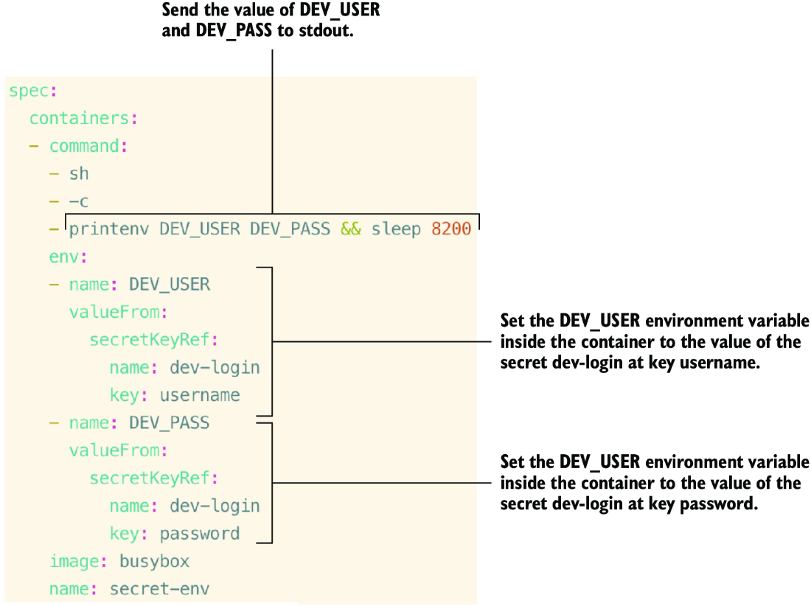

---

### Practice Exercises

4. Create a pod named `pod-limited` with image `httpd`. Set resource requests to 1 CPU and 100Mi memory.

5. Create a Deployment named `overloaded` with 3 replicas. Include:
   - initContainer with native sidecar method (`restartPolicy: Always`), busybox image, command `/bin/bash sleep 1d`, requests: 250m CPU, 600Mi memory
   - Main container with nginx image, requests: 250m CPU, 600Mi memory

6. Create a ConfigMap named `ui-data` with these key-value pairs and pass to a pod named `frontend` (busybox:1.28) via environment variables:
   - `color.good=purple`
   - `color.bad=yellow`
   - `allow.textmode=true`
   - `how.nice.to.look=fairlyNice`

---

## Summary

- **Scheduling** refers to creating a pod and assigning it to a node. Use node selector, node name, or affinity rules. Know the correct YAML syntax.

- Apply **labels** to influence pod scheduling. Use label selectors to schedule pods to specific nodes. Know how to apply labels to nodes and pods.

- **Node affinity** is a set of rules for the scheduler:
  - `requiredDuringSchedulingIgnoredDuringExecution` (hard rules)
  - `preferredDuringSchedulingIgnoredDuringExecution` (soft preferences)

- **Pod affinity** schedules a pod based on other pods with specific labels. Used for collocating pods on the same node or topology domain.

- Reserve and limit CPU and memory using **requests** and **limits**. The YAML syntax is important for the exam.

- **Multicontainer pods** share the same network namespace and storage, allowing direct communication.

- Inject configuration data using **ConfigMaps** and sensitive data using **Secrets**. Know how to mount as volumes and use as environment variables.
