# 5. Running Applications in Kubernetes

## This chapter covers
- Scaling applications for high availability
- Rolling updates and rollbacks
- Configuring autoscaling
- Exposing Deployments to create Services
- Performing maintenance tasks on a Kubernetes cluster
- Using Helm and Kustomize to install cluster components
- Installing Custom Resource Definitions and operators

This chapter covers the **operations side of Kubernetes**: how to maintain applications already running in Kubernetes. We cover common approaches for the exam including providing additional resources, scaling applications, providing consistent endpoints, and rolling out new versions.

---

## The Workloads and Scheduling Domain

| Competency | Chapter Section |
|------------|-----------------|
| Configure workload autoscaling | 5.1 |
| Understand application Deployments and how to perform rolling updates and rollbacks | 5.1 |
| Understand the primitives used to create robust, self-healing application Deployments | 5.2 |

## The Cluster Architecture, Installation, and Configuration Domain

| Competency | Chapter Section |
|------------|-----------------|
| Create and manage Kubernetes clusters using kubeadm | 5.2 |
| Use Helm and Kustomize to install cluster components | 5.3 |
| Understand custom resource definitions, install, and configure operators | 5.4 |

---

## 5.1 Orchestrating Applications

A **Deployment** is a core object in Kubernetes for achieving high availability, robustness, and self-healing.

| Type | Description | State |
|------|-------------|-------|
| **Stateless** | Pods can be replaced without affecting health | Managed via Deployment |
| **Stateful** | Data required for application to run | Managed via StatefulSet (not on exam) |

---

### 5.1.1 Modifying Running Applications

Pods are ephemeral by nature. A **Deployment** creates redundancy and fault tolerance.

> [!NOTE]
> **Exam Task Example:** Create a Deployment named `apache` that uses the image `httpd:2.4.65` with 3 replicas. After creation, scale to 5 replicas and change the image to `httpd:alpine`.

**Step 1: Create the Deployment**
```bash
root@kind-control-plane:/# kubectl create deploy apache --image httpd:2.4.65 --replicas 3
deployment.apps/apache created

root@kind-control-plane:/# kubectl get deploy
NAME     READY   UP-TO-DATE   AVAILABLE   AGE
apache   3/3     3            3           14s
```

**Step 2: Scale the Deployment**
```bash
root@kind-control-plane:/# kubectl scale deploy apache --replicas 5
deployment.apps/apache scaled

root@kind-control-plane:/# kubectl get po
NAME                      READY   STATUS    RESTARTS   AGE
apache-74f79bcc68-7lzqz   1/1     Running   0          7s
apache-74f79bcc68-89zwg   1/1     Running   0          33s
apache-74f79bcc68-v6drf   1/1     Running   0          33s
apache-74f79bcc68-x7bfw   1/1     Running   0          33s
apache-74f79bcc68-xdx4b   1/1     Running   0          7s
```

> [!NOTE]
> Pods are prefixed with the Deployment name followed by a hash, with unique suffixes since duplicate pod names aren't allowed.

**Step 3: Update the image**
```bash
root@kind-control-plane:/# kubectl set image deploy apache httpd=httpd:alpine
deployment.apps/apache image updated

root@kind-control-plane:/# kubectl get po
NAME                      READY   STATUS              RESTARTS   AGE
apache-698b8cccbd-45nzs   1/1     Running             0          2s
apache-698b8cccbd-bz4bm   1/1     Running             0          6s
apache-698b8cccbd-dx4j2   1/1     Running             0          6s
apache-74f79bcc68-89zwg   1/1     Terminating         0          27m
...
```

This triggers a **rolling update**, replacing old pods with new ones while minimizing downtime.

---

### 5.1.2 Application Maintenance

When you create or update a Deployment, Kubernetes automatically creates or updates a corresponding **ReplicaSet**.

```bash
root@kind-control-plane:/# kubectl get rs
NAME                DESIRED   CURRENT   READY   AGE
apache-698b8cccbd   5         5         5       28m
apache-74f79bcc68   0         0         0       45m
```

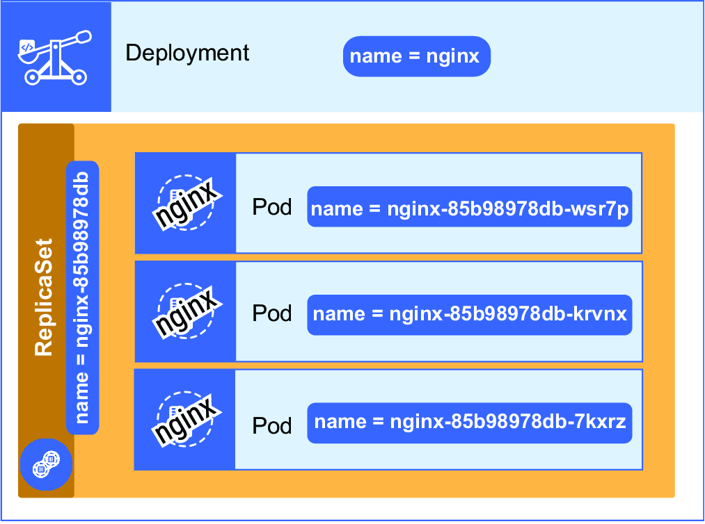

### Pod YAML vs Deployment YAML

The pod YAML is essentially placed under `template:` in the Deployment spec:

```bash
kubectl run nginx --image nginx --dry-run=client -o yaml > pod.yaml
kubectl create deploy nginx --image nginx --dry-run=client -o yaml > deploy.yaml
```

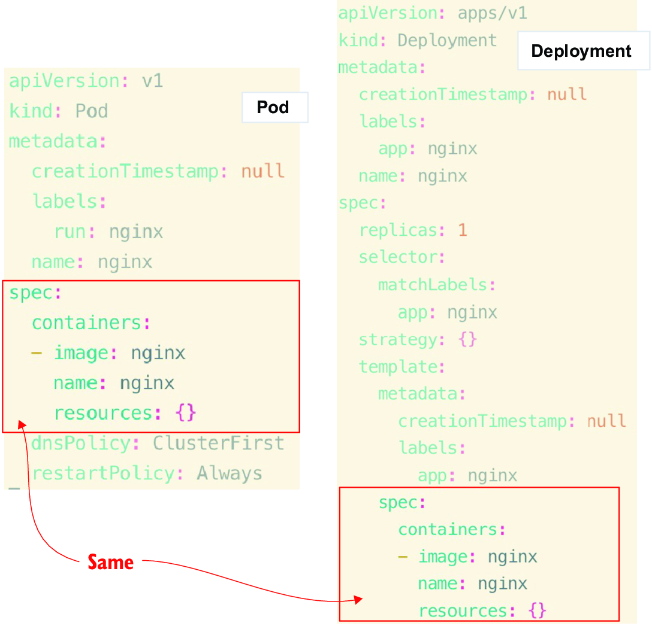

### Scaling via YAML

Edit the `replicas:` field in the Deployment YAML:

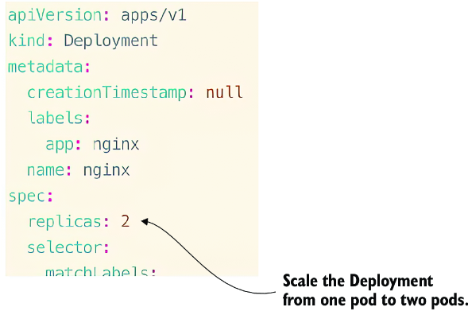

```bash
kubectl apply -f deploy.yaml
```

View ReplicaSet events:
```bash
kubectl describe rs
```

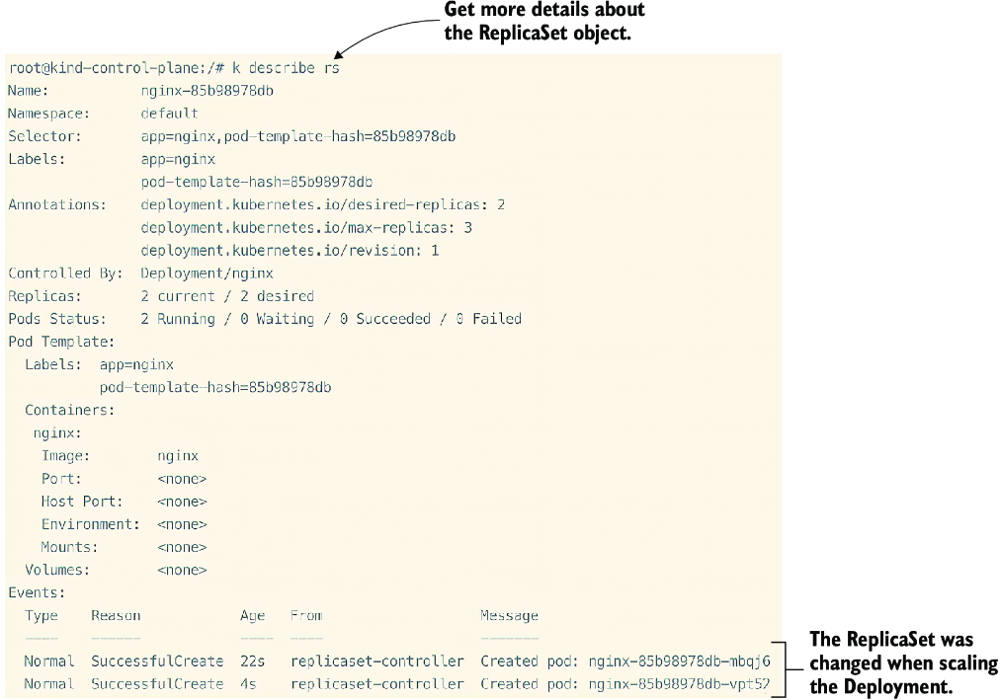

> [!TIP]
> To describe all resources of a type at once, just type the resource name: `kubectl describe rs`

### Image Changes Create New ReplicaSets

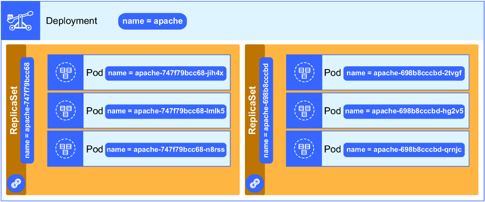

Watch the transition:
```bash
kubectl get po -w
```

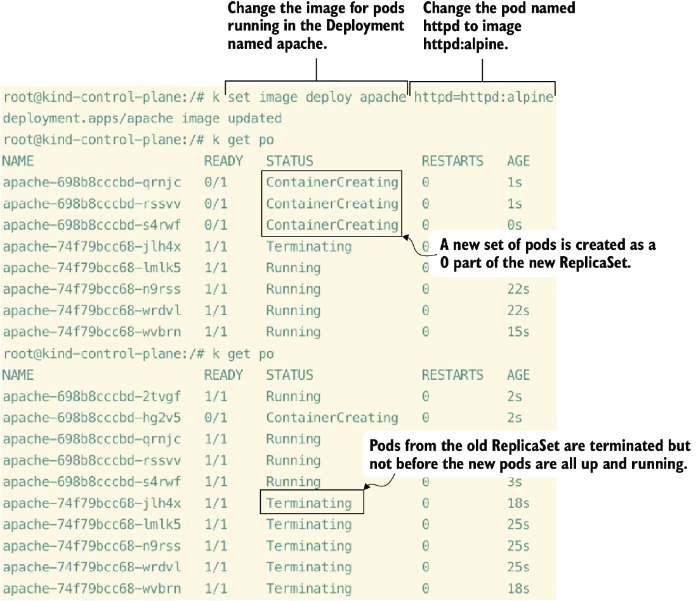

### Rollout Strategy

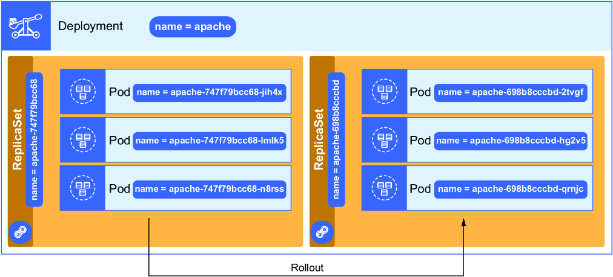

View the rollout strategy:
```bash
kubectl edit deploy apache
```

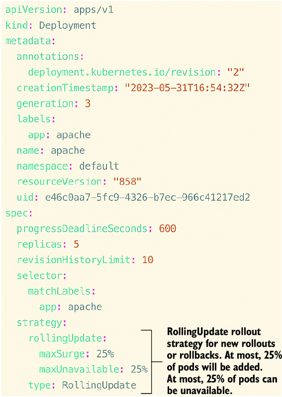

| Strategy | Description |
|----------|-------------|
| **RollingUpdate** | Old pods don't terminate until new pods are ready (default) |
| **Recreate** | Old pods terminate before new pods start (causes downtime) |

| Parameter | Description |
|-----------|-------------|
| **maxSurge** | Extra pods allowed above desired count during rollout |
| **maxUnavailable** | Pods that can be offline during update |

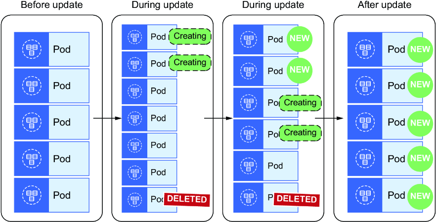

> [!TIP]
> Use `kubectl explain deploy.spec.strategy` to see available values. Add `--recursive` to navigate down fields.

---

### 5.1.3 Application Rollouts

Every time pods change in a Deployment, a new **revision** is created.

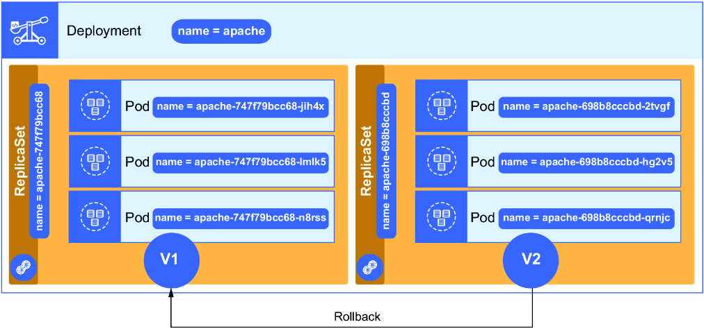

**View rollout history:**
```bash
root@kind-control-plane:/# kubectl rollout history deploy apache
deployment.apps/apache
REVISION  CHANGE-CAUSE
1         <none>
2         <none>
```

**Add annotation for change cause:**
```bash
root@kind-control-plane:/# kubectl annotate deploy apache kubernetes.io/change-cause="updated image tag from 2 to alpine"
deployment.apps/apache annotated

root@kind-control-plane:/# kubectl rollout history deploy apache
deployment.apps/apache
REVISION  CHANGE-CAUSE
1         <none>
2         updated image tag from 2 to alpine
```

**Rollback to previous revision:**
```bash
root@kind-control-plane:/# kubectl rollout undo deploy apache
deployment.apps/apache rolled back

root@kind-control-plane:/# kubectl rollout history deploy apache
deployment.apps/apache
REVISION  CHANGE-CAUSE
2         updated image tag from 2 to alpine
3         <none>
```

**Check rollout status:**
```bash
root@kind-control-plane:/# kubectl rollout status deploy apache --revision 3
deployment "apache" successfully rolled out
```

**Pause and resume rollouts (canary deployment simulation):**
```bash
root@kind-control-plane:/# kubectl set image deploy apache httpd=httpd:2.4
deployment.apps/apache image updated

root@kind-control-plane:/# kubectl rollout pause deploy apache
deployment.apps/apache paused

root@kind-control-plane:/# kubectl rollout status deploy apache
Waiting for deployment "apache" rollout to finish: 3 out of 5 new replicas have been updated...

root@kind-control-plane:/# kubectl rollout resume deploy apache
deployment.apps/apache resumed
```

> [!TIP]
> Use `kubectl rollout --help` for command syntax examples.

---

### 5.1.4 Exposing Deployments

Expose a Deployment to create a Service:

```bash
kubectl expose deploy nginx --name nginx-svc --port 80 --type ClusterIP --dry-run=client -o yaml > nginx-svc.yaml
```

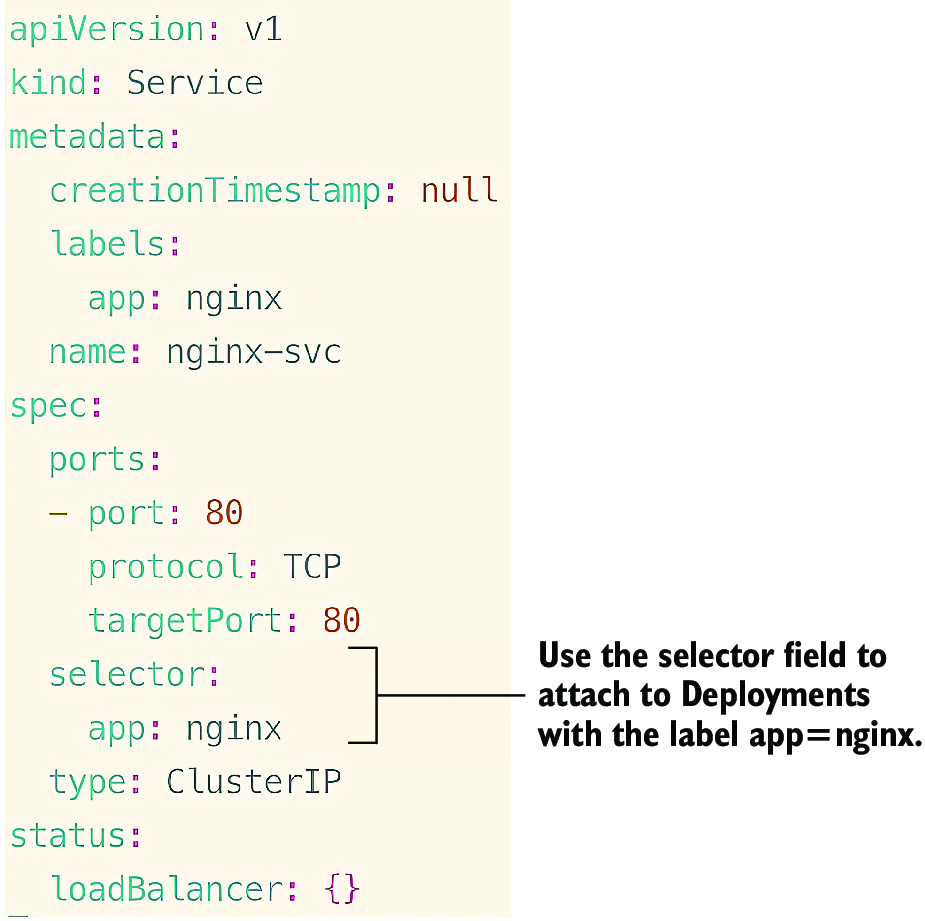

The **selector** associates the service with pods having the label `app=nginx`.

---

### 5.1.5 Autoscaling

The **Horizontal Pod Autoscaler (HPA)** scales pods based on resource utilization.

**Step 1: Configure CPU requests**

Add to deploy.yaml:
```yaml
spec:
  containers:
  - image: nginx
    name: nginx
    resources:
      requests:
        cpu: 10m
```

> [!NOTE]
> Replace `resources: {}` in your YAML file.

**Step 2: Create HPA**
```bash
root@kind-control-plane:/# kubectl autoscale deployment nginx --cpu=80% --min=2 --max=5 -o yaml
apiVersion: autoscaling/v2
kind: HorizontalPodAutoscaler
metadata:
  name: nginx
spec:
  maxReplicas: 5
  metrics:
  - resource:
      name: cpu
      target:
        averageUtilization: 80
        type: Utilization
    type: Resource
  minReplicas: 2
  scaleTargetRef:
    apiVersion: apps/v1
    kind: Deployment
    name: nginx
```

**View HPA:**
```bash
root@kind-control-plane:/# kubectl get hpa
NAME    REFERENCE          TARGETS       MINPODS   MAXPODS   REPLICAS   AGE
nginx   Deployment/nginx   cpu: 0%/80%   2         5         2          15m
```

> [!IMPORTANT]
> HPA requires **metrics-server** to collect container usage data. On the exam, it will be preinstalled.

**Install metrics-server (for practice):**
```bash
kubectl apply -f https://github.com/kubernetes-sigs/metrics-server/releases/download/v0.8.0/components.yaml

kubectl patch -n kube-system deployment metrics-server --type=json -p '[{"op":"add", "path":"/spec/template/spec/containers/0/args/-","value":"--kubelet-insecure-tls"}]'
```

**View resource usage:**
```bash
root@kind-control-plane:/# kubectl top pod | egrep "CPU|nginx"
NAME                      CPU(cores)   MEMORY(bytes)
nginx-5c799c6d5f-4lkr9    0m           3Mi
nginx-5c799c6d5f-8w494    0m           2Mi
```

> [!TIP]
> Create HPA with `kubectl autoscale` first, then edit with `kubectl edit hpa` to adjust parameters. Workloads need requests configured for functional HPA.

---

### Practice Exercises

1. Create a Deployment named `apache` using image `httpd:latest` with one replica. Scale to 5 replicas.
2. Update the image from `httpd:latest` to `httpd:2.4.63` using only kubectl commands.
3. View events of the ReplicaSet created from the image change.
4. Roll back to the previous version of the `apache` Deployment.
5. Change the rollout strategy for `apache` to Recreate.

---

## 5.2 Node Maintenance

With Deployments, pods can move from node to node with no downtime.

> [!NOTE]
> **Exam Task Example:** The node `kind-worker` is experiencing memory issues. Disable scheduling, evict all pods, then re-enable scheduling after verification.

**Step 1: Cordon the node (disable scheduling)**
```bash
root@kind-control-plane:/# kubectl cordon kind-worker
node/kind-worker cordoned

root@kind-control-plane:/# kubectl get no
NAME                 STATUS                     ROLES           AGE     VERSION
kind-control-plane   Ready                      control-plane   7m      v1.32.0
kind-worker          Ready,SchedulingDisabled   <none>          6m38s   v1.32.0
```

**Step 2: Drain the node (evict pods)**
```bash
root@kind-control-plane:/# kubectl drain kind-worker --ignore-daemonsets
node/kind-worker already cordoned
Warning: ignoring DaemonSet-managed Pods: kube-system/kindnet-h7695, kube-system/kube-proxy-j8wbc
evicting pod default/nginx-76d6c9b8c-hr9z6
pod/nginx-76d6c9b8c-hr9z6 evicted
node/kind-worker drained
```

**Step 3: Verify pods moved**
```bash
root@kind-control-plane:/# kubectl get po -o wide
NAME                     READY   STATUS    RESTARTS   AGE    IP           NODE
nginx-76d6c9b8c-4494r    1/1     Running   0          52s    10.244.0.7   kind-control-plane
nginx2-b648d744f-n6xb9   1/1     Running   0          3m6s   10.244.0.6   kind-control-plane
```

**Step 4: Uncordon the node (re-enable scheduling)**
```bash
root@kind-control-plane:/# kubectl uncordon kind-worker
node/kind-worker uncordoned
```

---

### 5.2.1 Cordon and Drain Nodes

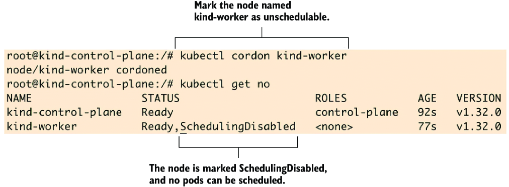

**Cordon** marks a node as unschedulable for new pods.

> [!TIP]
> After cordoning a node, always uncordon it. If scheduling remains disabled, you may lose points on the exam.

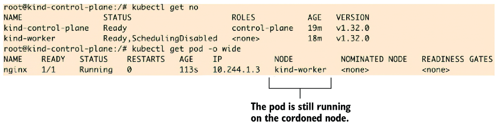

**Drain** evicts existing pods from the node:

```bash
kubectl drain kind-worker --ignore-daemonsets --force
```

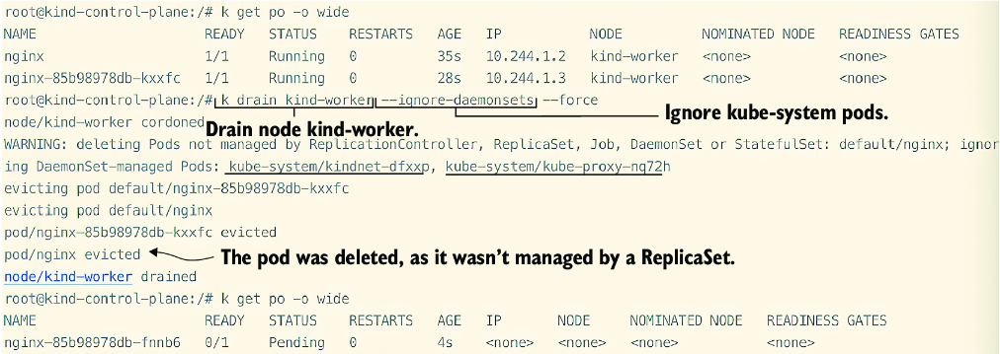

> [!WARNING]
> Pods not managed by a ReplicaSet are deleted permanently when drained!

---

### 5.2.2 Adding Nodes to the Cluster

> [!NOTE]
> **Exam Task Example:** Node `node02` is not appearing in `kubectl get nodes`. Allow it to join the cluster.

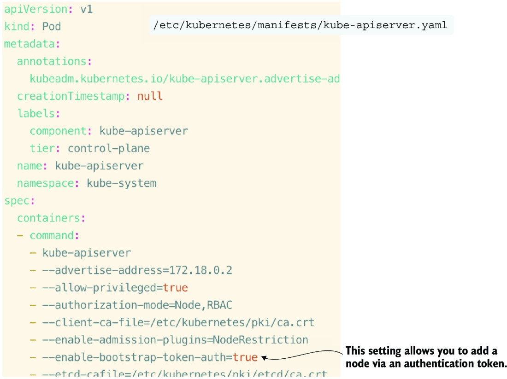

**Generate join command:**
```bash
root@kind-control-plane:/# kubeadm token create --print-join-command
kubeadm join kind-control-plane:6443 --token l5kotg.hiivo73eu000bbfu --discovery-token-ca-cert-hash sha256:13b3aac808908114d45b6ad91640babd8613d8136b21d405711a1204c68fa8a4
```

> [!TIP]
> Use the help menu: `kubeadm --help`

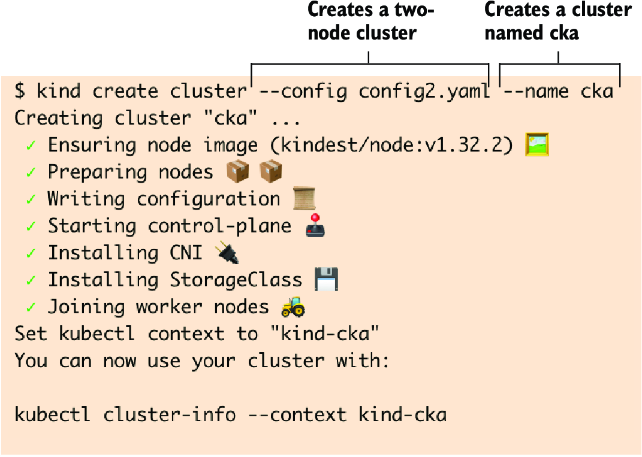

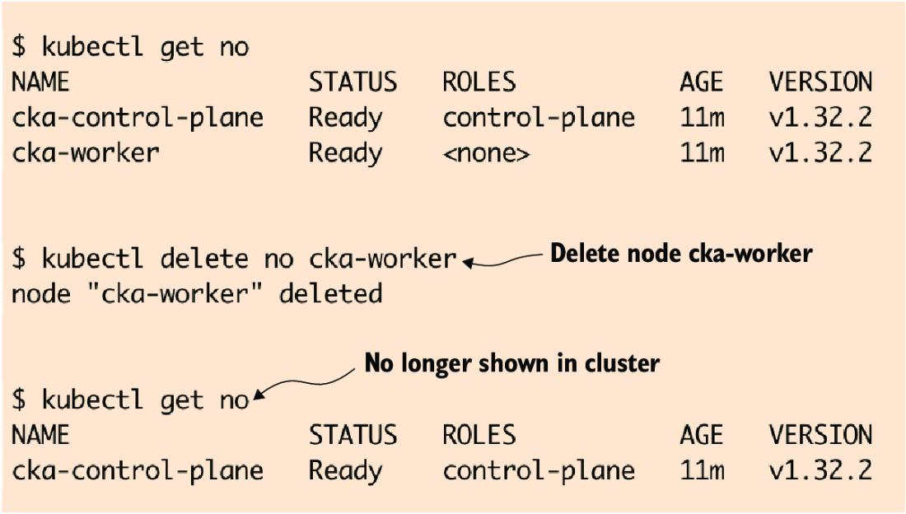

**Reset and join the node:**
```bash
root@cka-worker:/# kubeadm reset
[reset] Are you sure you want to proceed? [y/N]: y
...
```

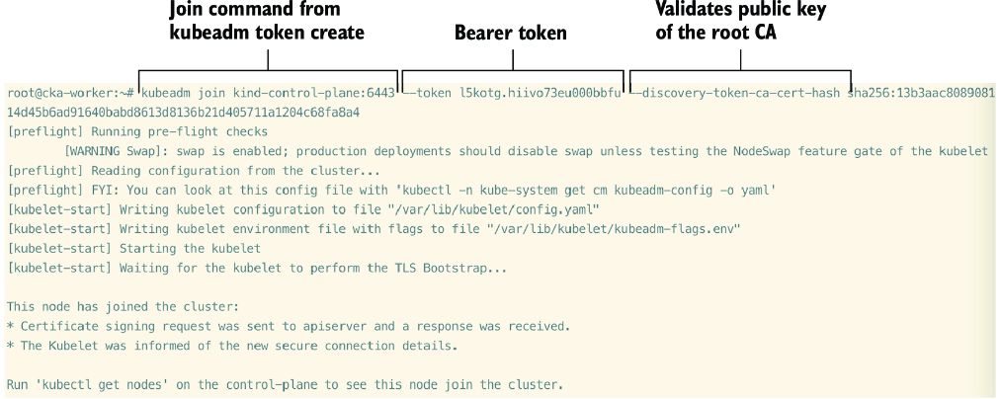

**Verify:**
```bash
root@kind-control-plane:/# kubectl get no
NAME                 STATUS   ROLES           AGE    VERSION
cka-worker           Ready    <none>          15m    v1.32.2
kind-control-plane   Ready    control-plane   2d1h   v1.32.2
kind-worker          Ready    <none>          2d1h   v1.32.2
```

---

### Practice Exercises

6. Cordon a worker node, schedule a pod, uncordon, then edit the pod to schedule to the uncordoned node.
7. Create nginx Deployment, remove control plane taint, add nodeSelector to schedule pods on control plane.

---

## 5.3 Using Helm and Kustomize

| Tool | Approach | Key Features |
|------|----------|--------------|
| **Helm** | Package manager with templating | Charts, repositories, values files |
| **Kustomize** | Declarative configuration management | Built into kubectl, overlays, patches |

---

### 5.3.1 Helm

**Install Helm:**

| OS | Command |
|----|---------|
| MacOS | `brew install helm` |
| Windows | `choco install kubernetes-helm` |
| Ubuntu/Debian | `curl -fsSL -o get_helm.sh https://raw.githubusercontent.com/helm/helm/main/scripts/get-helm-3 && chmod 700 get_helm.sh && ./get_helm.sh` |

**Verify installation:**
```bash
helm version --short
```

**Add a repository:**
```bash
root@kind-control-plane:/# helm repo add hashicorp https://helm.releases.hashicorp.com
"hashicorp" has been added to your repositories

root@kind-control-plane:/# helm repo list
NAME         URL
hashicorp    https://helm.releases.hashicorp.com
```

> [!TIP]
> During the exam, look at the weblinks provided in the question—they usually contain the Helm chart URL to add.

**Search for charts:**
```bash
root@kind-control-plane:/# helm search repo vault
NAME                                CHART VERSION    APP VERSION    DESCRIPTION
hashicorp/vault                     0.29.1           1.18.1         Official HashiCorp Vault Chart
```

**Add MetalLB repository:**
```bash
root@kind-control-plane:/# helm repo add metallb https://metallb.github.io/metallb
"metallb" has been added to your repositories
```

### Values Files

The values file parameterizes your Helm chart:

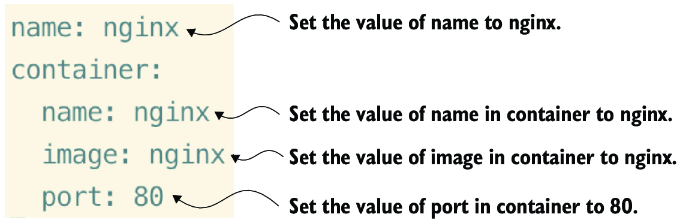

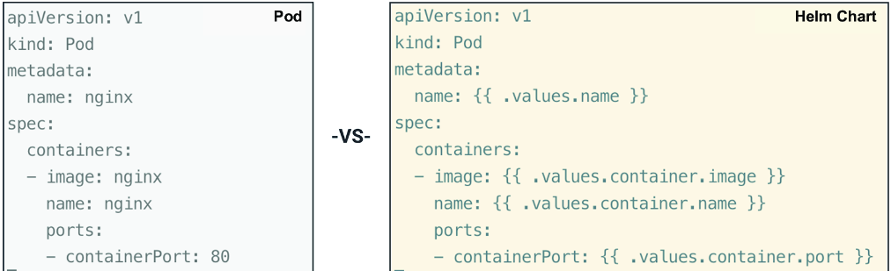

**Create values.yaml:**
```yaml
configInline:
  address-pools:
   - name: default
     protocol: layer2
     addresses:
     - 172.18.255.200-172.18.255.250
```

**Install with values:**
```bash
root@kind-control-plane:/# helm install metallb metallb/metallb --values values.yaml
NAME: metallb
LAST DEPLOYED: Thu Jan 23 04:49:11 2025
NAMESPACE: default
STATUS: deployed
REVISION: 1
```

> [!TIP]
> To install a specific version: `helm install metallb metallb/metallb --version x.y.z`

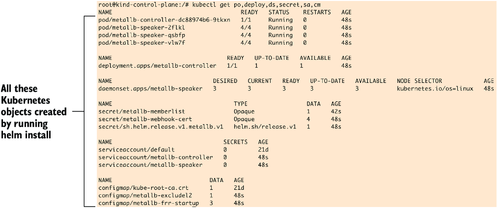

**List installed charts:**
```bash
root@kind-control-plane:/# helm ls
NAME       NAMESPACE    REVISION    UPDATED                              STATUS      CHART             APP VERSION
metallb    default      1           2025-01-23 04:49:11.896140217 +0000  deployed    metallb-0.14.9    v0.14.9
```

**Install to specific namespace:**
```bash
helm install <name> <chart> --namespace=your-namespace --create-namespace
```

> [!TIP]
> Use `helm install --dry-run=client` or `helm template` to generate manifests without installing.

---

### 5.3.2 Kustomize

Kustomize is built into kubectl—no separate CLI needed.

**Step 1: Create base directory**
```bash
mkdir -p base && cd base
```

**Step 2: Create deployment and service YAML**
```bash
kubectl create deploy my-app --image=nginx:latest --port=80 --dry-run=client -o yaml > deployment.yaml
kubectl create svc clusterip myapp --tcp=80:80 --dry-run=client -o yaml > service.yaml
```

**Step 3: Create kustomization.yaml**
```yaml
resources:
- deployment.yaml
- service.yaml
```

**Step 4: Apply with Kustomize**
```bash
kubectl apply -k base/
```

### Overlays

Create environment-specific customizations:

```bash
mkdir -p overlays/staging
```

**overlays/staging/kustomization.yaml:**
```yaml
resources:
- ../../base

patches:
- target:
    kind: Deployment
    name: my-app
  patch: |-
    - op: replace
      path: /spec/replicas
      value: 3
```

**Apply overlay:**
```bash
kubectl apply -k overlays/staging/
```

> [!TIP]
> Preview changes without applying: `kubectl kustomize overlays/staging/`
> Compare with cluster state: `kubectl kustomize overlays/staging/ | kubectl diff -f -`

> [!WARNING]
> If you remove an object from Kustomize files, it won't be removed from the cluster. Delete it manually!

---

## 5.4 Custom Resource Definitions and Operators

**CRDs** allow you to extend the Kubernetes API with custom resources.

**Operators** use CRDs to define what to manage and include controllers that automate tasks like deployment, scaling, and healing.

> [!TIP]
> The CKA exam doesn't ask about specific operators. We use CloudNativePG as an example.

---

### 5.4.1 Defining a CRD

Key CRD configuration:

| Field | Description |
|-------|-------------|
| **name** | Name of the CRD |
| **group** | API group |
| **scope** | Namespaced or Cluster |

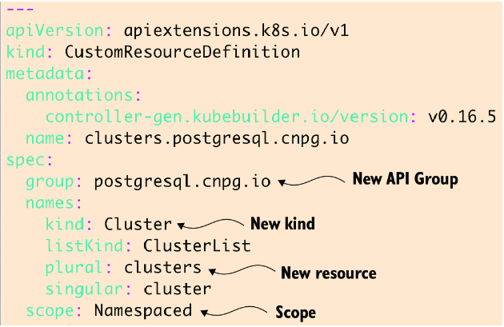

---

### 5.4.2 Installing Operators and CRDs

**Install CloudNativePG operator:**
```bash
kubectl apply --server-side -f https://raw.githubusercontent.com/cloudnative-pg/cloudnative-pg/release-1.26/releases/cnpg-1.26.1.yaml
```

**View installed CRDs:**
```bash
root@kind-control-plane:/# kubectl get crds
backups.postgresql.cnpg.io                2025-08-28T04:06:10Z
clusterimagecatalogs.postgresql.cnpg.io   2025-08-28T04:06:10Z
clusters.postgresql.cnpg.io               2025-08-28T04:06:10Z
databases.postgresql.cnpg.io              2025-08-28T04:06:10Z
...
```

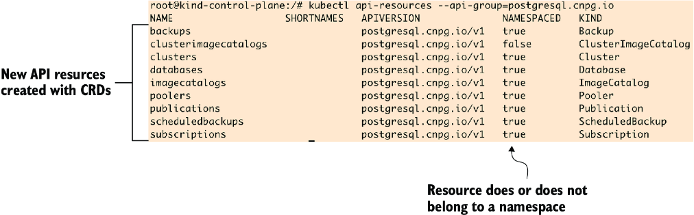

> [!TIP]
> If installing with Helm and you don't want CRDs, use `--skip-crds`.

**Explore CRD with explain:**
```bash
root@kind-control-plane:/# kubectl explain clusters.postgresql.cnpg.io
GROUP:      postgresql.cnpg.io
KIND:       Cluster
VERSION:    v1

DESCRIPTION:
    Cluster is the Schema for the PostgreSQL API
```

---

### 5.4.3 Utilizing Operators

**Verify operator is running:**
```bash
root@kind-control-plane:/# kubectl get deployment -n cnpg-system cnpg-controller-manager
NAME                      READY   UP-TO-DATE   AVAILABLE   AGE
cnpg-controller-manager   1/1     1            1           6m27s
```

> [!NOTE]
> **CRD** = Custom Resource Definition (the schema)
> **CR** = Custom Resource (an instance of the CRD)

**Create a Postgres cluster CR:**
```yaml
apiVersion: postgresql.cnpg.io/v1
kind: Cluster
metadata:
  name: my-postgres-cluster
  namespace: default
spec:
  instances: 1
  storage:
    size: 1Gi
```

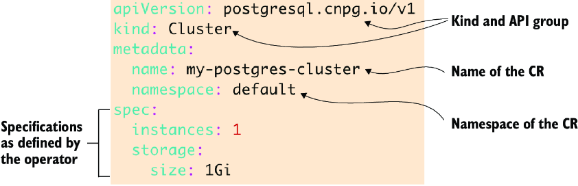

**Apply and verify:**
```bash
root@kind-control-plane:/# kubectl apply -f postgres-cluster.yaml
cluster.postgresql.cnpg.io/my-postgres-cluster created

root@kind-control-plane:/# kubectl get cluster my-postgres-cluster
NAME                  AGE     INSTANCES   READY   STATUS                     PRIMARY
my-postgres-cluster   3m19s   1           1       Cluster in healthy state   my-postgres-cluster-1

root@kind-control-plane:/# kubectl get pods
NAME                    READY   STATUS    RESTARTS   AGE
my-postgres-cluster-1   1/1     Running   0          6m44s
```

---

### Practice Exercises

8. Install cert-manager operator using Helm on namespace `my-cert-manager` with `--set crds.enabled=true`. List all CRDs belonging to cert-manager API group.

9. Install Argo CD operator using `kubectl apply -k`. Install CRDs separately. Check CRDs and verify the operator is running.

---

## Summary

- **Deployments** are common resources; ReplicaSets within keep the desired number of replicas running.

- **Rollouts** are versioned, and you can leave notes using annotations for other administrators.

- **Expose** a Deployment to create a service for external access.

- **Maintenance** requires knowledge of `cordon`, `drain`, and `uncordon` for OS upgrades or adding resources.

- **Add nodes** to an existing cluster using `kubeadm token create --print-join-command`.

- **Helm** is a package manager and templating engine for Kubernetes.

- **Kustomize** is built into kubectl, using `kustomization.yaml` files with base and overlays.

- **CRDs and Operators** extend Kubernetes—know how to install and utilize them for the exam.
