# 6. Communication in a Kubernetes Cluster

## This chapter covers
- How nodes communicate via a container network interface and the different container network interfaces available
- Pod-to-pod communication and traffic rules with Network Policies
- Types of Services in Kubernetes and when they are used
- Assigning IP addresses to pods
- Communication via DNS and how to use CoreDNS
- Using ingress and ingress controllers
- Understanding and implementing the new Gateway API mechanism

Networking in Kubernetes is complex, but we will break it down fully in this chapter—it's **20% of the CKA exam**. By the end, you'll know how pods talk to each other within a cluster.

---

## The Services and Networking Domain

| Competency | Chapter Section |
|------------|-----------------|
| Understand host networking configuration on the cluster nodes | 6.5 |
| Understand connectivity between pods | 6.2 |
| Use ClusterIP, NodePort, and LoadBalancer Service types and endpoints | 6.4 |
| Know how to use ingress controllers and ingress resources | 6.3 |
| Understand and use CoreDNS | 6.1, 6.2 |
| Choose an appropriate container network interface plugin | 6.5 |
| Define and enforce Network Policies | 6.6 |
| Use the Gateway API to manage ingress traffic | 6.7 |

---

## 6.1 Configuring DNS

**CoreDNS** is responsible for resolving hostnames to IP addresses. It's been the default DNS server since Kubernetes v1.12.

### IP Address Ranges in Kubernetes

| CIDR Range | Also Known As | Purpose | Managed By |
|------------|---------------|---------|------------|
| **Nodes CIDR** | Internal-IP | Worker/control plane node subnet | Cloud provider/network admin |
| **Pod CIDR** | Cluster-CIDR | Pod IP addresses | CNI (network plugin) |
| **Service CIDR** | Service-Cluster-IP-Range | ClusterIP Service addresses | API server |

> [!NOTE]
> **Exam Task Example:** Change Service CIDR to 100.96.0.0/16, update the DNS Service IP, modify kubelet configuration, and verify pods receive the new DNS IP.

### Changing Service CIDR

**Step 1: Modify API server configuration**

```bash
vim /etc/kubernetes/manifests/kube-apiserver.yaml
```

Change `--service-cluster-ip-range` from `10.96.0.0/16` to `100.96.0.0/16`:

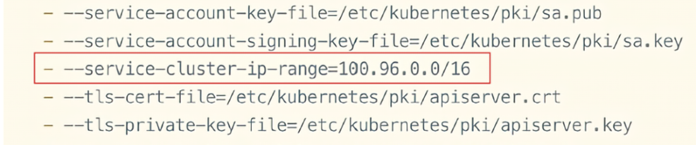

**Step 2: Delete and recreate Services**

```bash
root@kind-control-plane:/# kubectl -n kube-system delete svc kube-dns
service "kube-dns" deleted

root@kind-control-plane:/# kubectl delete svc kubernetes
service "kubernetes" deleted

root@kind-control-plane:/# kubectl delete servicecidr kubernetes
servicecidr.networking.k8s.io "kubernetes" deleted
```

**Step 3: Verify new CIDR**
```bash
root@kind-control-plane:/# kubectl get servicecidr
NAME         CIDRS           AGE
kubernetes   100.96.0.0/16   11s
```

> [!TIP]
> Use Tab for autocomplete on resource names to prevent typos. Always copy and paste where you can!

**Step 4: Recreate kube-dns Service**

```bash
cat <<'EOF' | kubectl create -f -
apiVersion: v1
kind: Service
metadata:
  labels:
    k8s-app: kube-dns
    kubernetes.io/cluster-service: "true"
    kubernetes.io/name: CoreDNS
  name: kube-dns
  namespace: kube-system
spec:
  clusterIP: 100.96.0.10
  clusterIPs:
  - 100.96.0.10
  ports:
  - name: dns
    port: 53
    protocol: UDP
    targetPort: 53
  - name: dns-tcp
    port: 53
    protocol: TCP
    targetPort: 53
  selector:
    k8s-app: kube-dns
  type: ClusterIP
EOF
```

**Step 5: Modify kubelet configuration**

Edit `/var/lib/kubelet/config.yaml`:

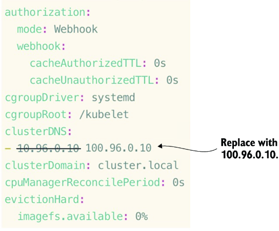

**Step 6: Edit kubelet ConfigMap**
```bash
kubectl -n kube-system edit cm kubelet-config
```

**Step 7: Upgrade and restart kubelet**
```bash
kubeadm upgrade node phase kubelet-config
systemctl daemon-reload
systemctl restart kubelet
```

> [!TIP]
> Memorize: `systemctl stop kubelet`, `systemctl start kubelet`, `systemctl restart kubelet`, and `systemctl daemon-reload`

**Step 8: Verify DNS in new pod**
```bash
root@kind-control-plane:/# kubectl run netshoot --image=nicolaka/netshoot --command sleep --command "3600"

root@kind-control-plane:/# kubectl exec -it netshoot -- bash
bash-5.1# cat /etc/resolv.conf
search default.svc.cluster.local svc.cluster.local cluster.local
nameserver 100.96.0.10
options ndots:5

bash-5.1# nslookup example.com
Server:    100.96.0.10
Address:   100.96.0.10#53
Name:      example.com
Address:   23.220.75.245
```

---

## 6.2 CoreDNS

CoreDNS provides a central location for pods to query hostnames and IP addresses.

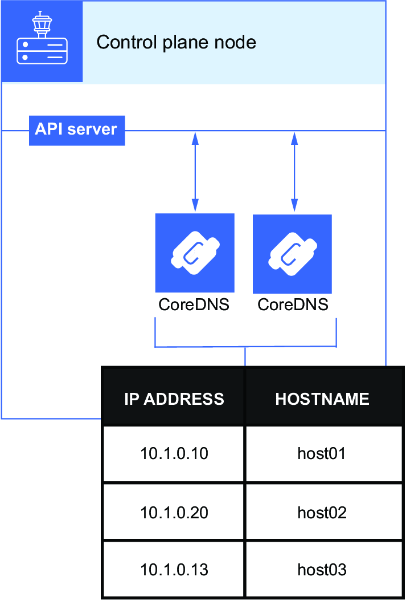

### 6.2.1 Service CIDR

Service CIDRs are a non-namespaced resource defining virtual IP address ranges for ClusterIP Services.

> [!NOTE]
> Every servicecidr has a **finalizer** attached—it can only be deleted if associated Services are deleted first.

### 6.2.2 Config Files

| Configuration | Location |
|---------------|----------|
| kubelet config file | `/var/lib/kubelet/config.yaml` |
| Static pods directory | `/etc/kubernetes/manifests/` |
| kubelet ConfigMap | `kubelet-config` in kube-system |
| CoreDNS ConfigMap | `coredns` in kube-system |

> [!TIP]
> Static pods in `/etc/kubernetes/manifests/` autoprovision without the scheduler's awareness.

### 6.2.3 Replicating DNS

CoreDNS runs as a Deployment with replicas:

```bash
root@kind-control-plane:/# kubectl -n kube-system get deploy
NAME      READY   UP-TO-DATE   AVAILABLE   AGE
coredns   2/2     2            2           147m
```

**Scale for better performance:**
```bash
kubectl -n kube-system scale deploy coredns --replicas 3
```

### 6.2.4 Pod-to-Pod Connectivity

**Service FQDN format:**
```
<service-name>.<namespace-name>.svc.cluster.local
```

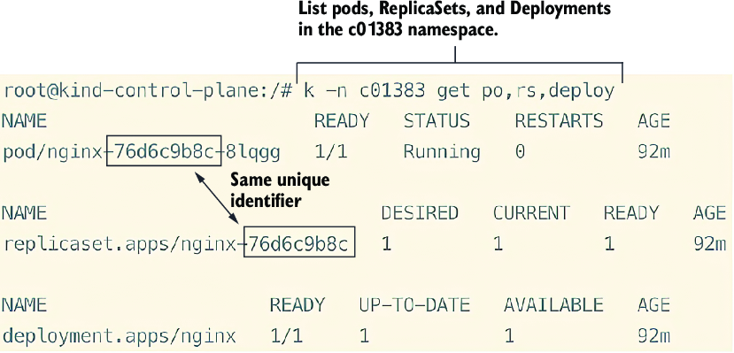

**Communicate across namespaces:**
```bash
root@nginx-76d6c9b8c-8lqgg:/# curl apache-svc
curl: (6) Could not resolve host: apache-svc

root@nginx-76d6c9b8c-8lqgg:/# curl apache-svc.default
<html><body><h1>It works!</h1></body></html>
```

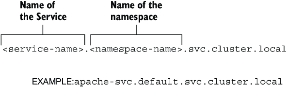

**Pod FQDN format:**
```
<ip-with-dashes>.<namespace>.pod.cluster.local
```

Example: `10-244-0-14.default.pod.cluster.local`

---

### Practice Exercises

1. Exec into a pod and cat `/etc/resolv.conf` to see the DNS server IP.
2. Stop and reload the kubelet daemon. Verify the Service is active.
3. Edit the kube-dns Service clusterIP to `100.96.0.10`.
4. Edit the kubelet ConfigMap to change clusterDNS.
5. Scale CoreDNS Deployment to 3 replicas.
6. Test access from a pod to a Service.
7. Locate a Service by its DNS name using minimal characters.

---

## 6.3 Ingress and Ingress Controllers

**Ingress** works with Services to route external HTTP/HTTPS traffic to internal workloads. Routing rules are based on HTTP request paths and hostnames.

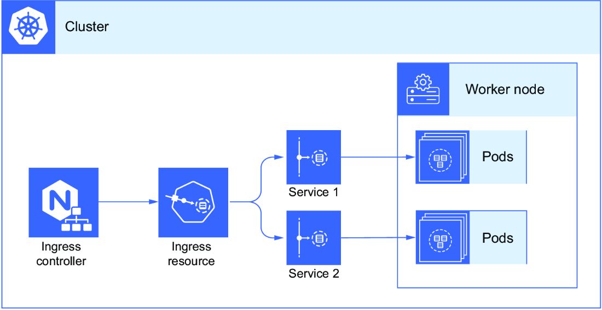

> [!NOTE]
> **Exam Task Example:** Install an ingress controller, create Deployment `hello`, Service `hello-svc`, and ingress resource routing `hello.com` to the Service.

### Installing Ingress Controller

```bash
kubectl apply -f https://raw.githubusercontent.com/chadmcrowell/acing-the-cka-exam/main/ch_06/nginx-ingress-controller.yaml
```

**View resources:**
```bash
root@ingress-control-plane:/# kubectl -n ingress-nginx get all
NAME                                            READY   STATUS      RESTARTS   AGE
pod/ingress-nginx-controller-6c695f6cc7-ntjbt   1/1     Running     0          27s
...
```

> [!NOTE]
> Popular ingress controllers: **ingress-nginx** (Kubernetes community), HAProxy, Contour, nginx-ingress (NGINX company - different from ingress-nginx).

### Creating Deployment and Service

```bash
kubectl create deploy hello --image nginxdemos/hello:plain-text --port 80
kubectl expose deploy hello --name hello-svc --port 80
```

### Creating Ingress Resource

```bash
kubectl apply -f https://raw.githubusercontent.com/chadmcrowell/acing-the-cka-exam/main/ch_06/hello-ingress.yaml
```

**Add DNS entry for testing:**

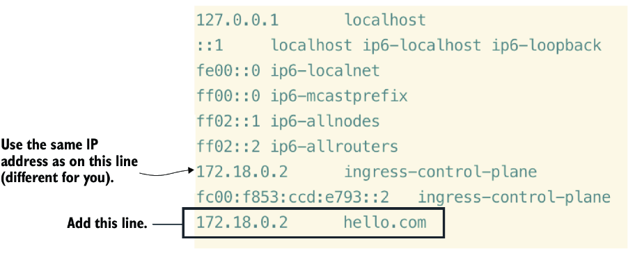

**Test:**
```bash
root@ingress-control-plane:/# curl hello.com
Server address: 10.244.0.8:80
Server name: hello-665cb98d5f-cfmll
Date: 30/Sep/2022:20:38:01 +0000
URI: /
```

### Ingress Path Types

| Path Type | Description |
|-----------|-------------|
| **Exact** | Must match path exactly (case-sensitive) |
| **Prefix** | Matches URL path split by `/` |
| **ImplementationSpecific** | Ingress class decides |

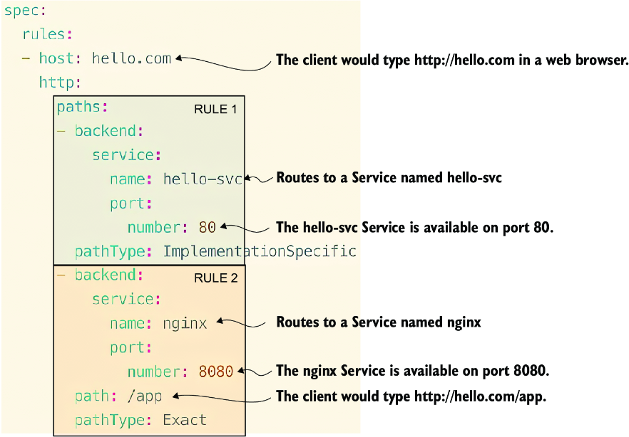

### Subdomain Routing

```yaml
apiVersion: networking.k8s.io/v1
kind: Ingress
metadata:
  name: hello
spec:
  rules:
  - host: hello.com
    http:
      paths:
      - pathType: ImplementationSpecific
        path: "/"
        backend:
          service:
            name: hello-svc
            port:
              number: 80
  - host: app.hello.com
    http:
      paths:
      - pathType: Exact
        path: "/"
        backend:
          service:
            name: nginx
            port:
              number: 8080
```

---

## 6.4 Services

Pods are ephemeral—their IP addresses constantly change. **Services** provide:
- Distributed load balancing
- Consistent IP address and DNS name
- Pod discovery across nodes

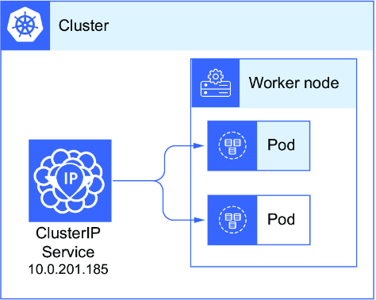

### Service Types

| Type | Description | Access |
|------|-------------|--------|
| **ClusterIP** | Internal cluster communication only | Within cluster |
| **NodePort** | Exposes static port on each node (30000-32768) | Node IP:Port |
| **LoadBalancer** | External load balancer | External IP |
| **ExternalName** | CNAME record, no ClusterIP | DNS only |

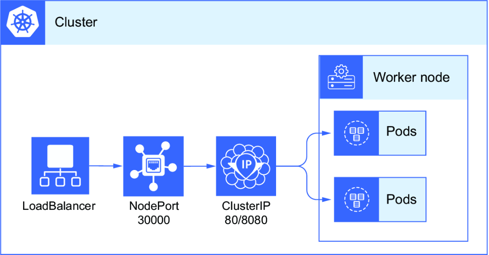

**View endpoints:**
```bash
root@kind-control-plane:/# kubectl get ep
NAME         ENDPOINTS         AGE
apache-svc   10.244.0.14:80    129m
kubernetes   172.18.0.2:6443   8h
```

---

### 6.4.1 ClusterIP Service

For internal cluster communication only.

```bash
kubectl create svc clusterip internal-svc --tcp 8080:80 --dry-run=client -o yaml > svc.yaml
```

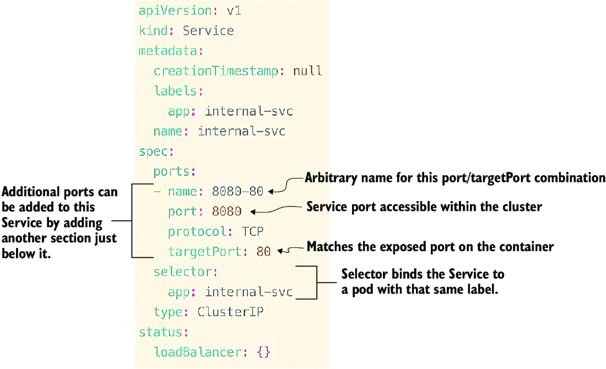

**Multiple ports:**
```yaml
spec:
  ports:
  - name: 8080-80
    port: 8080
    protocol: TCP
    targetPort: 80
  - name: search
    port: 9200
    protocol: TCP
    targetPort: 9200
  selector:
    app: internal-svc
  type: ClusterIP
```

**Headless Service** (direct pod access):
```yaml
spec:
  clusterIP: None
  ...
```

---

### 6.4.2 NodePort Service

Exposes a static port on each node (port range: 30000-32768).

```bash
kubectl create svc nodeport no --node-port 30000 --tcp 443:80 --dry-run=client -o yaml > nodeport.yaml
```

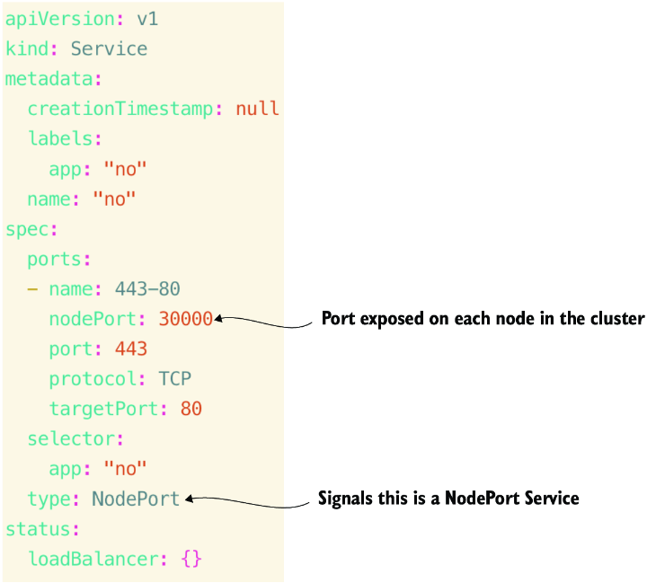

```bash
root@kind-control-plane:/# kubectl get svc
NAME   TYPE       CLUSTER-IP      EXTERNAL-IP   PORT(S)         AGE
no     NodePort   100.96.95.252   <none>        443:30000/TCP   3s
```

---

### 6.4.3 LoadBalancer Service

Uses an external load balancer (cloud or bare metal like MetalLB).

```bash
kubectl create svc loadbalancer lb-svc --tcp 8080:8080 --dry-run=client -o yaml > lb-svc.yaml
```

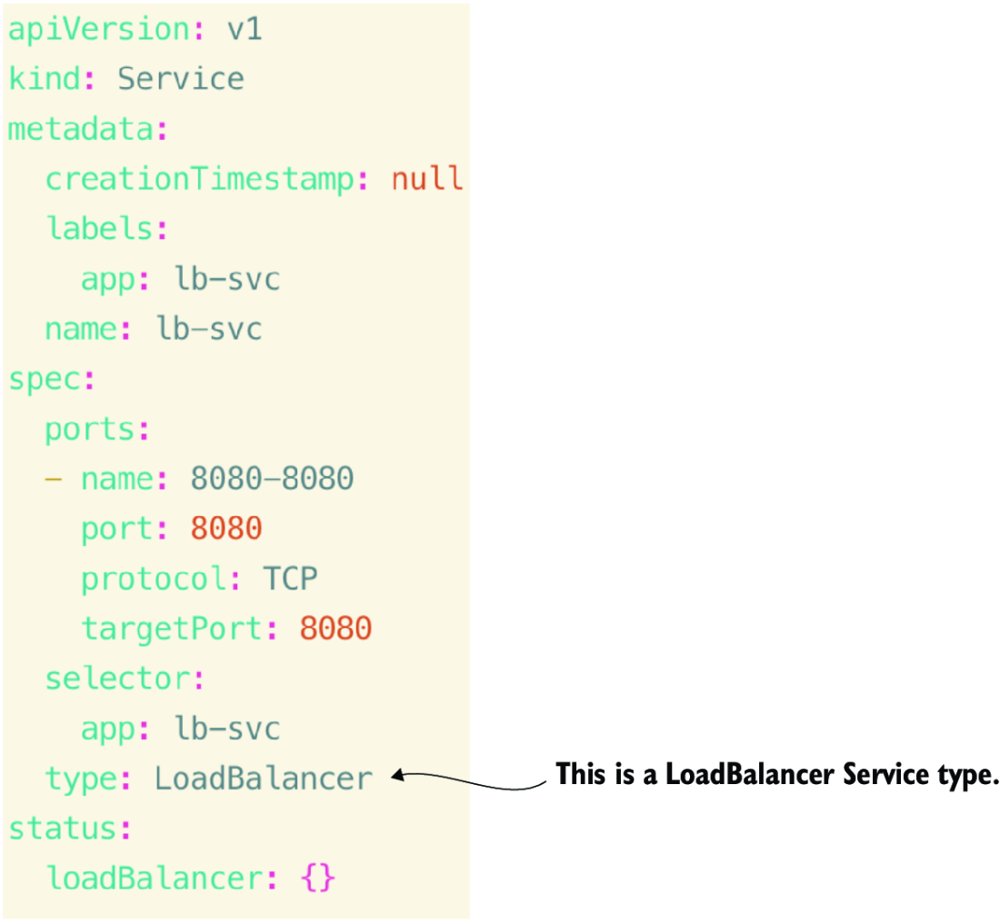

**Install MetalLB for kind:**
```bash
kubectl apply -f https://raw.githubusercontent.com/chadmcrowell/acing-the-cka-exam/main/ch_06/metallb-native.yaml
```

**Configure address pool:**
```yaml
apiVersion: metallb.io/v1beta1
kind: IPAddressPool
metadata:
  name: first-pool
  namespace: metallb-system
spec:
  addresses:
  - 172.18.255.1-172.18.255.50
---
apiVersion: metallb.io/v1beta1
kind: L2Advertisement
metadata:
  name: example
  namespace: metallb-system
```

**Change Service to LoadBalancer:**
```bash
kubectl edit svc apache-svc  # Change type: ClusterIP to type: LoadBalancer

root@kind-control-plane:/# kubectl get svc
NAME         TYPE           CLUSTER-IP      EXTERNAL-IP    PORT(S)        AGE
apache-svc   LoadBalancer   100.96.25.132   172.18.255.1   80:30499/TCP   30s

root@kind-control-plane:/# curl 172.18.255.1
<html><body><h1>It works!</h1></body></html>
```

---

## 6.5 Cluster Node Networking Configuration

**CNI (Container Network Interface)** provides network overlays for pod communication across nodes.


| Popular CNIs | Notes |
|--------------|-------|
| **Flannel** | Simple, used on CKA exam |
| **Calico** | Supports Network Policies, used on CKA exam |
| **Cilium** | eBPF-based |
| **Kindnet** | Default for kind clusters |

**View CNI DaemonSet:**
```bash
root@kind-control-plane:/# kubectl get ds -n kube-system
NAME         DESIRED   CURRENT   READY   UP-TO-DATE   AVAILABLE
kindnet      1         1         1       1            1
kube-proxy   1         1         1       1            1
```

### Installing Flannel CNI

1. Download and install bridge plugin on all nodes:
```bash
wget https://github.com/containernetworking/plugins/releases/download/v1.7.1/cni-plugins-linux-amd64-v1.7.1.tgz
tar -xvf cni-plugins-linux-amd64-v1.7.1.tgz
mv bridge /opt/cni/bin/
```

2. Install Flannel:
```bash
kubectl apply -f https://raw.githubusercontent.com/flannel-io/flannel/master/Documentation/kube-flannel.yml
```

3. Verify:
```bash
root@kind-control-plane:/# kubectl get no
NAME                 STATUS   ROLES           AGE   VERSION
kind-control-plane   Ready    control-plane   16m   v1.32.0
kind-worker          Ready    <none>          16m   v1.32.0
```

---

### Practice Exercises

8. Create Deployment `hello` and expose with ClusterIP Service on port 80.
9. Change `hello-svc` to NodePort (30000), test with curl.
10. Install ingress controller, create ingress for `hello.com`.
11. Create kind cluster without CNI, install Calico.

---

## 6.6 Network Policies

**Network Policies** manage traffic flow within a Kubernetes cluster—restrict pod-to-pod communication, filter ingress on specific ports, or enforce namespace-level isolation.


> [!TIP]
> Ensure your CNI supports Network Policies! **Calico** supports them; **Flannel** does not.

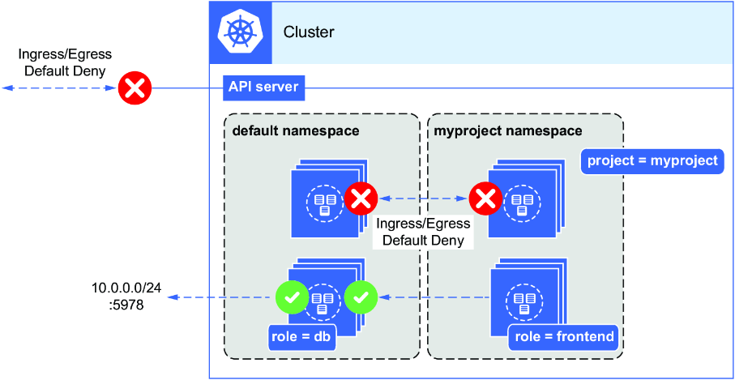

### Deny All Policy

```yaml
apiVersion: networking.k8s.io/v1
kind: NetworkPolicy
metadata:
  name: default-deny-all
  namespace: default
spec:
  podSelector: {}
  policyTypes:
  - Ingress
  - Egress
```

**Test:**
```bash
root@kind-control-plane:/# kubectl run busybox --image=busybox -it -- sh
/ # wget -qO- http://10.244.162.129:80 --timeout 10
wget: download timed out
```

### Allow Specific Traffic

**Allow ingress to nginx from busybox:**
```yaml
apiVersion: networking.k8s.io/v1
kind: NetworkPolicy
metadata:
  name: allow-nginx-ingress
  namespace: default
spec:
  podSelector:
    matchLabels:
      run: nginx
  policyTypes:
    - Ingress
  ingress:
    - from:
        - podSelector:
            matchLabels:
              run: busybox
      ports:
        - protocol: TCP
          port: 80
```

**Allow egress from busybox to nginx:**
```yaml
apiVersion: networking.k8s.io/v1
kind: NetworkPolicy
metadata:
  name: allow-busybox-egress
  namespace: default
spec:
  podSelector:
    matchLabels:
      run: busybox
  policyTypes:
    - Egress
  egress:
    - to:
        - podSelector:
            matchLabels:
              run: nginx
      ports:
        - protocol: TCP
          port: 80
```

> [!TIP]
> If `.spec.podSelector` is empty `{}`, the NetworkPolicy applies to all pods in the namespace.

> [!IMPORTANT]
> Network Policies are **additive**—they don't conflict. Each item under `.spec.ingress[].from[]` is treated as **OR**. Items within the same list entry are **AND**.

---

### Practice Exercises

12. Create `backend` and `frontend` namespaces with deny-all policies. Create nginx Deployment in backend, netshoot pod in frontend. Test connectivity, then allow ingress from frontend.

---

## 6.7 Gateway API

The **Gateway API** is the next evolution in managing ingress traffic, offering greater flexibility than traditional ingress resources.

### Three Personas

| Persona | Resource | Scope | Responsibility |
|---------|----------|-------|----------------|
| **Infrastructure Provider (SRE)** | GatewayClass | Cluster | Define underlying infrastructure |
| **Cluster Operator** | Gateway | Namespace | TLS, ports, protocols |
| **Application Developer** | HTTPRoute/TCPRoute | Namespace | Application routing rules |

> [!TIP]
> Gateway API is built with CRDs. Know the three object types: **GatewayClass**, **Gateway**, and **HTTPRoute**.

### GatewayClass

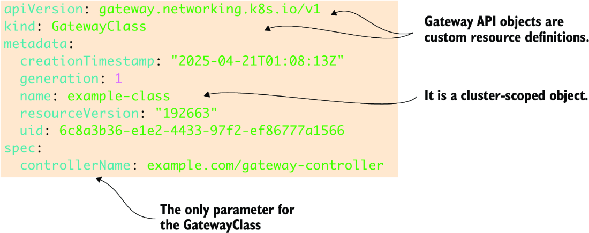

```yaml
apiVersion: gateway.networking.k8s.io/v1
kind: GatewayClass
metadata:
  name: example-class
spec:
  controllerName: example.com/gateway-controller
```

> [!TIP]
> GatewayClass takes only one parameter: `controllerName`. Easy partial points!

### Gateway


```yaml
apiVersion: gateway.networking.k8s.io/v1
kind: Gateway
metadata:
  name: example-gateway
  namespace: default
spec:
  gatewayClassName: example-class
  listeners:
  - name: http
    protocol: HTTP
    port: 80
```

### HTTPRoute

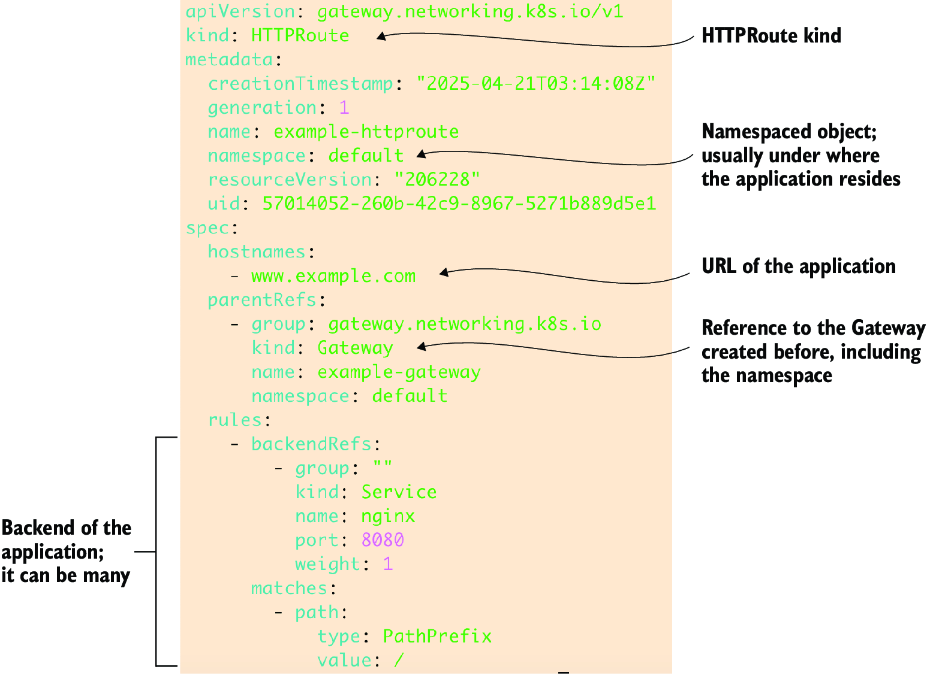

```yaml
apiVersion: gateway.networking.k8s.io/v1
kind: HTTPRoute
metadata:
  name: example-httproute
spec:
  parentRefs:
  - name: example-gateway
  hostnames:
  - "www.example.com"
  rules:
  - matches:
    - path:
        type: PathPrefix
        value: /
    backendRefs:
    - name: nginx
      port: 8080
```

### Ingress vs Gateway API

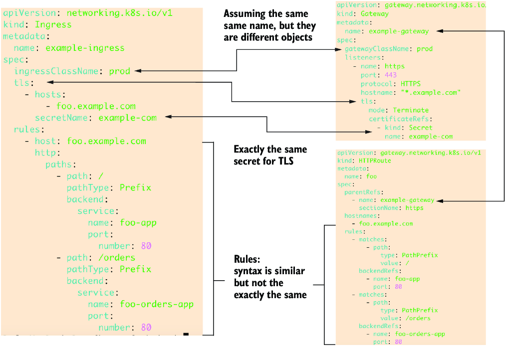

> [!TIP]
> On the exam, you might be asked to convert an ingress object into Gateway API specs.

---

### Practice Exercises

13. Create kind cluster with Gateway API CRDs. Create namespace `app-space`, pod `simple-web`, Service, ingress resource, Gateway, and HTTPRoute. Compare ingress and HTTPRoute.

---

## Summary

- **CoreDNS** provides DNS resolution in a Kubernetes cluster. Know how to configure and use it.

- CoreDNS runs as a **Deployment** in kube-system. Scale replicas for faster resolution.

- The **kubelet** populates each pod with the CoreDNS IP address. Static pods live in `/etc/kubernetes/manifests/`.

- Pod DNS resolver file is `/etc/resolv.conf`. Use **FQDN** for cross-namespace resolution.

- **Ingress** and ingress controllers handle layer-7 routing. Know path-based and host-based routing.

- Four **Service types**: ClusterIP, NodePort, LoadBalancer, ExternalName. Understand pod connectivity.

- The **kubelet** is a Linux service. Know how to stop, start, and reload it.

- **CNI** assists node-to-node communication via packet encapsulation. Know Flannel and Calico for the exam.

- **Network Policies** control traffic flow. Know that Calico supports them; Flannel does not.

- **Gateway API** is the next evolution for ingress traffic. Know GatewayClass, Gateway, and HTTPRoute.
