# 7. Storage in Kubernetes

## This chapter covers
- Creating a volume in Kubernetes
- Persistent volume claims and storage classes
- Using storage with applications in Kubernetes

Pods are ephemeral, and so is the data that resides in them. To solve this problem and retain data, we create **persistent volumes (PVs)**. On the exam, you'll be tested on creating a PV, a persistent volume claim (PVC), and a storage class.

---

## The Storage Domain

| Competency | Chapter Section |
|------------|-----------------|
| Implement storage classes and dynamic volume provisioning | 7.1, 7.3 |
| Configure volume types, access modes, and reclaim policies | 7.1.1, 7.1.2, 7.1.3, 7.4 |
| Manage persistent volumes and persistent volume claims | 7.2 |

---

## 7.1 Persistent Volumes

**Persistent Volumes (PVs)** are cluster-wide (not namespaced) resources that decouple storage from pods. The actual storage is backed by the host, NFS server, S3 bucket, or other storage providers.

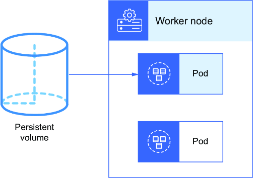

The CKA exam covers three volume types:
1. **emptyDir** - Temporary storage (non-persistent)
2. **hostPath** - Local node directory
3. **nfs** - Network file system

> [!NOTE]
> **Exam Task Example:** Create a hostPath PV `vol02833` (100 MB) from `/mnt/data`, a PVC `claim-02833` (90 MB), and mount it to Deployment `frontend0113` at `/usr/share/nginx/html`.

### Creating a PV

Use the Kubernetes documentation: http://mng.bz/rW0y

> [!TIP]
> Use CTRL + SHIFT + C to copy and CTRL + SHIFT + V to paste in the exam environment.

**pv.yaml:**

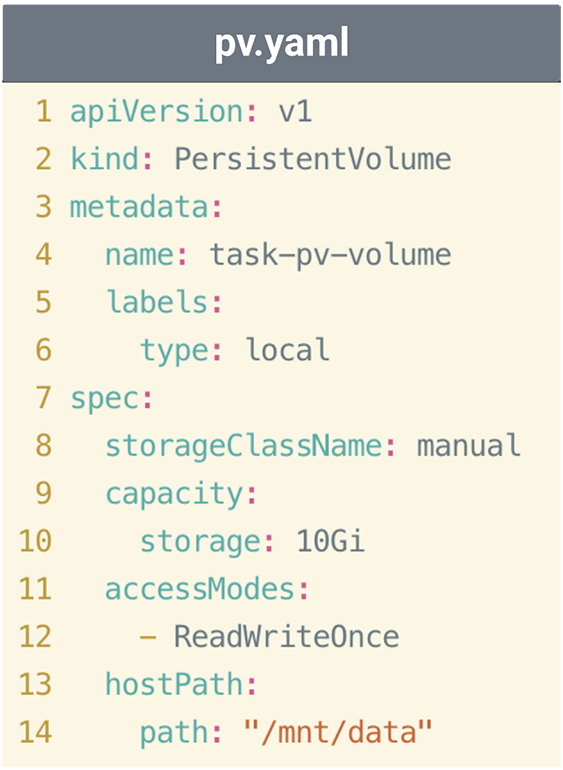

```bash
root@kind-control-plane:/# kubectl create -f pv.yaml
root@kind-control-plane:/# kubectl get pv
NAME       CAPACITY   ACCESS MODES   RECLAIM POLICY   STATUS      CLAIM   STORAGECLASS
vol02833   100Mi      RWO            Retain           Available           manual
```

### Creating a PVC

**pvc.yaml:**

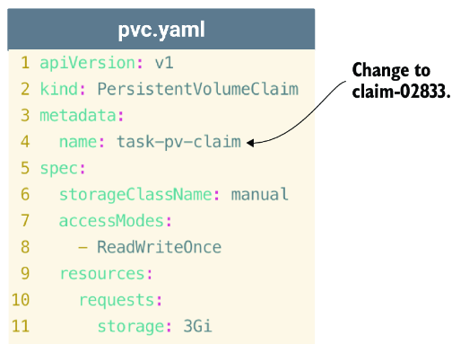

```bash
root@kind-control-plane:/# kubectl apply -f pvc.yaml
root@kind-control-plane:/# kubectl get pvc
NAME          STATUS   VOLUME     CAPACITY   ACCESS MODES   STORAGECLASS   AGE
claim-02833   Bound    vol02833   100Mi      RWO            manual         4m

root@kind-control-plane:/# kubectl get pv
NAME       CAPACITY   ACCESS MODES   RECLAIM POLICY   STATUS   CLAIM                 STORAGECLASS
vol02833   100Mi      RWO            Retain           Bound    default/claim-02833   manual
```

> [!TIP]
> List multiple resources at once: `kubectl get pv,pvc`

> [!IMPORTANT]
> The PVC claims the entire PV even if requesting less. A PVC for 110Mi from a 100Mi PV would remain unbound.

### Creating a Deployment with PVC

**deploy.yaml:**


**Add volumes section:**

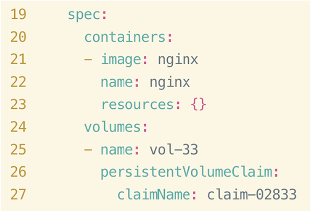

**Complete YAML with volumeMounts:**

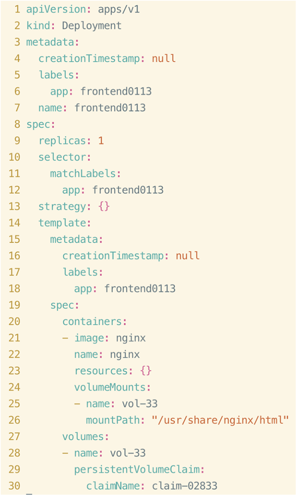

```bash
root@kind-control-plane:/# kubectl apply -f deploy.yaml
root@kind-control-plane:/# kubectl get deploy
NAME           READY   UP-TO-DATE   AVAILABLE   AGE
frontend0113   1/1     1            1           8s
```

**Verify mount:**

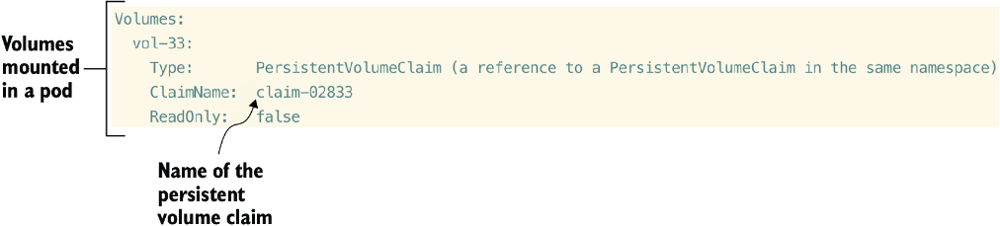

---

### 7.1.1 The Problem with hostPath

**hostPath** mounts a local directory from the node. Data persists on the node but:
- No data synchronization across nodes
- If a node is lost, so is the data

> [!TIP]
> If the exam says storage must persist beyond the pod's life, use **hostPath** unless stated otherwise. If data must exist on something besides local storage, the exam will specify the volume type (e.g., `nfs`).

### NFS Volume Example

NFS volumes store data on a network share and support multiple writers:

```yaml
apiVersion: v1
kind: PersistentVolume
metadata:
  name: nfs-pv
spec:
  capacity:
    storage: 1Mi
  accessModes:
    - ReadWriteMany
  nfs:
    server: nfs-server.default.svc.cluster.local
    path: "/"
  mountOptions:
    - nfsvers=4.2
```

**NFS PVC:**
```yaml
apiVersion: v1
kind: PersistentVolumeClaim
metadata:
  name: nfs-pvc
spec:
  accessModes:
    - ReadWriteMany
  storageClassName: ""
  resources:
    requests:
      storage: 1Mi
  volumeName: nfs-pv
```

**Pod using NFS:**
```yaml
apiVersion: v1
kind: Pod
metadata:
  name: nfs-pod
spec:
  containers:
  - image: nginx
    name: nfs-pod
    volumeMounts:
      - name: nfs-vol
        mountPath: "/usr/share/nginx/html"
  volumes:
  - name: nfs-vol
    persistentVolumeClaim:
      claimName: nfs-pvc
```

---

### 7.1.2 Volume Modes

| Volume Mode | Description |
|-------------|-------------|
| **FileSystem** (default) | Mounted into pods as a directory |
| **Block** | Raw block device, unformatted |

```bash
root@kind-control-plane:/# kubectl describe pv vol02833
...
VolumeMode:      FileSystem
...
```

**Create Block mode PV:**

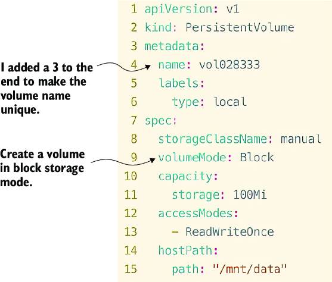

---

### 7.1.3 Access Modes

| Access Mode | Short Form | Description |
|-------------|------------|-------------|
| **ReadWriteOnce** | RWO | One node can mount for read/write |
| **ReadOnlyMany** | ROX | Multiple nodes can mount for read only |
| **ReadWriteMany** | RWX | Multiple nodes can mount for read/write |
| **ReadWriteOncePod** | RWOP | Only one pod can mount for read/write |

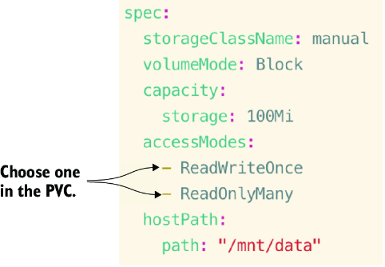

> [!IMPORTANT]
> **hostPath** only supports **ReadWriteOnce**. **NFS** supports RWO, ROX, and RWX.

> [!TIP]
> The exam covers only **emptyDir**, **hostPath**, and **nfs** volume types. emptyDir doesn't have access modes (not a PV type).

---

### 7.1.4 Reclaim Policies

| Policy | Description |
|--------|-------------|
| **Retain** | Volume can be used again; data retained |
| **Recycle** | Volume scrubbed (rm -f) - **DEPRECATED** |
| **Delete** | PV and backing storage deleted |

```bash
root@kind-control-plane:/# kubectl describe pv vol02833
...
Reclaim Policy:  Retain
...
```

> [!NOTE]
> Only Amazon EBS, GCE PD, Azure Disk, Oracle Cloud Infrastructure, and Cinder support the Delete policy.

---

### Practice Exercises

1. Create PV `volstore308` (22 MB) from `/mnt/data` with no storage class.
2. Create PVC `pv-claim-vol` to claim the PV.
3. Create pod `pod-access` (centos:7) mounting at `/tmp/persistence` with `sleep 3600`.

---

## 7.2 Persistent Volume Claims

PVCs choose the closest available PV to fulfill the request.

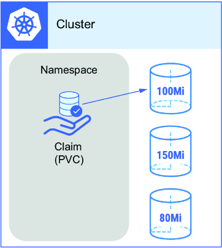

### Volume Protection

PVCs prevent accidental storage removal:

```bash
root@kind-control-plane:/# kubectl delete pv vol02833 --force
persistentvolume "vol02833" force deleted

root@kind-control-plane:/# kubectl get pv
NAME       CAPACITY   ACCESS MODES   RECLAIM POLICY   STATUS        CLAIM                 
vol02833   100Mi      RWO            Retain           Terminating   default/claim-02833
```

The PV remains in **Terminating** state until:
1. PVC is deleted
2. Pod using the PVC is deleted

### Volume Phases

| Phase | Description |
|-------|-------------|
| **Available** | Ready to be claimed |
| **Bound** | Already claimed by a PVC |
| **Released** | Reclaim policy is Retain; waiting for new PVC |
| **Failed** | Reclaim process failed |

---

## 7.3 Storage Class

A **storage class** is a "storage profile" for dynamically provisioning storage.

```bash
root@kind-control-plane:/# kubectl get sc
NAME                 PROVISIONER             RECLAIMPOLICY   VOLUMEBINDINGMODE      ALLOWVOLUMEEXPANSION
standard (default)   rancher.io/local-path   Delete          WaitForFirstConsumer   false
```

> [!NOTE]
> **Exam Task Example:** Create PVC `claim-03833` using storage class `standard` with 1 GB. Mount to Deployment `backend0113` at `/var/lib/mysql`.

**newpvc.yaml:**

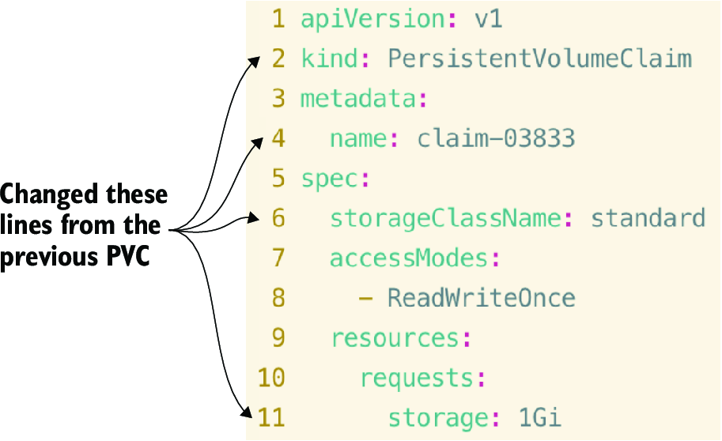

### Dynamic Provisioning

```bash
root@kind-control-plane:/# kubectl get pvc
NAME          STATUS    VOLUME      CAPACITY   ACCESS MODES   STORAGECLASS
claim-02833   Bound     vol028333   100Mi      RWO            manual
claim-03833   Pending                                         standard
```

The PVC is **Pending** because storage is only provisioned when a consumer (pod) is created.

### Creating the Consumer

**backend.yaml:**

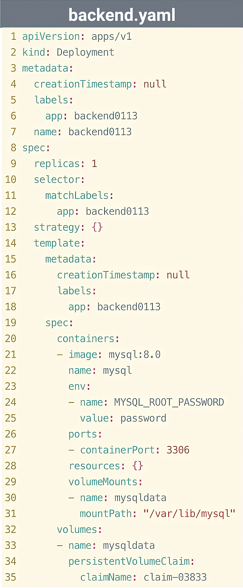

```bash
root@kind-control-plane:/# kubectl apply -f backend.yaml
root@kind-control-plane:/# kubectl get pvc,pv
NAME                                STATUS   VOLUME                                     CAPACITY   ACCESS MODES   STORAGECLASS
persistentvolumeclaim/claim-02833   Bound    vol028333                                  100Mi      RWO            manual
persistentvolumeclaim/claim-03833   Bound    pvc-5cc8fff1-e8a2-4934-ae17-fa4e3ecbcb40   1Gi        RWO            standard

NAME                                                        CAPACITY   ACCESS MODES   RECLAIM POLICY   STATUS   CLAIM
persistentvolume/pvc-5cc8fff1-e8a2-4934-ae17-fa4e3ecbcb40   1Gi        RWO            Delete           Bound    default/claim-03833
persistentvolume/vol028333                                  100Mi      RWO            Retain           Bound    default/claim-02833
```

---

### 7.3.1 Inheriting from the Storage Class

PVs inherit properties from the storage class:

```yaml
root@kind-control-plane:/# kubectl get sc standard -o yaml
apiVersion: storage.k8s.io/v1
kind: StorageClass
metadata:
  annotations:
    storageclass.kubernetes.io/is-default-class: "true"
  name: standard
provisioner: rancher.io/local-path
reclaimPolicy: Delete
volumeBindingMode: WaitForFirstConsumer
```

---

### Practice Exercises

4. Create storage class `node-local` with provisioner `kubernetes.io/no-provisioner` and `WaitForFirstConsumer`.
5. Create PVC `claim-sc` (39 MB) from the storage class with ReadWriteOnce.
6. Create pod `pod-sc` (nginx) mounting at `/usr/nginx/www/html`.

---

## 7.4 Nonpersistent Volumes

**emptyDir** uses temporary container storage that lasts only for the pod's lifetime.

> [!NOTE]
> **Exam Task Example:** Create pod `log-collector` with emptyDir volume `logvol` mounted at `/var/log`.

**log-collector.yaml:**

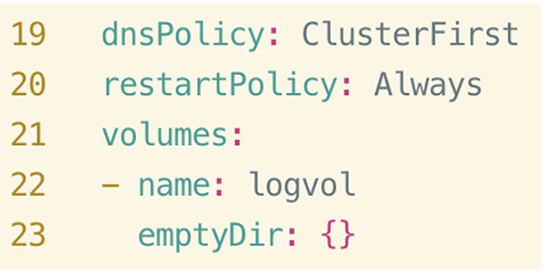

```yaml
apiVersion: v1
kind: Pod
metadata:
  labels:
    run: log-collector
  name: log-collector
spec:
  containers:
  - command:
    - sleep
    - "3600"
    image: busybox
    name: log-collector
    resources: {}
    volumeMounts:
    - mountPath: /var/log
      name: logvol
  dnsPolicy: ClusterFirst
  restartPolicy: Always
  volumes:
  - name: logvol
    emptyDir: {}
```

```bash
root@kind-control-plane:/# kubectl create -f log-collector.yaml
root@kind-control-plane:/# kubectl describe po log-collector
...
Volumes:
  logvol:
    Type:       EmptyDir (a temporary directory that shares a pod's lifetime)
    Medium:
    SizeLimit:  <unset>
```

> [!WARNING]
> emptyDir data does not persist. If the pod is killed, the data is deleted.

---

### Practice Exercises

7. Create pod `shared-pod-data` with two containers:
   - `busybox` (busybox:1.28) with `sleep 3600`
   - `httpd` (httpd:alpine3.17)
   - Share an emptyDir volume: busybox at `/html/`, httpd at `/var/www/html/`

---

## Summary

- **PVs** retain data beyond pod lifetime. Use when exam asks to retain data after deleting a pod.

- **PVCs** claim volumes for pods. Claims choose the nearest available size. Know how to mount volumes in Deployments/pods.

- **Volume Modes**: FileSystem (directory) or Block (raw). FileSystem is default.

- **Reclaim Policies**: Retain, Recycle (deprecated), or Delete. Watch for keywords in exam questions.

- **Access Modes**: RWO, ROX, RWX, RWOP. Check if multiple nodes need access.

- **Storage Classes** dynamically provision storage. No need to create PV manually—just create PVC referencing the storage class.
