# 8. Troubleshooting Kubernetes

## This chapter covers
- Monitoring and viewing logs
- Identifying high CPU or RAM usage
- Resolving common cluster problems
- Analyzing network traffic to identify communication concerns

Troubleshooting is the biggest topic (**30%**) on the CKA exam. This means fixing problems with applications, control plane components, worker nodes, and the underlying network.

---

## The Troubleshooting Domain

| Competency | Chapter Section |
|------------|-----------------|
| Monitor cluster and application resource usage | 8.1 |
| Manage and evaluate container output streams | 8.1 |
| Troubleshoot cluster components | 8.1, 8.2, 8.3 |
| Troubleshoot clusters and nodes | 8.2 |
| Troubleshoot Services and networking | 8.3 |

> [!NOTE]
> The exercises in this chapter involve "breaking" the cluster to provide something to troubleshoot. On the exam, the cluster will already be broken.

---

## 8.1 Understanding Application Logs

Container engines write all output to **stdout** and **stderr** streams to `/var/log/containers` on the node.

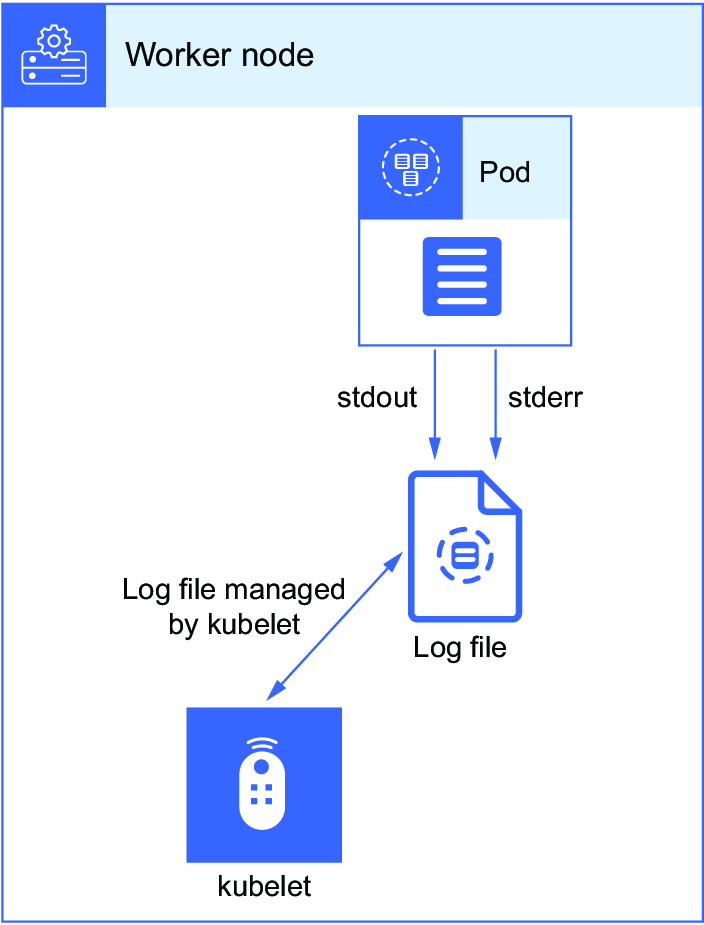

> [!NOTE]
> **Exam Task Example:** Create namespace `db08328`, create a mysql Deployment, view logs to determine why pod is unhealthy, fix and restore to running state.

### Setup and Context

```bash
apt update && apt install -y bash-completion
echo 'source <(kubectl completion bash)' >> ~/.bashrc
echo 'source /usr/share/bash-completion/bash_completion' >> ~/.bashrc
echo 'alias k=kubectl' >> ~/.bashrc
echo 'complete -o default -F __start_kubectl k' >> ~/.bashrc
source ~/.bashrc
```

```bash
root@kind-control-plane:/# kubectl create ns db08328
namespace/db08328 created

root@kind-control-plane:/# kubectl config set-context --current --namespace db08328
Context "kubernetes-admin@kind" modified.
```

> [!TIP]
> Once you set context to a namespace, you don't need `-n` each time. But on the exam, you may switch between clusters and namespaces, so sometimes explicitly typing the namespace is safer.

### Pod Status Types

| Status | Meaning |
|--------|---------|
| **CrashLoopBackOff** | Pod starts, crashes, restarts in a loop. Kubernetes waits with increasing back-off time. |
| **ImagePullBackOff** | Image not found locally or in registry. Continues retrying with back-off delay. |
| **ErrImagePull** | Image cannot be found or pulled due to authorization. |
| **CreateContainerConfigError** | Container won't start due to missing required components. |
| **RunContainerError** | Container runtime or entry point problems. |
| **FailedScheduling** | Nodes unschedulable, tained, or can't satisfy requirements. |
| **NonZeroExitCode** | Container exits due to application error or missing file. |
| **OOMKilled** | Memory limit exceeded. |

### Viewing Logs

```bash
root@kind-control-plane:/# kubectl get po -w
NAME                     READY   STATUS             RESTARTS      AGE
mysql-68f7776797-w92l6   0/1     CrashLoopBackOff   1 (10s ago)   7m28s

root@kind-control-plane:/# kubectl logs mysql-68f7776797-w92l6
2022-12-04 16:51:13+00:00 [ERROR] [Entrypoint]: Database is uninitialized 
↪ and password option is not specified
    You need to specify one of the following as an environment variable:
    - MYSQL_ROOT_PASSWORD
    - MYSQL_ALLOW_EMPTY_PASSWORD
    - MYSQL_RANDOM_ROOT_PASSWORD
```

**Fix by adding environment variable:**

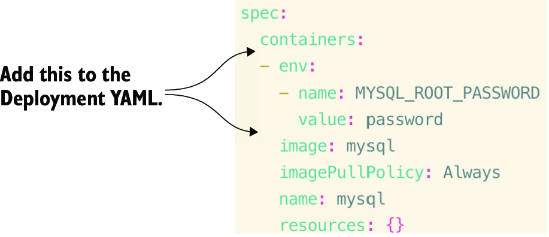

```bash
root@kind-control-plane:/# kubectl get po
NAME                     READY   STATUS    RESTARTS   AGE
mysql-5dcb7797f7-6spvc   1/1     Running   0          12m
```

> [!TIP]
> Alternative fix: `kubectl set env deploy/mysql MYSQL_ROOT_PASSWORD=password`

---

### 8.1.1 Container Log Detail

For multi-container pods, use `-c` to specify the container:

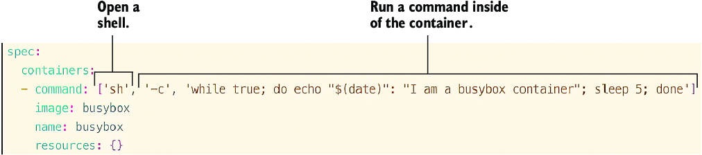

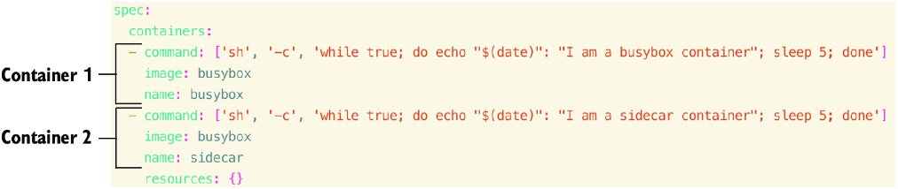

> [!TIP]
> **Vim copy/paste:** Select lines with `Shift + V`, use arrows to select, press `Y` to copy, `P` to paste.

```bash
# View specific container logs
kubectl logs busybox -c busybox
kubectl logs busybox -c sidecar

# View all containers
kubectl logs busybox --all-containers

# Stream logs
kubectl logs busybox --all-containers -f
```

> [!TIP]
> Use `kubectl logs --help` to see example commands you can copy and paste!

**Log file location:**

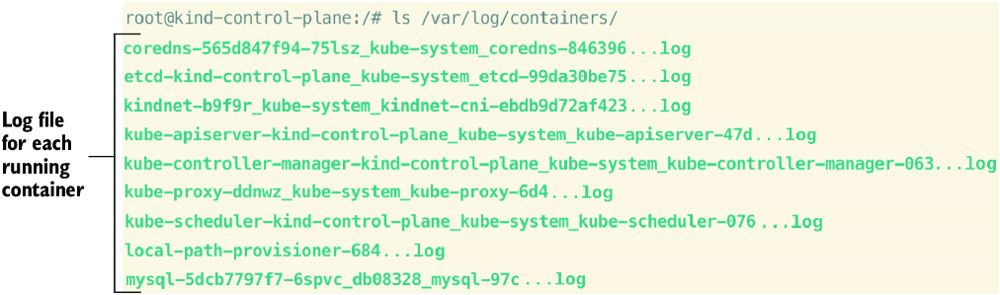

Log file format: `PODNAME_NAMESPACE_CONTAINERNAME-CONTAINERID.log`

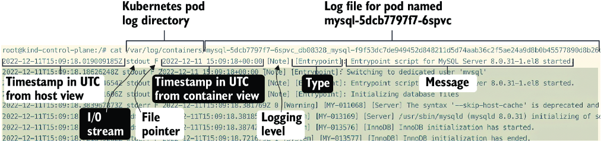

### Troubleshooting Decision Tree

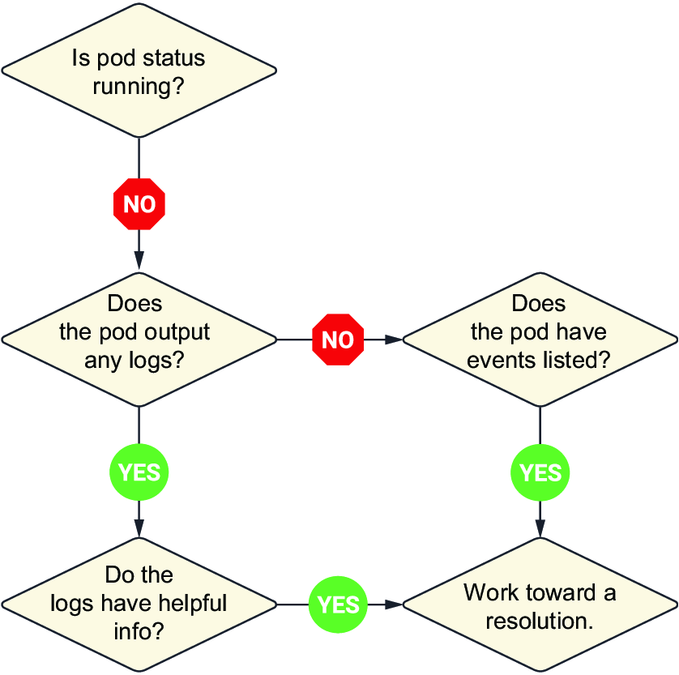

If `kubectl logs` returns nothing, use `kubectl describe po <pod-name>` to see events.

---

### 8.1.2 Troubleshooting from Inside the Container

```bash
# Create pod and get shell
kubectl run tool --image lansible/dnstools:latest -it

# DNS lookup from inside container
/ # nslookup kubernetes

# Re-enter running container
kubectl exec -it tool -- sh

# Run command and delete pod when done
kubectl run curlpod --image=nicolaka/netshoot --rm -it -- sh
```

> [!TIP]
> For troubleshooting pod communication, use `kubectl run busybox --image busybox -it` to keep container running.

For distroless images (no shell), use **ephemeral containers**: https://mng.bz/wZVB

---

### Practice Exercises

1. Create pod `testbox` with `busybox` image and `sleep 3600` command. Fix if not running.
2. Create pod `busybox2` with `busybox:1.35.0`. Find and fix the failure.
3. Create pod `curlpod2` with `nicolaka/netshoot`, run `nslookup` on Kubernetes Service.

---

## 8.2 Cluster Component Failure

Control plane components run as pods in `kube-system` namespace:
- **Scheduler** - assigns pods to nodes
- **Controller Manager** - matches desired state to current state
- **etcd** - cluster data store
- **API Server** - cluster communication hub

**Static pod manifests:** `/etc/kubernetes/manifests/`

> [!NOTE]
> **Exam Task Example:** Create Deployment `prod-app`, simulate scheduler failure, find and fix why new pods are pending.

### Troubleshooting Scheduler Failure

```bash
root@kind-control-plane:/# kubectl get po
NAME                        READY   STATUS    RESTARTS   AGE
prod-app-85c9dd4f9d-9clfl   0/1     Pending   0          7s
prod-app-85c9dd4f9d-l7fmj   1/1     Running   0          4m21s
prod-app-85c9dd4f9d-mbdk7   0/1     Pending   0          7s

root@kind-control-plane:/# kubectl -n kube-system logs kube-scheduler-kind-control-plane | tail -2
Error: unknown flag: --kkubeconfig
```

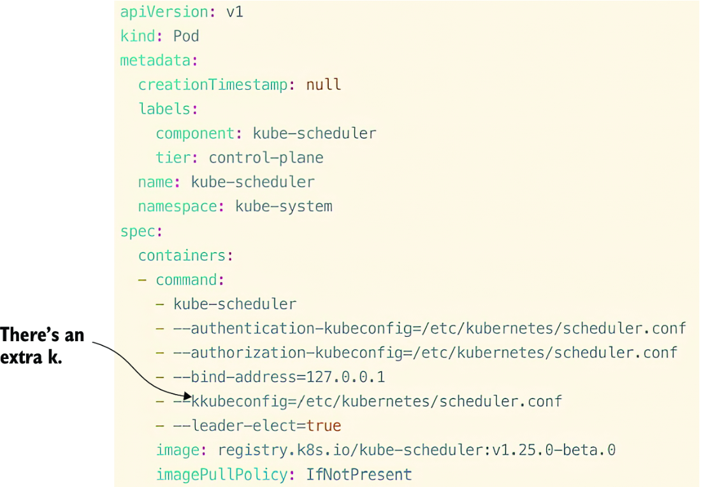

**Fix:** Edit `/etc/kubernetes/manifests/kube-scheduler.yaml` and remove the extra "k".

---

### 8.2.1 Troubleshooting Cluster Events

```bash
# View all cluster events
kubectl get events -A

# Filter out normal events
kubectl get events --field-selector type!=Normal -A

# Dump entire cluster info
kubectl cluster-info dump

# Search for errors
kubectl cluster-info dump | grep error
```

> [!TIP]
> Events are held for only 1 hour by default.

---

### 8.2.2 Worker Node Failure

**Check node resources:**
```bash
root@kind-control-plane:~# kubectl top no
NAME                 CPU(cores)   CPU(%)   MEMORY(bytes)   MEMORY(%)   
kind-control-plane   265m         13%      972Mi           49%

root@kind-control-plane:~# kubectl describe node kind-control-plane | grep Allocated -A 5
Allocated resources:
  Resource           Requests     Limits
  --------           --------     ------
  cpu                1050m (52%)  100m (5%)
  memory             490Mi (24%)  390Mi (19%)
```

> [!IMPORTANT]
> Distinguish between **resource utilization** (`kubectl top nodes`) and **resource allocation** (`kubectl describe nodes`).

**Check disk space:**
```bash
df -h
```

**Check kubelet:**
```bash
systemctl status kubelet
journalctl -u kubelet
```

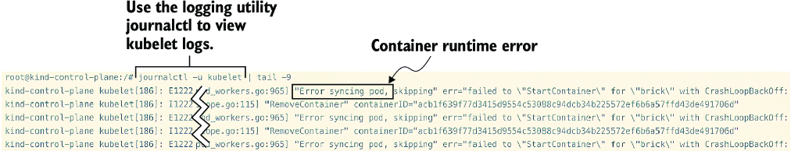

**Kubelet configuration:** `/var/lib/kubelet/config.yaml`

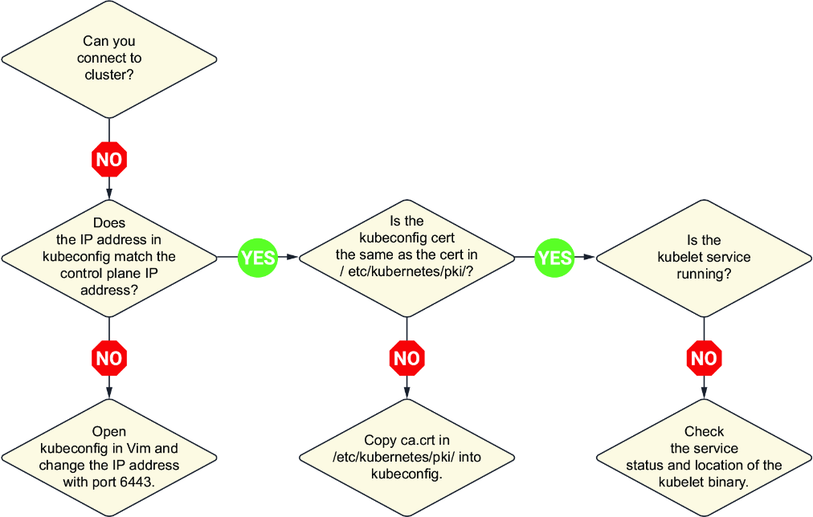

**Restart kubelet after changes:**
```bash
systemctl daemon-reload
systemctl restart kubelet
```

---

### 8.2.3 Did You Specify the Right Host or Port?

Common error: `The connection to the server $SERVER:6443 was refused - did you specify the right host or port?`

**Causes:**
- Misconfigured API server
- Incorrect kubeconfig

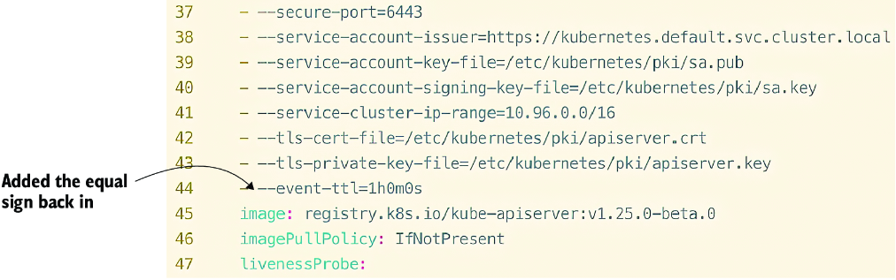

> [!TIP]
> SSH to the control plane node before looking for `/etc/kubernetes/manifests/`.

> [!WARNING]
> Don't panic! Make a backup of `kube-apiserver.yaml` before changes. Use `crictl` to check container status.

**Using crictl:**
```bash
root@kind-control-plane:~# crictl ps
CONTAINER           STATE               NAME
84234147eb024       Running             kube-apiserver
5dd8b3aeaa752       Running             kube-controller-manager
5228bb1f5eb7c       Running             kube-scheduler
f9f8ea21cb4be       Running             etcd

# Stop and remove container to restart
crictl stop 842
crictl rm 842
```

---

### 8.2.4 Troubleshooting kubeconfig

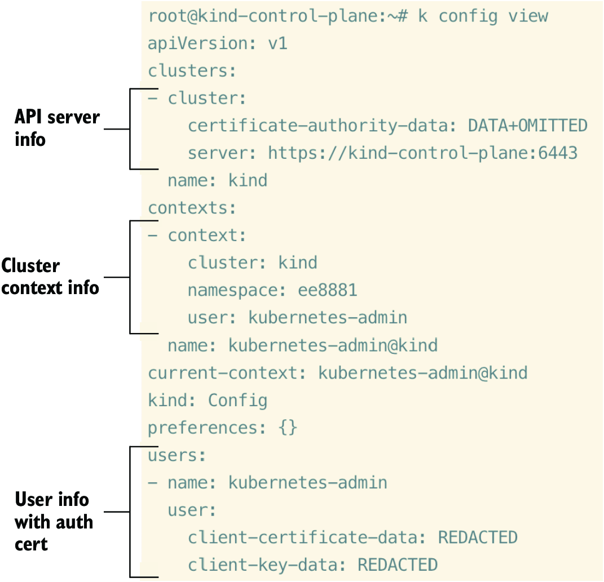

```bash
# View kubeconfig
kubectl config view

# View with raw certificates
kubectl config view --raw

# Use backup kubeconfig
kubectl get no --kubeconfig /etc/kubernetes/admin.conf

# Set environment variable
KUBECONFIG=/etc/kubernetes/admin.conf

# Copy backup to default location
cp /etc/kubernetes/admin.conf ~/.kube/config
```

> [!TIP]
> If kubeconfig is missing, copy from `/etc/kubernetes/admin.conf` or set the `KUBECONFIG` environment variable.

**Sync configs:** `kubectl config view --flatten > ~/.kube/config`

**Check server IP:**
```bash
ip addr | grep eth0
```

---

### 8.2.5 Multiple Errors: Where to Start?

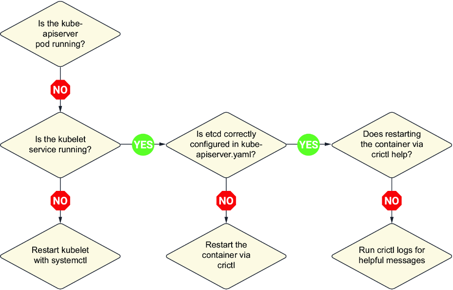

**Troubleshooting order (like peeling an onion):**
1. **etcd** - outer layer
2. **kube-apiserver** - depends on etcd
3. **controller-manager**
4. **scheduler**

**Check exited containers:**
```bash
crictl ps -a | grep kube-apiserver
crictl logs <container-id>
```

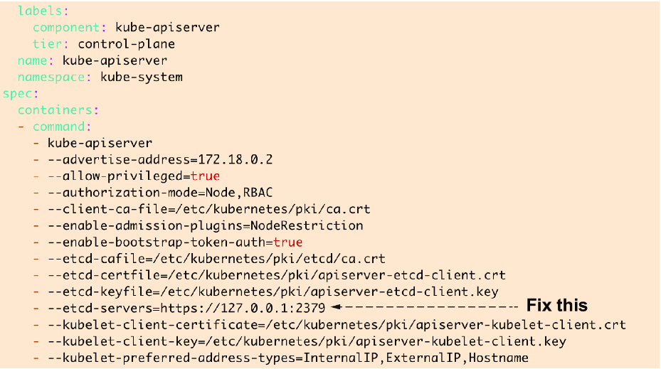

> [!IMPORTANT]
> On the exam, leave the cluster in a pristine state! Fix all pending pods.

---

### Practice Exercises

4. Move `kube-scheduler.yaml` to `/tmp`, create a pod, find why it's pending, fix it.
5. Run the kubelet troubleshooting command, check status, and resolve the problem.

---

## 8.3 Network Troubleshooting

Pod-to-pod communication happens via the **CNI (Container Network Interface)**. If nodes are not ready or containers can't get IP addresses, check the CNI.

> [!NOTE]
> The exam will provide YAML or links to install CNI—you don't need to memorize installation steps.

---

### 8.3.1 Troubleshooting the Config

> [!NOTE]
> **Exam Task Example:** Replace kube-proxy ConfigMap with a bug, view logs, find and fix the misconfiguration.

```bash
root@kind-control-plane:/# kubectl -n kube-system get po
...
kube-proxy-chc4w                             0/1     CrashLoopBackOff   7 (40s ago)

root@kind-control-plane:/# kubectl -n kube-system logs kube-proxy-chc4w
E1211 17:17:07.621228 err="stat /var/lib/kube-proxy/kubeconfigd.conf: 
↪no such file or directory"
```

**Issue:** `kubeconfigd.conf` should be `kubeconfig.conf`

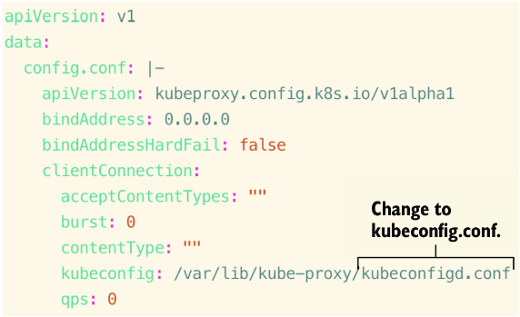

**Fix:**
```bash
kubectl -n kube-system edit cm kube-proxy
# Change kubeconfigd.conf to kubeconfig.conf

kubectl -n kube-system delete po kube-proxy-chc4w
```

> [!TIP]
> Type namespace first (`kubectl -n kube-system...`) for Tab autocompletion of resource names.

**kube-proxy details:**
- Creates iptables rules for pod network communication
- Runs as a DaemonSet on each node
- Can be reset with: `kubeadm init phase addon all`

```bash
# View network activity
netstat -plan | grep kube-proxy

# List DaemonSets
kubectl get ds -A
```

---

### 8.3.2 Troubleshooting Services

> [!NOTE]
> **Exam Task Example:** Create Deployment and Service, curl fails, find and fix the issue.

**Common issues:**
1. **Wrong port** on Service
2. **Label mismatch** between Service selector and pod labels

```bash
# Check Service ports
kubectl get svc

# Check pod labels
kubectl get po --show-labels

# View Service selector
kubectl get svc -o yaml
```

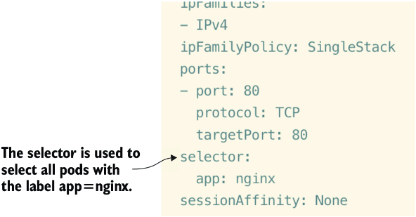

---

### 8.3.3 Troubleshooting Cluster-Wide Communications

- If Service selector doesn't match pod labels, application is unreachable
- Check **endpoints**: `kubectl get ep`
- No endpoints = label selector mismatch

> [!TIP]
> Generate correct syntax with: `kubectl create deploy nginx --image nginx --dry-run=client -o yaml` then `kubectl expose deploy nginx`

---

## Summary

- View pod logs with `kubectl logs` or in `/var/log/containers/` directory.

- Many pod statuses help identify issues. A pod can be Running but still inaccessible.

- Cluster events (`kubectl get events -A`) show errors across the cluster.

- **Metrics server** monitors cluster metrics (`kubectl top no/po`).

- Control plane issues: check `kube-system` namespace. Know what each component does.

- Multiple errors: troubleshoot top-down (etcd → apiserver → controller → scheduler).

- Network issues: check **kube-proxy** (iptables rules) and CNI installation.

- Service connectivity: verify **ports** and **label selectors** match between Service and Deployment.
