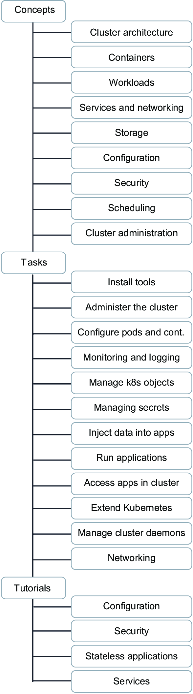
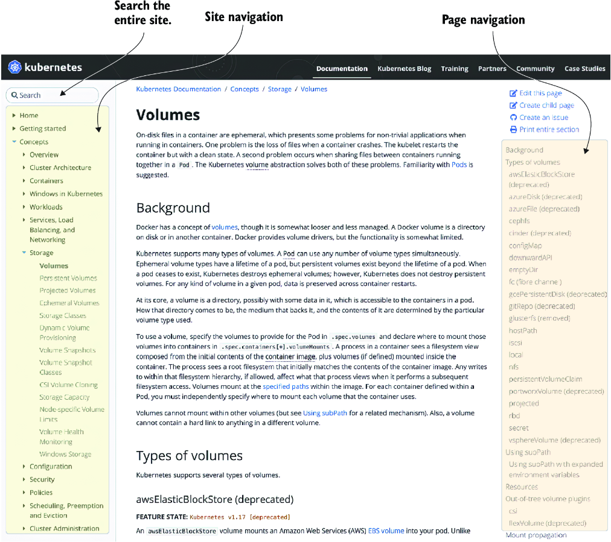
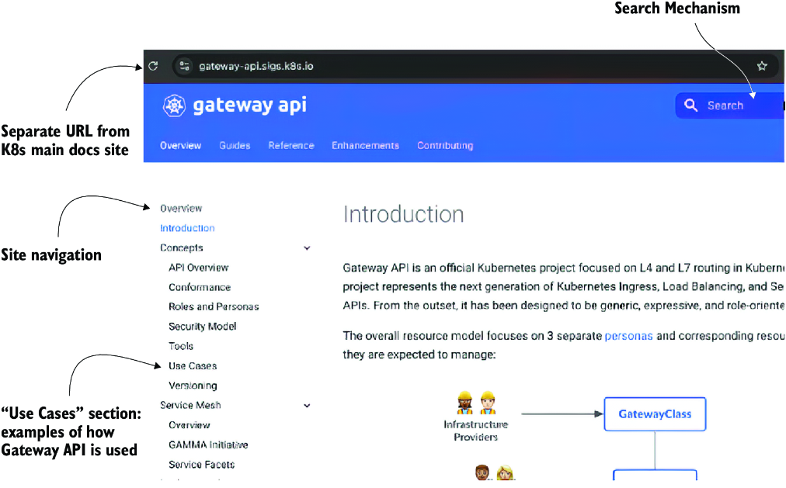
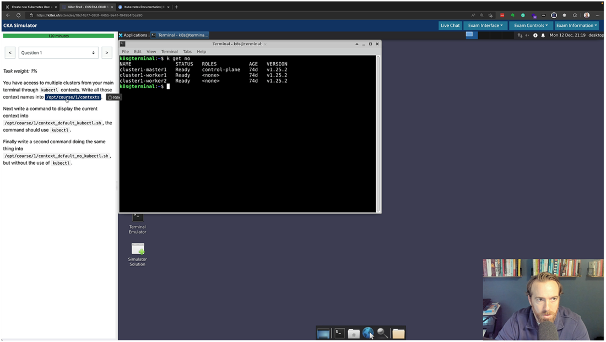

# 9. Taking the Test

## This chapter covers
- The most important aspects of the exam
- Preparing for exam day
- Review of the Kubernetes documentation
- Accessing your free practice exam
- Accessing a free cheat sheet for kubectl commands

We hope by now you feel prepared for the **Certified Kubernetes Administrator (CKA) exam**. This chapter is dedicated to reviewing the book and shoring up any weak areas so you can revisit principles and areas of study that may need further review.

---

## 9.1 Exam Basics

Chapter 1 covered the exam's purpose, but this chapter highlights the most important topics for preparing for exam day and reviews the technical competence required.

### 9.1.1 Competencies Condensed

| Domain | Weight | Topics | Chapters |
|--------|--------|--------|----------|
| **Cluster, Architecture, Installation, and Configuration** | 25% | Manage RBAC, Prepare infrastructure, Create/manage clusters with kubeadm, Cluster lifecycle, HA control plane, Helm & Kustomize, Extension interfaces (CNI, CSI, CRI), CRDs & operators | 2, 3, 5 |
| **Workloads and Scheduling** | 15% | Deployments, rolling updates, rollbacks, ConfigMaps & Secrets, Autoscaling, Self-healing, Pod scheduling (limits, affinity) | 4, 5 |
| **Services & Networking** | 20% | Pod connectivity, Network Policies, Service types (ClusterIP, NodePort, LoadBalancer, ExternalName), Gateway API, Ingress, CoreDNS | 6 |
| **Storage** | 10% | Storage classes, Dynamic provisioning, Volume types, access modes, reclaim policies, PVs and PVCs | 7 |
| **Troubleshooting** | 30% | Troubleshoot clusters/nodes, Cluster components, Monitor resources, Container output streams, Services and networking | 8 |

> [!TIP]
> If you feel weak in any area, go back to the corresponding chapters to review. At the top of chapters 2-8, you can see which competency relates to which chapter.

---

## 9.2 Exam Clusters

During the exam, each question will ask you to **SSH to a specific machine** to access the cluster.

> [!IMPORTANT]
> - Create a habit of **exiting and returning to the "jump" box** with the `exit` command after completing each task.
> - **Double-check hostnames** before you SSH—copy and paste them.
> - Each host will have different terminal prompts; pay attention to which cluster you're in.
> - You don't want to miss points because you were in the wrong cluster!

---

## 9.3 Chapter Reviews

The following is a quick review of each chapter. Keywords are presented to help you review terms important for the exam.

### 9.3.1 Quick Review of Chapter 2

**Topics:** Cluster architecture, cluster upgrades, and cluster management.

Key points:
- **Control plane nodes** run system (static) pods; **worker nodes** run application pods
- **Static pods** aren't managed by the scheduler—located in `/etc/kubernetes/manifests`
- **kubelet** runs on every node as a Linux system service
- Cluster config is stored in **etcd** (runs as a pod in `kube-system`)

| Keyword | Description | Section |
|---------|-------------|---------|
| Taints and tolerations | Control plane taints and how to add tolerations | 2.1.3 |
| Namespaces | Finding kube-system pods (controller manager, scheduler, API server, etc.) | 2.1 |
| Static pods | Modify system pods via YAML in `/etc/kubernetes/manifests` | 2.2.1 |
| Kubeadm | Upgrade Kubernetes components | 2.1.1 |
| Kubelet | Linux system service (daemon) on each node | 1.7 |

---

### 9.3.2 Quick Review of Chapter 3

**Topics:** RBAC and high availability cluster management.

Key points:
- Users and service accounts access the cluster via the **Kubernetes API**
- Everything goes through **RBAC** for authentication, authorization, and access control

| Keyword | Description | Section |
|---------|-------------|---------|
| Users and groups | Creating users with limited permissions | 3.2 |
| RBAC | Authentication, authorization, and access control | 3.1 |
| Service accounts | Mount to pods for API access | 3.3 |
| Cluster roles | Cluster-wide permissions | 3.1.1 |
| Roles | Namespace-scoped permissions | 3.1.1 |

---

### 9.3.3 Quick Review of Chapter 4

**Topics:** ConfigMaps, Secrets, resource limits, Deployments, and templating tools.

Key points:
- **Node selectors** schedule pods to specific nodes by label
- Check node labels: `kubectl get no --show-labels`
- **Node affinity** provides fallback scheduling options
- **Interpod affinity** schedules pods based on existing pod locations

| Keyword | Description | Section |
|---------|-------------|---------|
| Node selectors | Schedule pods to certain nodes | 4.1.1 |
| Node name | Target specific node by name | 4.1.1 |
| Node affinity | Flexible scheduling with fallback options | 4.1.2 |
| ConfigMaps | Configuration data for pods | 4.2.3 |
| Secrets | Sensitive data attached via volume mount | 4.2.3 |
| Resource requests/limits | CPU and memory constraints | 4.2.1 |

---

### 9.3.4 Quick Review of Chapter 5

**Topics:** Scaling, rollouts, and Deployment management.

Key points:
- **Scaling** = adding more pod replicas
- **Rollouts** make updating applications simple
- **Helm** packages applications for one-command deployment
- **Kustomize** creates overlays for environment-specific configs (DRY principle)
- **CRDs and operators** extend Kubernetes natively

| Keyword | Description | Section |
|---------|-------------|---------|
| Scale Deployments | Change replica count | 5.1.1 |
| ReplicaSets | Track pod replicas per revision | 5.1.2 |
| Rollouts | Deploy new versions, check history | 5.1.3 |
| Cordon and drain | Node maintenance | 5.2 |
| Adding nodes | Join new nodes to cluster | 5.2.2 |
| Helm | Deploy with Helm charts | 5.3.1 |
| Kustomize | Apply overlays with kubectl | 5.3.2 |
| CRDs and operators | Extend Kubernetes | 5.4 |

---

### 9.3.5 Quick Review of Chapter 6

**Topics:** Networking, DNS, Services, and CNI plugins.

Key points:
- **CoreDNS** resolves hostnames to IPs quickly
- **Ingress** exposes applications externally
- **Network Policies** filter traffic (Calico supports them; Flannel does not)
- **Gateway API** is a new competency with GatewayClass, Gateway, and HTTPRoute objects

| Keyword | Description | Section |
|---------|-------------|---------|
| CoreDNS | DNS resolution and configuration | 6.1 |
| Pod communication | Pod-to-pod and Service-to-Service | 6.2.3 |
| Ingress | Expose Services externally | 6.3 |
| Services | ClusterIP, NodePort, LoadBalancer | 6.4 |
| Network Policies | Traffic filtering and segregation | 6.6 |
| Gateway API | Advanced traffic management | 6.7 |

---

### 9.3.6 Quick Review of Chapter 7

**Topics:** Storage in Kubernetes.

Key points:
- **PVs** and **PVCs** decouple storage from pods
- **Volume modes**: Filesystem vs Block
- **Access modes**: ReadWriteOnce, ReadWriteMany, etc.
- **Storage classes** autoprovision volumes dynamically
- **emptyDir** provides temporary pod storage

| Keyword | Description | Section |
|---------|-------------|---------|
| Persistent volumes | Create PV and PVC for pods | 7.1 |
| Volume modes | Filesystem or Block | 7.1.2 |
| Access modes | Read/write permissions | 7.1.3 |
| Storage class | Dynamic volume provisioning | 7.3 |
| emptyDir | Temporary storage (dies with pod) | 7.4 |

---

### 9.3.7 Quick Review of Chapter 8

**Topics:** Troubleshooting clusters, pods, Services, and networks.

Key points:
- Follow the **decision tree** in figure 8.7 for troubleshooting
- Check **pod status** for clues (8 different statuses in table 8.1)
- Problems may be in control plane, nodes, or kubeconfig

| Keyword | Description | Section |
|---------|-------------|---------|
| Pod logs | View logs to troubleshoot failures | 8.1 |
| Network troubleshooting | Use temporary pods for DNS testing | 8.1.2 |
| Scheduler failure | Fix scheduler issues | 8.2 |
| Events | Analyze cluster event logs | 8.2.1 |
| Troubleshooting kubeconfig | Fix cluster access issues | 8.2.4 |
| Service connection | Check endpoints and pod connectivity | 8.3.1 |

---

## 9.4 Kubernetes Documentation Review

You can have documentation open during the exam! Take full advantage of this.

**Primary documentation:** https://kubernetes.io/docs

**Navigation tips:**
- Left side: Page-to-page navigation
- Right side: Section navigation within the page
- Use the **search bar** to find specific topics quickly

> [!WARNING]
> Search results may link to external sites you're **not allowed to visit**. Hover over links to verify they start with `https://kubernetes.io/docs`. If you accidentally click, the browser will block it.

> [!TIP]
> Use **Ctrl + F** (Find in Page) in Firefox to quickly search the current page.

### Additional Documentation

| Resource | URL |
|----------|-----|
| **Gateway API** | https://gateway-api.sigs.k8s.io |
| **Helm** | https://helm.sh/docs |

> [!NOTE]
> You don't need to memorize URLs—each exam question provides links to relevant documentation.

---

## 9.5 Practice Exam

Every exam purchase includes a **free practice exam voucher** from **Killer Shell (KLLR SHLL)**.

**Practice exam info:**
- Website: https://killer.sh
- Sign in with your **Linux Foundation credentials**
- You get **two sessions** in the simulator (same questions)
- Questions are **harder** than the real exam
- FAQ: https://killer.sh/faq

**Additional practice resource:** https://sailor.sh (real-world simulator)

---

## 9.6 Additional Tips for the Exam

### Practice
- Go through all exercises in this book **multiple times**
- Use **Killercoda** (https://killercoda.com) for additional practice
- Create your own scenarios to reinforce concepts

### Exam Day Preparation
- Have your **identification ready**
- Ensure your room meets the **cleanliness requirements**
- Run a **hardware compatibility check** a few days before: http://mng.bz/d1vw
- Log in to the portal **30 minutes early**: https://trainingportal.linuxfoundation.org/

### Results and Retakes
- Results are emailed **24 hours** after completing the exam
- You have **one free retake** if you don't pass
- **Retake as soon as possible** while everything is fresh!

---

## Summary

- **Review chapter highlights** to master content across all competency domains.

- **Practice, practice, practice.** Make it a daily habit leading up to the exam.

- **Master the Kubernetes documentation** to take full advantage of the open-book format.

- **Work with multiple clusters** on the exam. Know how to switch and verify your current context.

- **Use both practice exam sessions.** They're harder than the real exam and prepare you well.

- **Review the handbook** for physical environment rules and prepare everything in advance.

- **You have one free retake**—don't stress! You can do it!

- **If you need to retake**, do it quickly while everything is fresh. Avoid procrastination!

> [!TIP]
> **Good luck on your CKA exam!** Thank you for allowing us to guide you through this journey.
