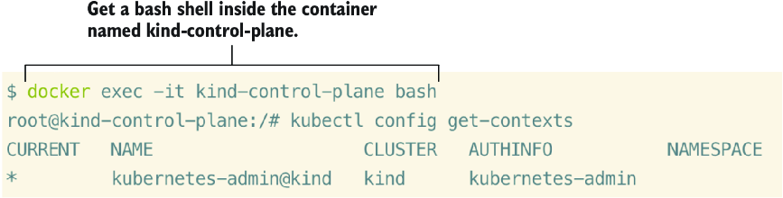

# Appendix A: Creating a Kubernetes Cluster with kind

This appendix shows you how to install a **Kubernetes in Docker (kind)** cluster with multiple nodes, where the nodes are Docker containers. You will:
- Download and install kind (which uses kubeadm to bootstrap your cluster)
- Learn how to set the context for your cluster
- Switch between multiple clusters or users

**Prerequisites:** Docker and kind

---

## A.1 Installing the Required Packages

### A.1.1 Install Docker Desktop

Docker Desktop serves as the container runtime for the machine running the kind cluster.

**Installation Steps:**

1. Open a web browser, and go to https://www.docker.com/products/docker-desktop
2. Download the installer for your operating system (choose chip architecture if needed)
3. Run the installer (`.dmg`, `.exe`, `.deb`, or `.rpm`), and accept all defaults
4. Open the application—you should see the whale icon in the task bar
5. If you see the whale icon, Docker is running!

> [!NOTE]
> If you are on Windows and already have Docker installed, make sure you're in **Linux container mode** (default for new installations).

> [!TIP]
> Docker Desktop is compute- and memory-intensive. Configure resource usage under **Preferences → Advanced**. You can stop or pause Docker when not using it.

**Verify Docker installation:**

```bash
$ docker ps
CONTAINER ID   IMAGE     COMMAND   CREATED   STATUS    PORTS     NAMES
```

No errors = successful installation. No containers shown because we haven't created any yet.

---

### A.1.2 Installing kind

Install kind with just **one command**:

| OS | Command |
|----|---------|
| **macOS** | `brew install kind` |
| **Windows** | `choco install kind` |
| **Linux** | `curl -Lo ./kind https://kind.sigs.k8s.io/dl/v0.29.0/kind-linux-amd64 && chmod +x ./kind && sudo mv ./kind /usr/local/bin/kind` |

**Verify installation:**

```bash
$ kind
kind creates and manages local Kubernetes clusters using Docker container 'nodes'

Usage:
  kind [command]

Available Commands:
  build       Build one of [node-image]
  completion  Output shell completion code for the specified shell (bash, zsh or fish)
  create      Creates one of [cluster]
  delete      Deletes one of [cluster]
  export      Exports one of [kubeconfig, logs]
  get         Gets one of [clusters, nodes, kubeconfig]
  help        Help about any command
  load        Loads images into nodes
  version     Prints the kind CLI version

Flags:
  -h, --help              help for kind
  -q, --quiet             silence all stderr output
  -v, --verbosity int32   info log verbosity
      --version           version for kind

Use "kind [command] --help" for more information about a command.
```

---

### A.1.3 Creating a kind Kubernetes Cluster

```bash
$ kind create cluster
Creating cluster "kind" ...
 ✓ Ensuring node image (kindest/node:v1.32.2) 
 ✓ Preparing nodes
 ✓ Writing configuration
 ✓ Starting control-plane 
 ✓ Installing CNI
 ✓ Installing StorageClass
Set kubectl context to "kind-kind"
You can now use your cluster with:

kubectl cluster-info --context kind-kind

Not sure what to do next? Check out https://kind.sigs.k8s.io/docs/user/quick-start/
```

**Congratulations!** You've bootstrapped your Kubernetes cluster.

To operate from the control plane node (like on the CKA exam):

```bash
docker exec -it kind-control-plane bash
kubectl config get-contexts
```



---

### A.1.4 Install kubectl (optional)

kubectl is already preinstalled in the kind container. Install on your local workstation only if you prefer not to run commands from inside a container.

> [!TIP]
> **kubectl pronunciations:** "cube-cuttle", "cube-eck-tell", "cube-C-T-L", or officially "cube-control". Great ice breaker for fellow Kubernetes administrators!

**Installation:**

| OS | Command |
|----|---------|
| **macOS** | `brew install kubectl` |
| **Windows** | `choco install kubernetes-cli` |
| **Linux** | See below |

**Linux installation:**

```bash
curl -LO "https://dl.k8s.io/release/$(curl -L -s https://dl.k8s.io/release/stable.txt)/bin/linux/amd64/kubectl" && \
chmod +x kubectl && \
sudo mv kubectl /usr/local/bin/kubectl
```

**Verify:**

```bash
$ kubectl version --client
Client Version: v1.32.2
Kustomize Version: v5.5.0
```

---

## A.2 Creating a Multinode Cluster

Create a multinode cluster to simulate the CKA exam environment (typically 1 control plane + 2 worker nodes).

**First, delete the existing cluster:**

```bash
kind delete cluster
```

**Create the config file:**

**macOS/Linux:**
```bash
cat <<EOF | tee config.yaml
kind: Cluster
apiVersion: kind.x-k8s.io/v1alpha4
nodes:
- role: control-plane
- role: worker
- role: worker
EOF
```

**Windows PowerShell:**
```powershell
@"
kind: Cluster
apiVersion: kind.x-k8s.io/v1alpha4
nodes:
  - role: control-plane
  - role: worker
  - role: worker
"@ | Out-File -FilePath config.yaml -Encoding utf8
```

**Windows Git Bash:**
```bash
echo "kind: Cluster
apiVersion: kind.x-k8s.io/v1alpha4
nodes:
- role: control-plane
- role: worker
- role: worker" | tee config.yaml
```

**Create the cluster:**

```bash
$ kind create cluster --config config.yaml --image kindest/node:v1.32.2
Creating cluster "kind" ...
 ✓ Ensuring node image (kindest/node:v1.32.2)
 ✓ Preparing nodes
 ✓ Writing configuration
 ✓ Starting control-plane 
 ✓ Installing CNI
 ✓ Installing StorageClass
 ✓ Joining worker nodes
Set kubectl context to "kind-kind"
```

**Verify:**

```bash
$ kubectl get no
NAME                 STATUS   ROLES           AGE   VERSION
kind-control-plane   Ready    control-plane   98s   v1.32.2
kind-worker          Ready    <none>          70s   v1.32.2
kind-worker2         Ready    <none>          70s   v1.32.2
```


**Congratulations—you've created a three-node Kubernetes cluster!**

---

## A.3 Setting Context with kubeconfig

The kubeconfig file (`admin.conf`) is located in `/etc/kubernetes/`. During bootstrap, it's copied to `~/.kube/config`.

**View kubeconfig:**

```bash
kind get kubeconfig --name "kind"
# or
kubectl config view
```

**Inside the control plane container:**

```bash
$ docker exec -it kind-control-plane bash
root@kind-control-plane:/# echo $KUBECONFIG
/etc/kubernetes/admin.conf
```

**Using multiple kubeconfig files:**

```bash
# Use a different kubeconfig
export KUBECONFIG=~/Downloads/config2

# Use multiple kubeconfig files
export KUBECONFIG=~/.kube/config:~/Downloads/config2

# View all contexts
kubectl config get-contexts

# Switch context
kubectl config use-context kind-kind
```

**Example:**

```bash
$ export KUBECONFIG=~/Downloads/config2:~/.kube/config
$ kubectl config get-contexts
CURRENT   NAME             CLUSTER          AUTHINFO         NAMESPACE
          docker-desktop   docker-desktop   docker-desktop
*         k8s              k8s              k8s
          kind-kind        kind-kind        kind-kind

$ kubectl config use-context kind-kind
Switched to context "kind-kind".
```

**Merge configs:**

```bash
$ export KUBECONFIG=~/Downloads/config2:~/.kube/config
$ kubectl config view --flatten > ~/.kube/config
```

---

## A.4 Setting an Alias for kubectl

Save time by using an alias:

```bash
# Set alias temporarily
alias k=kubectl

# Verify
k get no
```

**Make it persistent:**

```bash
echo 'alias k=kubectl' >> ~/.bashrc
source ~/.bashrc
```

**Example output:**

```bash
root@kind-control-plane:/# k get no
NAME                 STATUS   ROLES           AGE   VERSION
kind-control-plane   Ready    control-plane   23h   v1.25.0-beta.0
```

---

## A.5 Setting kubectl Autocomplete

Autocomplete helps prevent typos with long resource names. Press **Tab** to autocomplete namespace and resource names.

**Setup commands (run in order inside the control plane container):**

```bash
apt update && apt install -y bash-completion
echo 'source <(kubectl completion bash)' >> ~/.bashrc
echo 'source /usr/share/bash-completion/bash_completion' >> ~/.bashrc
echo 'alias k=kubectl' >> ~/.bashrc
echo 'complete -o default -F __start_kubectl k' >> ~/.bashrc
source ~/.bashrc
```

> [!TIP]
> Run these one by one inside a shell to the control plane node: `docker exec -it kind-control-plane bash`
